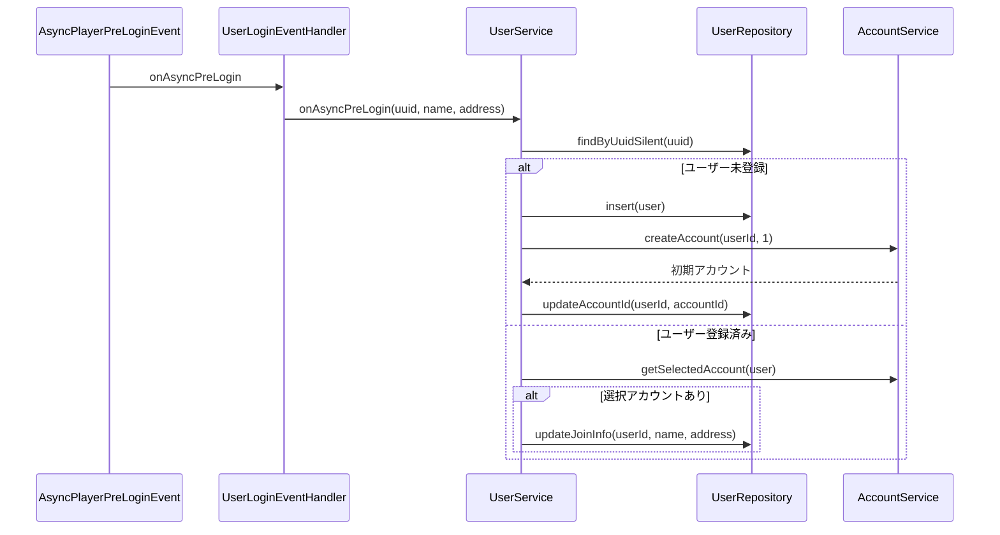
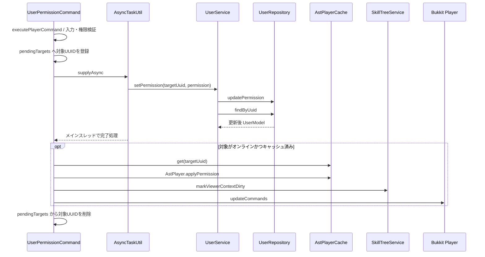

# 01_4-統合フロー

## 1. ログイン前処理

### シーケンス

### 処理要点

- `AsyncPlayerPreLoginEvent` の非同期イベント内で API 呼び出しまで完結する。
- 未登録時はユーザー、初期アカウント、選択アカウント ID の順に作成・更新する。
- 登録済みでも選択アカウントが取得できない場合は参加情報を更新しない。

### 例外・終了条件

- API 処理の例外は `UserService.onAsyncPreLogin` が捕捉して `LogId.W_5051` を記録する。

## 2. 権限変更

### シーケンス

### 処理要点

- 同一対象への並行更新は `pendingTargets` で拒否し、二重送信を防ぐ。
- API 更新と再取得は非同期、Bukkit オブジェクトとキャッシュの更新はメインスレッドで行う。
- オンライン反映後はスキルツリー表示条件とコマンド可視性も更新する。

### 例外・終了条件

- 更新中の対象には `PlayerMsgId.P_5306` を返す。
- 非同期処理失敗時は `LogId.E_5059` を記録して `PlayerMsgId.P_5062` を送信する。
- 成否にかかわらず `pendingTargets` の登録を解除する。
