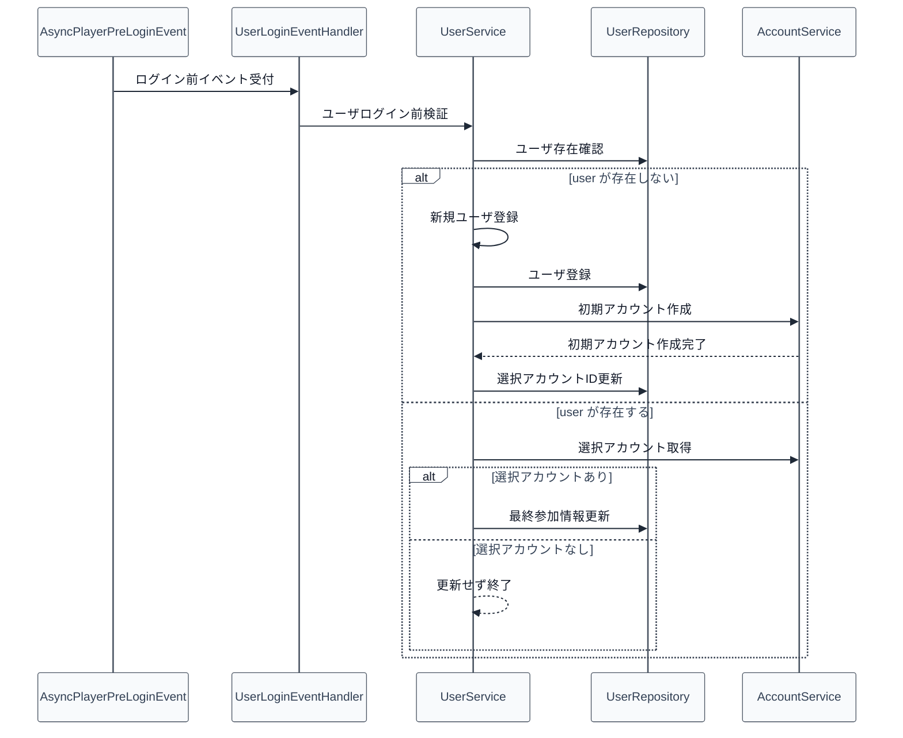

# 01_4.00-統合フロー

## 1. ログイン前処理（event -> service -> repository -> account）

物理名対応:

- ログイン前イベント受付: `onAsyncPreLogin`（`UserLoginEventHandler`）
- ユーザログイン前検証: `onAsyncPreLogin`（`UserService`）
- ユーザ存在確認: `findByUuidSilent`
- 新規ユーザ登録: `registerNewUser`
- ユーザ登録: `insert`
- 選択アカウントID更新: `updateAccountId`
- 最終参加情報更新: `updateJoinInfo`

## 2. 権限変更処理（command -> service -> repository）

1. `/user permission` を受け、コマンドで実行者権限と入力値を検証する
2. サービスで `権限更新` を実行し、リポジトリへ更新を委譲する
3. 更新後ユーザーを再取得する
4. 対象がオンラインなら [[03_1.00-モデル定義]].プレイヤーキャッシュ へ反映する
5. 実行者へ結果を返す

物理名対応:

- 権限更新: `setPermission`（`UserService`）
