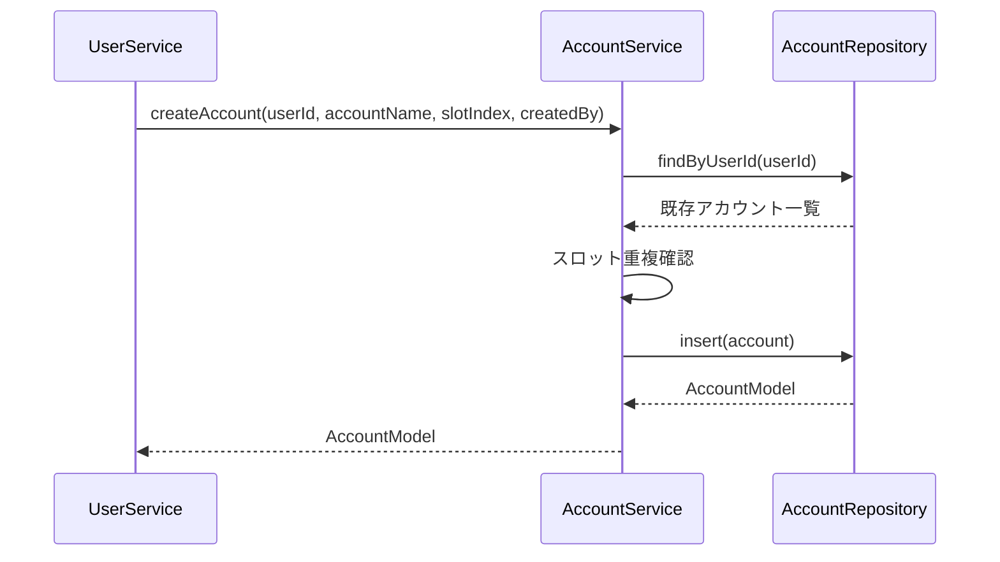
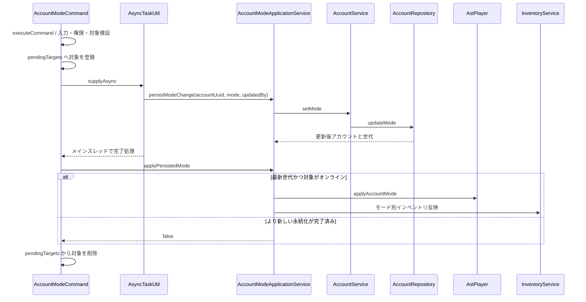
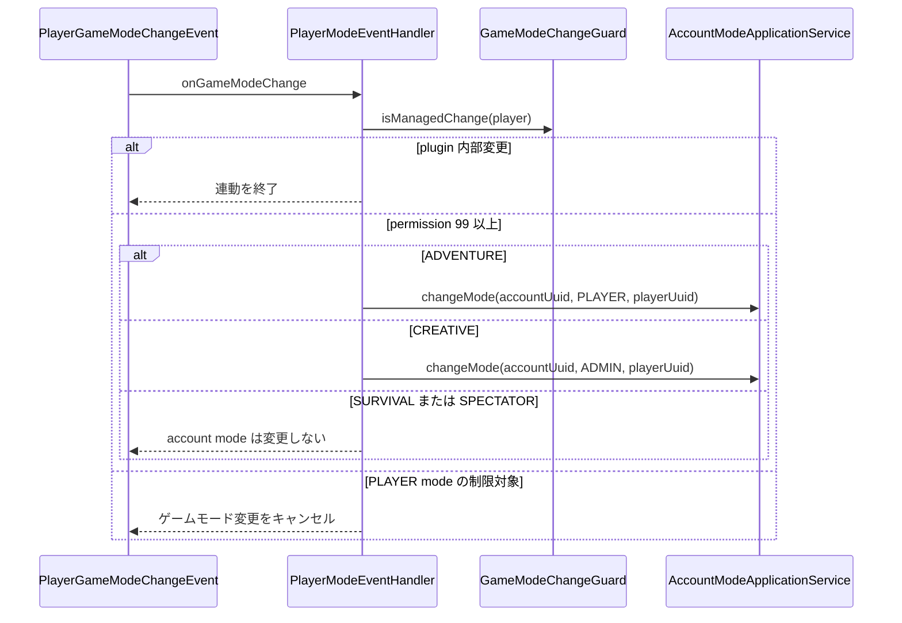
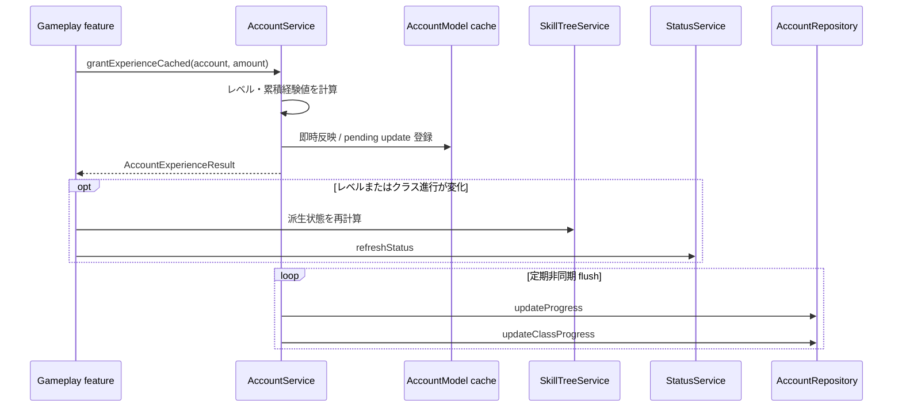

# 02_4.00-統合フロー

## 1. 初期アカウント作成

### シーケンス

### 処理要点

- `slotIndex` が既存アカウントと重複する場合は登録しない。
- account feature はアカウントの作成までを担当する。初回メール作成を呼び出す実装はない。

### 例外・終了条件

- 一覧取得または登録 API の例外は呼び出し元へ伝播する。

## 2. アカウントモード変更

### シーケンス

### 処理要点

- オンライン名、アカウント UUID、ユーザー UUID の順で対象を解決する。
- 同一アカウントの API 更新を直列化し、完了世代が最新の結果だけをオンライン状態へ反映する。
- tool mode を離れる場合はスナップショットを保存し、新モードに応じて通常 GUI、tool GUI、または空 GUI を反映する。
- 成功メッセージには `AccountMode.getDisplayName()` の表示名を使う。

### 例外・終了条件

- 同一対象の更新中は `PlayerMsgId.P_5334`、対象未検出は `PlayerMsgId.P_5333` を返す。
- 非同期処理失敗時は `LogId.E_5154` を記録して `PlayerMsgId.P_5062` を送信する。

## 3. ゲームモード連動

### シーケンス

### 処理要点

- plugin 自身が行うゲームモード変更は `GameModeChangeGuard` で再入を除外する。
- 外部変更のうち ADVENTURE / CREATIVE だけを account mode へ連動する。

## 4. 経験値加算と定期保存

### シーケンス

### 処理要点

- UI とゲーム進行はメモリ上の更新結果を即時利用し、API 保存は定期 flush へ集約する。
- plugin 停止時は `AccountService.stop` が未保存の経験値・クラス進行を複数回 flush する。

### 例外・終了条件

- flush 失敗は pending update を保持して次回再試行する。
- 停止時の再試行後も残る更新は `LogId.W_5156`、個別 flush 失敗は `LogId.E_5156` / `LogId.E_5157` で記録する。
