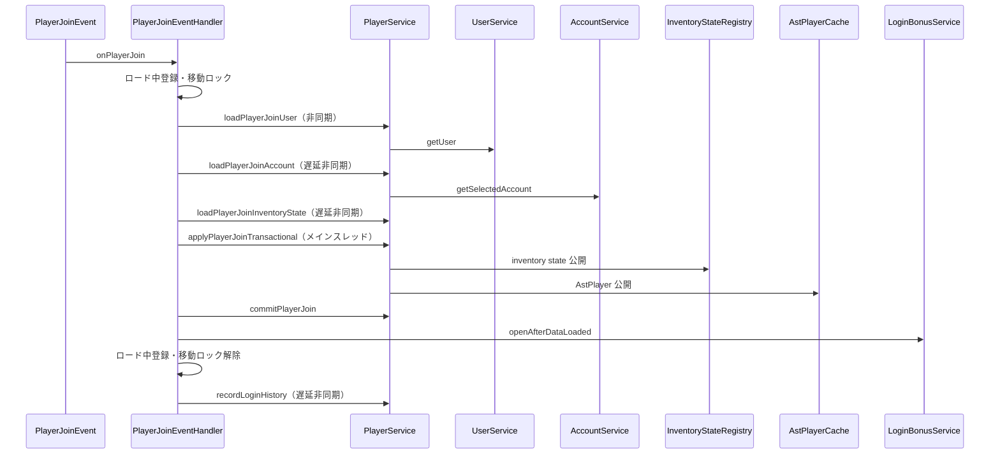
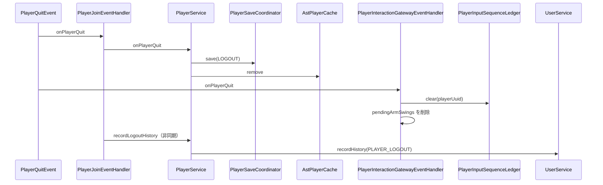
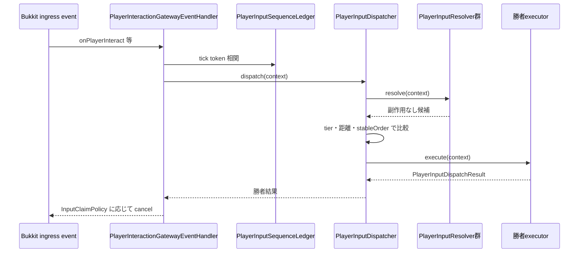
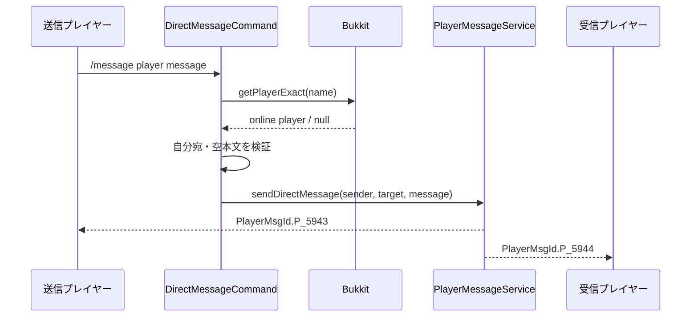
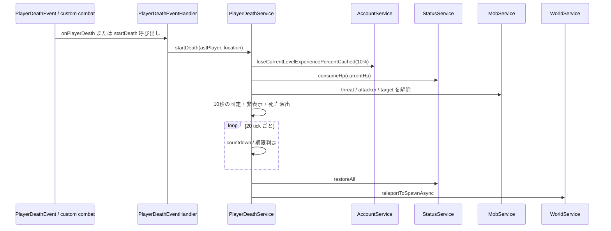
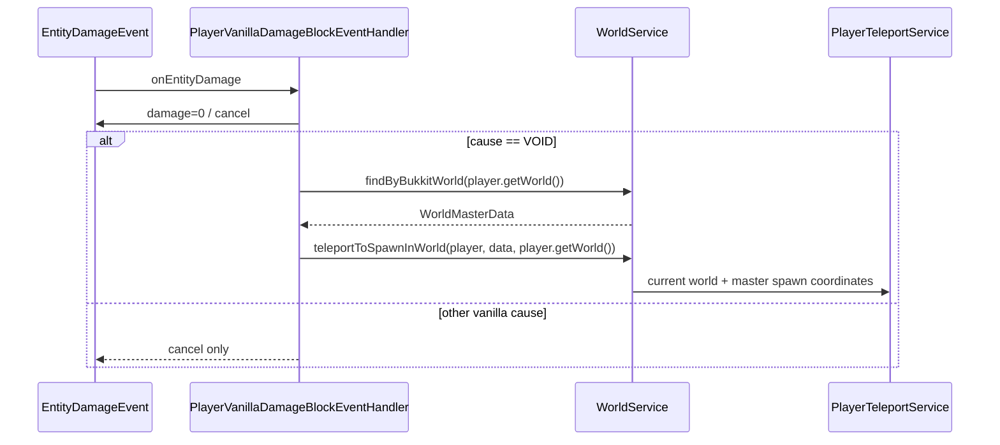

# 03_4-統合フロー

## 1. ログイン反映

### シーケンス

### 処理要点

- user、account、inventory state を段階的に非同期取得し、Bukkit 状態と feature 状態の公開だけをメインスレッドで行う。
- player 公開後に quest、skill tree、skill bind preset 等の参加状態を反映し、すべて成功してから retained-state lease を確定する。
- ロード中の通常移動は固定位置へ戻すが、yaw / pitch と `PlayerTeleportEvent` は許可する。
- ログインボーナスは参加データ公開後に非同期取得し、最新 request ID と同一アカウントを確認して GUI を開く。

### 例外・終了条件

- 途中失敗時は公開済み feature を逆順に破棄し、`PlayerService.rollbackPlayerJoin` で Bukkit 状態と retained-state lease を復元する。
- 失敗時もロード中登録と移動ロックを解除し、`LogId.E_5070` を記録する。

## 2. ログアウト保存

### シーケンス

### 処理要点

- 保存要求を発行してから `AstPlayerCache` からセッションを削除する。
- 共通入力 gateway は同じ退出イベントで tick token と pending arm swing を破棄する。保存処理との順序依存はない。

### 例外・終了条件

- 保存失敗時の inventory state 保持・再試行は [[03_3-保存]] を正本とする。
- 退出イベント処理の例外は `LogId.E_5070` で記録する。

## 3. プレイヤー入力共通入口

### シーケンス

### 処理要点

- 右・左クリック、block mutation、item drop、hotbar slot、sneak を `InputFamily` / `InputSource` へ正規化する。
- player feature は `DROP_ITEM` の player-mode guard と `SNEAK` の wall-cling / dodge fallback を提供する。
- 候補の優先順位、距離比較、arm swing の次 tick fallback は [[28_4-統合フロー]] を正本とする。

## 4. ダイレクトメッセージ送信

### シーケンス

### 処理要点

- 宛先は完全一致するオンラインプレイヤーだけを対象とする。
- システム通知、全体・パーティーチャット、ダイレクトメッセージの送信は `PlayerMessageService` に集約する。

### 例外・終了条件

- 宛先未検出は `P_5905`、自分宛は `P_5947`、空本文は `P_5946` を返す。

## 5. プレイヤー死亡と復帰

### シーケンス

### 処理要点

- vanilla 死亡では inventory、level、drop を保持し、AstralRecord の死亡状態へ統合する。
- 死亡中は無敵化して他プレイヤーから隠し、死亡地点へ固定する。テレポートイベントは移動固定の対象外とする。
- 期限終了時は全リソースを回復し、指定 recovery action または参加スポーンへ復帰する。

### 例外・終了条件

- 既に死亡中の場合、`startDeath` は `false` を返して二重開始しない。
- イベント処理失敗は共通 event 実行失敗 `LogId.E_3002` を記録する。

## 6. vanilla damage 抑止と奈落復帰

### シーケンス

### 処理要点

- プレイヤーへの Bukkit `EntityDamageEvent` は原因にかかわらず damage を 0 にしてキャンセルする。
- `VOID` では、奈落ダメージを受けた Bukkit ワールドを維持し、そのワールドに WorldMasterData の `spawnLocation` を適用して転送する。
- WorldMasterData を逆引きできない場合は Bukkit の既定スポーンへ fallback せず、damage のキャンセルだけを行う。
- 転送は `PlayerTeleportService` 経由で行い、転送前のプレイヤーの yaw / pitch を維持する。
