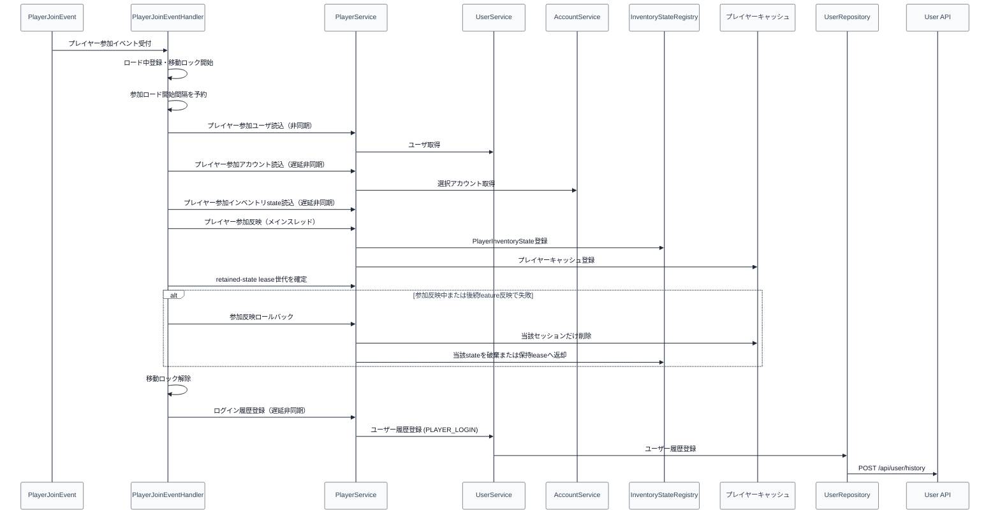

# 03_4.00-統合フロー

## 1. ログイン反映（event -> staged load -> service -> cache -> user history）

ロード中に `PlayerMoveEvent` で通常移動による X/Y/Z またはワールド移動を検出した場合、`PlayerJoinEventHandler` は移動先を参加時のロック座標へ差し戻す。yaw/pitch は差し戻さず、視点変更は許可する。`PlayerTeleportEvent` は参加時スポーンなどのサーバー制御を妨げないよう許可し、移動先を新しいロック座標として扱う。

## 2. ログアウト保存（event -> service -> save -> cache -> user history）

1. `PlayerQuitEvent` を受け、[[03_3.02-サービス]].プレイヤー退出処理を実行する
2. [[03_3.05-保存]].プレイヤー保存実行を実行する
3. [[03_3.04-キャッシュ]].プレイヤーキャッシュ削除を実行する
4. 非同期で [[01_3.02-サービス]].ユーザー履歴登録 を実行し、user feature 側で `POST /api/user/history (PLAYER_LOGOUT)` を呼び出す

同じ`PlayerQuitEvent`で`PlayerInteractionGatewayEventHandler.onPlayerQuit`が[[28_3.02-サービス]].プレイヤー入力状態破棄 を呼び、入力tokenとpending arm swingを破棄する。保存処理と入力破棄の実行順には依存しない。

## 3. プレイヤー入力共通入口（event -> gateway -> dispatcher）

1. `PlayerInteractionGatewayEventHandler`が右クリック、左クリック、block mutation、item drop、hotbar slot変更、sneak変更のingress eventを受信する。
2. eventを`InputFamily`と`InputSource`へ正規化し、同一tickのhand違い・event種別違いを同じtokenへ相関する。
3. `PlayerInputDispatcher`が全featureの副作用なし候補を比較する。
4. 勝者executorだけを一回実行し、`PlayerInputDispatchResult`をgatewayへ返す。
5. gatewayは`InputClaimPolicy`に従って必要な場合だけeventを抑止する。

player側は`DROP_ITEM`のplayer-mode guardと、`SNEAK`のwall-cling / dodgeを最終fallback候補として提供する。上位のboss・world・menu等が勝った場合は実行しない。候補優先順位、距離比較、arm swingの次tickfallbackを含む詳細フローは[[28_4.00-統合フロー]]を正本とする。
