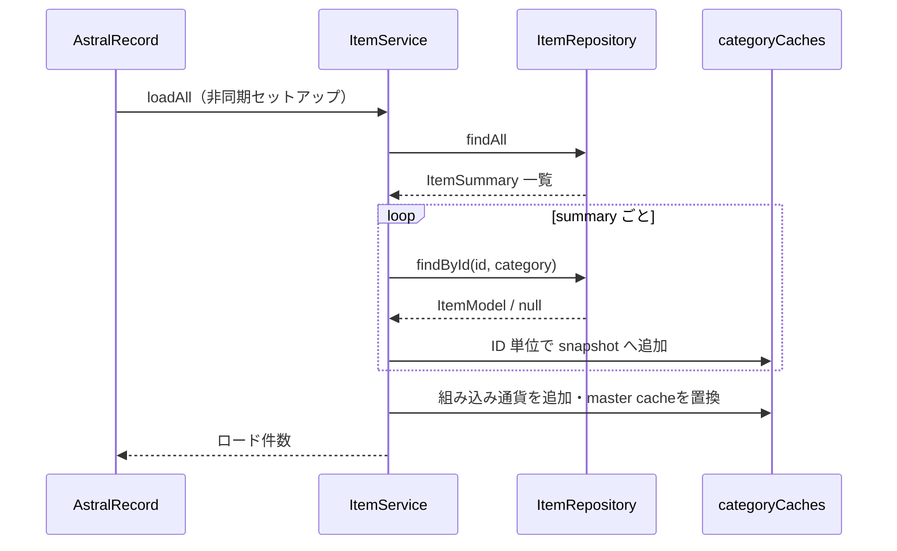
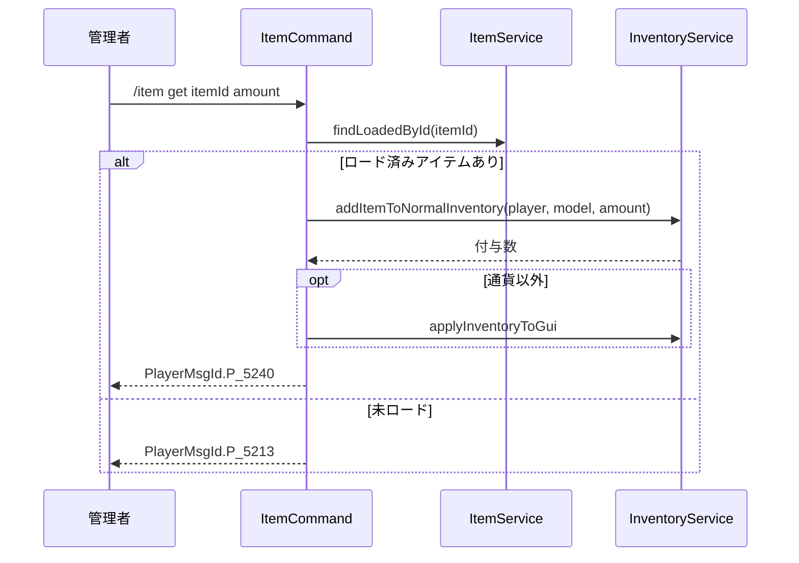
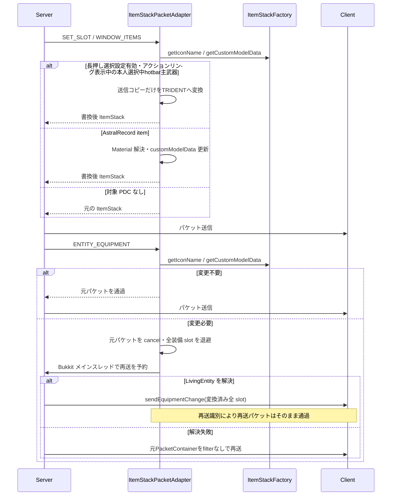
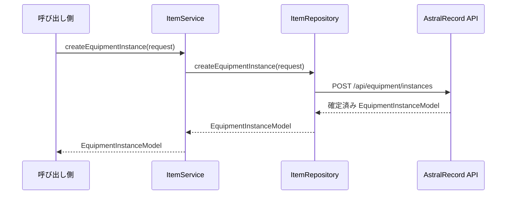
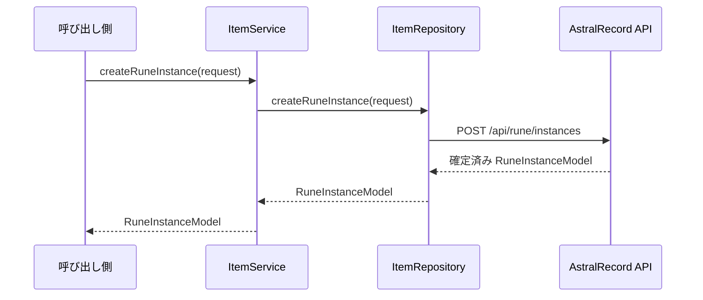
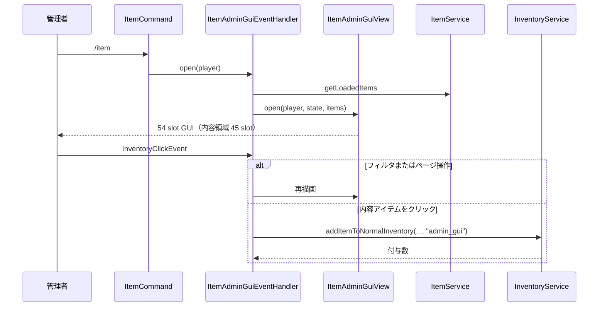
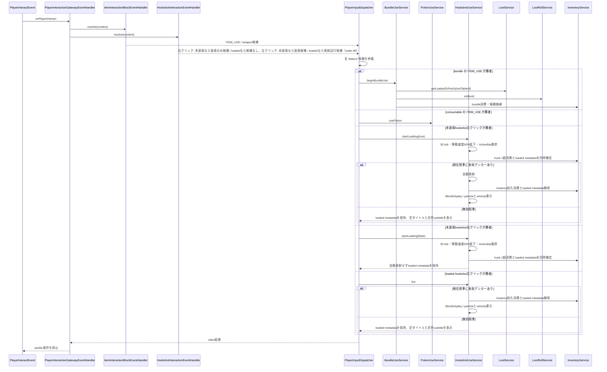
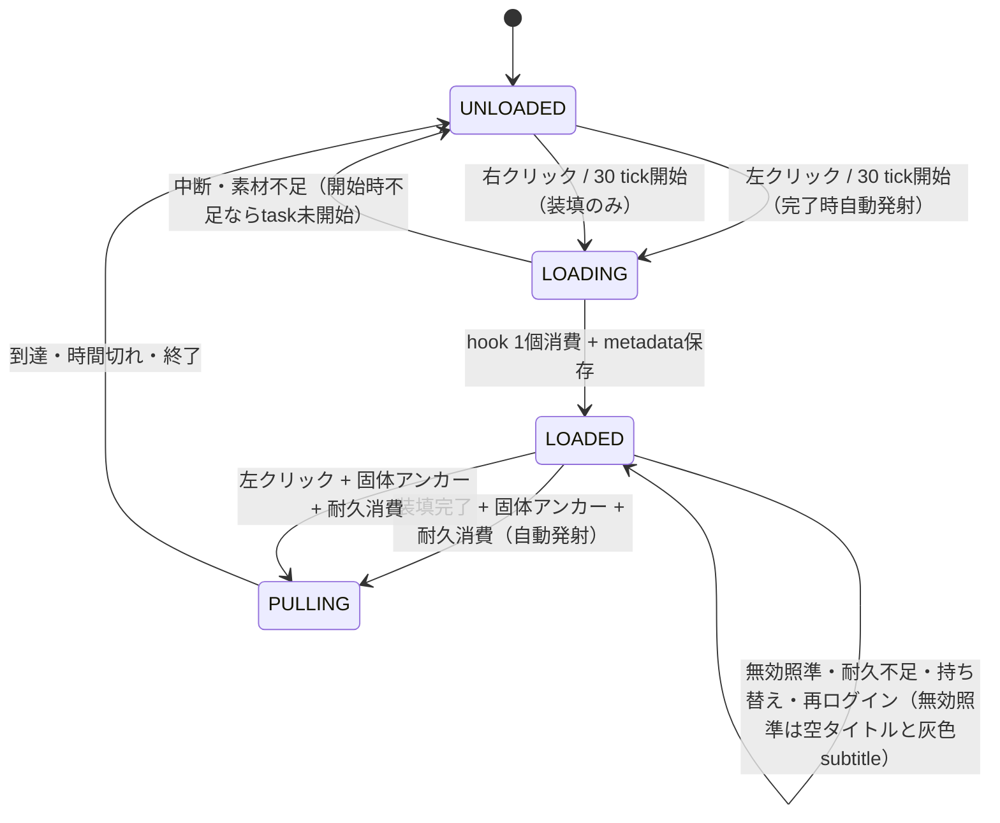
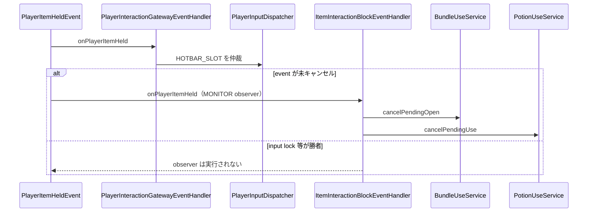

# 04_4-統合フロー

## 1. 起動時のアイテム一括ロード

### シーケンス

### 処理要点

- plugin 起動時に一覧 API と各 summary の詳細 API を呼び、`ConcurrentHashMap` の ID key キャッシュへ登録する。
- `ItemStackFactory` のテンプレートは item キャッシュと別管理し、必要時に生成する。

### 例外・終了条件

- カテゴリ単位の取得結果と失敗は `LogId.I_5202` / `I_5203` / `E_5202` 等で記録する。

## 2. `/item get` による付与

### シーケンス

### 処理要点

- `/item get` は起動時または `/item load` でロード済みのキャッシュだけを参照し、API 取得を行わない。
- 数量は省略時 `1`、整数化失敗時 `1`、下限 `1` とする。
- 付与数が 0 以下なら `PlayerMsgId.P_5241` を返す。

## 3. 送信 ItemStack のアイコン置換

### シーケンス

### 処理要点

- サーバー側の保存 ItemStack は変更せず、送信時の表示だけを差し替える。
- `ACTION_RING_HOLD_SELECT` が有効な本人では、選択中 hotbar 主武器を `SET_SLOT` / `WINDOW_ITEMS` の送信コピーで `TRIDENT` にする。本人向け `ENTITY_EQUIPMENT` のメインハンド再同期でも同じ変換を適用する。ホットバースロット切り替え、設定変更、インベントリ同期時に選択 slot cache に基づいて inventory を再送し、リングを開く前からクライアントが使用種別を認識できるようにする。プラグイン管理 GUI のセッション終了時は、遷移先 GUI や別インベントリが開いていないことを確認した次 tick にも inventory を再送する。これはクライアントの使用継続・解除入力を得るための仮想化であり、他の hotbar slot、他エンティティの装備、サーバー保存状態には適用しない。
- `SET_SLOT` と `WINDOW_ITEMS` は ProtocolLib の元パケットを送信コピーへ書き換える。
- `ENTITY_EQUIPMENT` は pair-list を直接書き戻さない。変更が必要な場合だけ元パケットを cancel し、Paper API の `Player#sendEquipmentChange` で全 slot を再送して、本人の選択中メインハンドには仮想トライデントを、それ以外のメインハンド・オフハンド・防具にはマスター icon を反映する。
- `LivingEntity` の解決に失敗した場合は、pair-list を書き換えていない元 `PacketContainer` を ProtocolLib listener filter なしで再送する。
- 防具表示設定はパケット受信者を基準とし、本人と受信者が追跡中の他プレイヤーへ同じ表示方針を適用する。
- 再送した `ENTITY_EQUIPMENT` は再送識別により listener の変換対象外とする。
- `resolveMaterial` は Material 解決結果をキャッシュする。

### 例外・終了条件

- 不明な icon Material は `LogId.W_5210` を記録し、元の Material を維持する。

## 4. 装備インスタンス生成

### シーケンス

### 処理要点

- ステータスロールの確定値は API が生成する。
- 作成元 `source` と作成者 `createdBy` をリクエストへ含める。

## 5. ルーンインスタンス生成

### シーケンス

### 処理要点

- ルーンのステータスロール確定値も API を正本とする。
- 作成済みインスタンスは ID 指定の取得 API で再取得できる。

## 6. `/item` 管理者 GUI

### シーケンス

### 処理要点

- `/item` 無引数は usage ではなく ADMIN(99) 専用 GUI を開く。
- カテゴリ・レア度フィルタとページ状態はプレイヤー単位で保持する。
- 左クリックは 1、右クリックは半スタック切り上げ、Shift+左クリックは 1 スタックを付与する。最大スタック 1 の item は常に 1 となる。
- 表示 ItemStack は shop 表示と同じ未確定範囲 Lore を使い、付与成功後も GUI を閉じない。

### 例外・終了条件

- 権限不足、対象不明、付与不能のクリックは拒否し、付与不能時は `PlayerMsgId.P_5241` と拒否音を返す。

## 7. クリック item 使用

### シーケンス

### 処理要点

- resolver は副作用なしで候補を返し、dispatcher が選んだ一件だけを実行する。
- hookshot は未装填の右クリックで装填のみの候補、未装填の左クリックで装填候補、loaded状態の左クリックで発射試行候補を返す。loadedまたは装填中の右クリックは候補を返さない。候補は `stableOrder=80` で既存独自world操作の `10`～`70` の後、generic vanilla block の `90` の前に位置付ける。的なしの発射試行はloaded状態を保持し、空タイトルと灰色subtitleで不命中を表示する。装填開始時にhookが不足している場合は装填taskを開始せずエラーを表示する。
- bundle は `loot_table:` 接頭辞を正規化して loot を解決し、各 content の確率と pool の `pick` 上限を `LootRollService` で処理する。
- 報酬は AstralRecord inventory へ格納する。現実装では収容できなかった残数を生成せず破棄するため、改善方針は [[04_9-未決事項]] で管理する。
- 成功時はサマリー、各報酬名と個数、表示・音・パーティクルを提示する。
- hookshotは左クリックまたは右クリックで装填を開始し、装填開始前にhook 1個の所持を確認する。不足時は装填taskを開始せずエラーを表示する。装填完了時だけhookを1個消費する。左クリック装填は完了後に有効アンカーがあれば自動発射し、右クリック装填は自動発射せずloaded状態を保持する。発射時だけ耐久を消費してloaded状態を外す。照準が無効、または耐久不足ならloaded状態を保持し、無効照準では空タイトルと灰色subtitleを表示する。牽引は`Player#setVelocity`の速度補正だけで行い、座標teleportは使わない。

### フックショット状態

### 例外・終了条件

- loot または報酬 item を解決できない場合は bundle を消費せず失敗する。
- 勝者 executor の拒否・失敗・例外後に、別候補へ fallback しない。

## 8. HOTBAR_SLOT 後の使用待機解除

### シーケンス

### 処理要点

- `ItemInteractionBlockEventHandler.onPlayerItemHeld` は候補を返さない非競合 observer とする。
- 実際に hotbar 変更が成立した場合だけ bundle / potion の使用待機を解除する。
