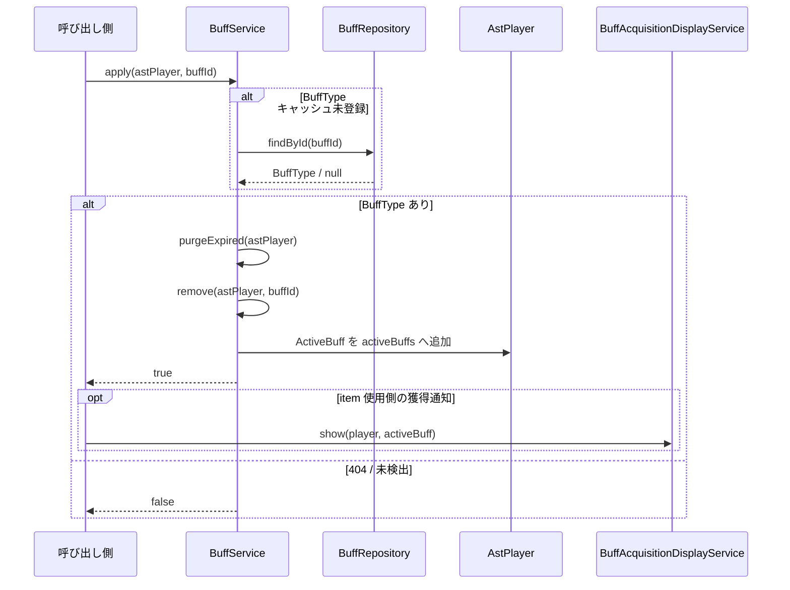
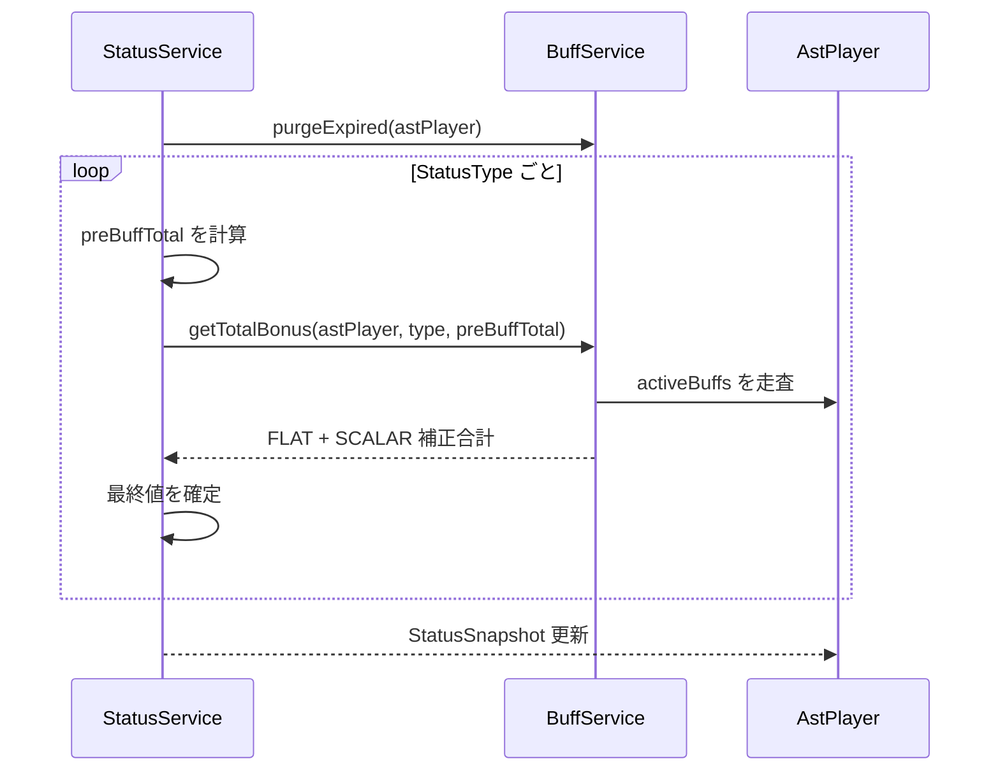
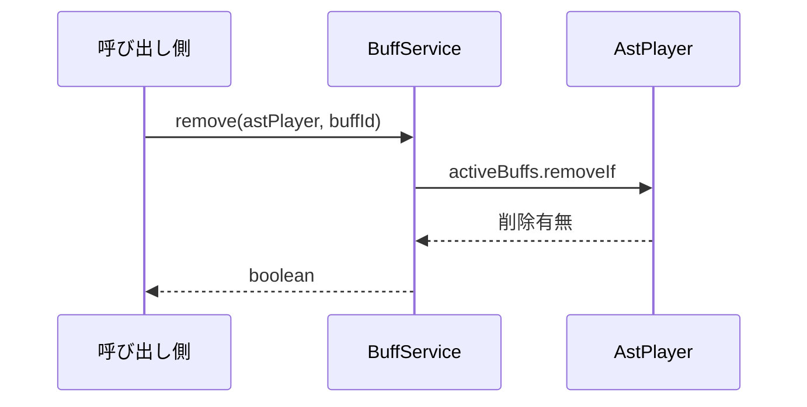

# 05_4.00-統合フロー

## 1. バフ付与

### シーケンス

### 処理要点

- 同一 `buffId` は重複保持せず、既存エントリを削除して開始・終了時刻を更新する。
- BUFF consumable は `PotionUseService` から `StatusService.applyBuff` を経由して付与し、成功時に獲得通知を表示する。
- `BuffAcquisitionDisplayService.show` は既存通知を破棄し、視界右下へ残時間と先頭 modifier を表示する。

### 例外・終了条件

- API の 404 は未検出として `false` を返す。
- 404 以外の API 例外は呼び出し元へ伝播する。

## 2. ステータス再計算時のバフ反映

### シーケンス

### 処理要点

- `FLAT` は定数加算、`SCALAR` は `preBuffTotal * value` として加算する。
- 期限切れエントリを除外してから全有効バフの対象 `StatusType` を合算する。

## 3. バフ解除

### シーケンス

### 処理要点

- `buffId` が一致するアクティブバフをすべて削除する。
- 戻り値は 1 件以上削除した場合だけ `true` とする。
