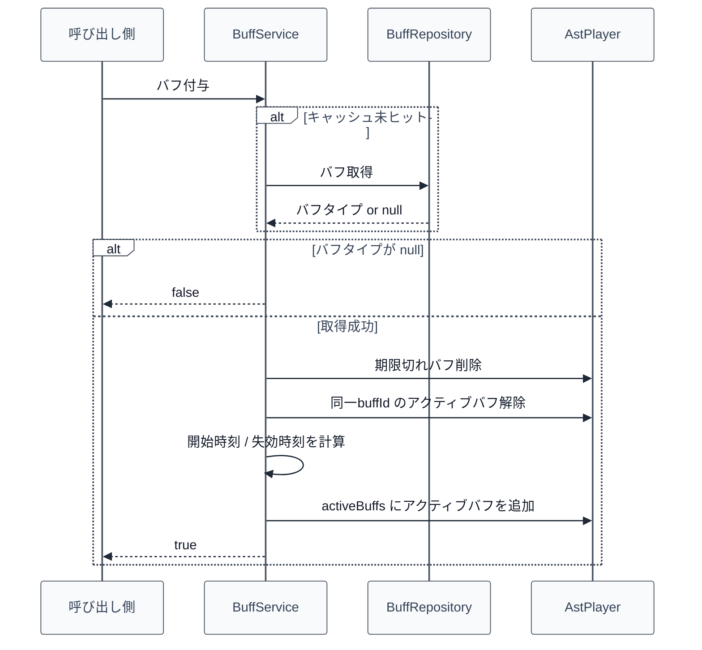

# 05_4.00-統合フロー

## 1. バフ付与（service -> repository -> AstPlayer）

物理名対応:

- バフ付与: `apply`（`BuffService`）
- バフ取得: `findById`（`BuffRepository`）
- 期限切れバフ削除: `purgeExpired`（`BuffService`）
- バフ解除: `remove`（`BuffService`）

## 2. ステータス再計算時のバフ反映（status -> buff）

1. `StatusService.refreshStatus` がプレイヤーの期限切れバフ削除を実行する
2. 各 `StatusType` ごとにベース値 + 非バフ補正の合計（preBuffTotal）を算出する
3. `StatusService.getBonusValue` 内で [[05_3.02-サービス]].バフ補正合計取得 を呼ぶ
4. `BuffService` は SCALAR 補正に `preBuffTotal` を乗算した値と FLAT 補正の合計を返す
5. `StatusService` が `非バフ補正 + バフ補正` を最終 bonus として確定する

物理名対応:

- バフ補正合計取得: `getTotalBonus`（`BuffService`）
- 期限切れバフ削除: `purgeExpired`（`BuffService`）

## 3. バフ解除（service -> AstPlayer）

1. 呼び出し側が [[05_3.02-サービス]].バフ解除 を呼ぶ
2. `AstPlayer.activeBuffs` から `buffId` 一致エントリを `removeIf` で削除する
3. 削除有無を `boolean` で返す

物理名対応:

- バフ解除: `remove`（`BuffService`）
