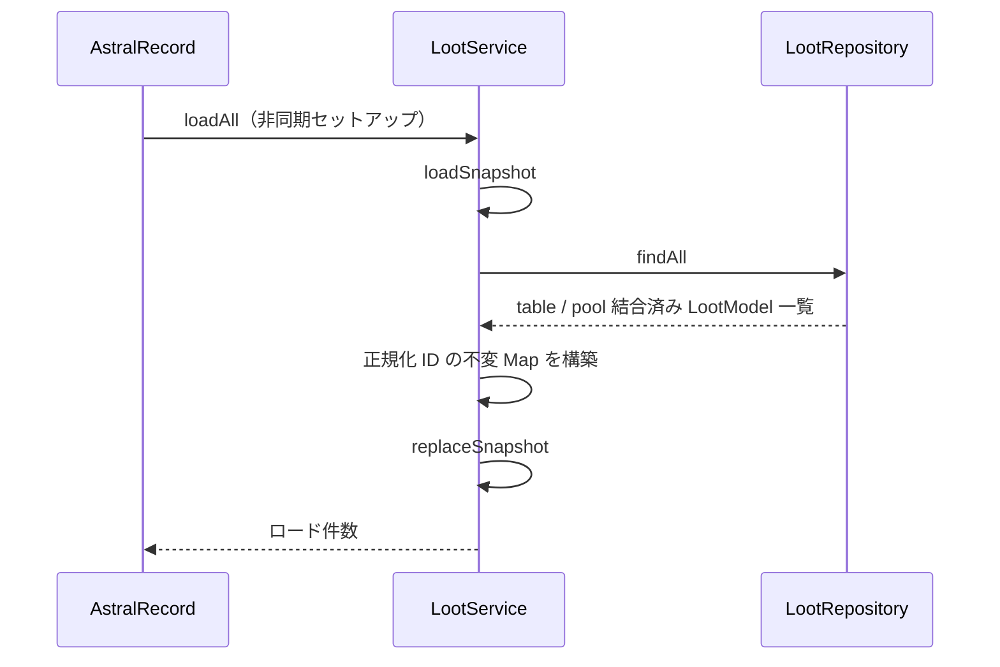
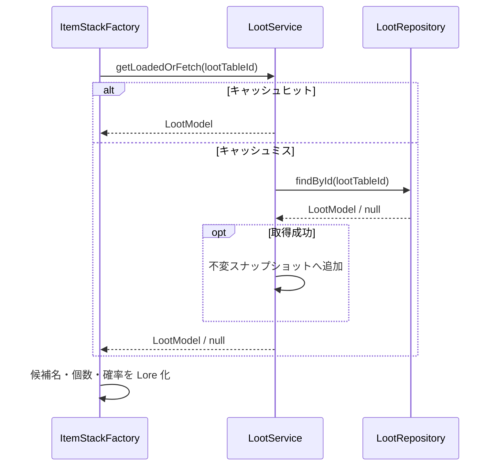
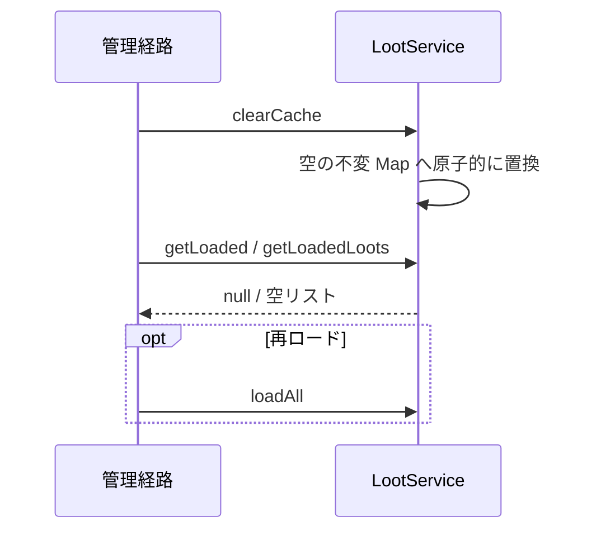
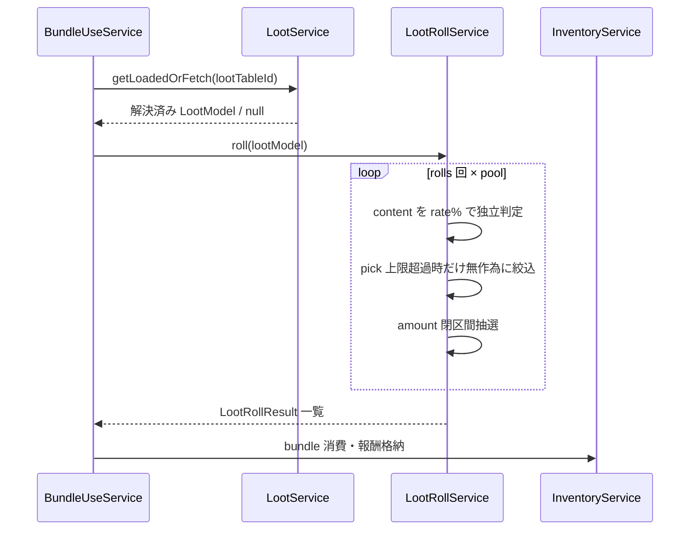
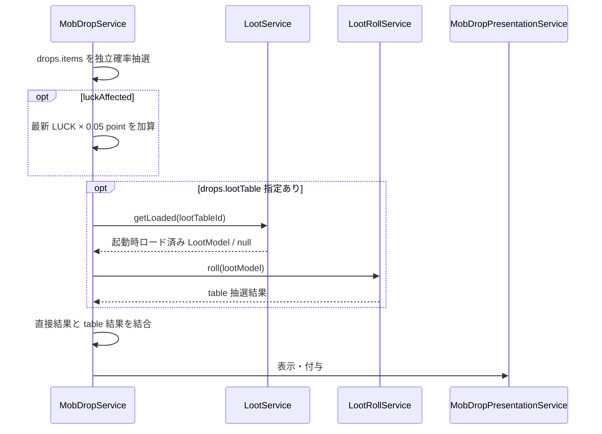

# 06_4.00-統合フロー

## 1. 起動時の一括ロード

### シーケンス

### 処理要点

- 全件取得が完了するまで公開中キャッシュを変更せず、構築済み不変 Map を一回で `volatile` 参照へ公開する。
- `loadSnapshot` と `replaceSnapshot` を分離し、master reload の prepare / commit に利用できる。
- ID は trim、接頭辞除去、小文字化してキャッシュキーにする。

### 例外・終了条件

- `loadAll` は例外を `LogId.E_5301` で記録し、既存スナップショットを維持して `0` を返す。

## 2. バンドル Lore 表示時の参照

### シーケンス

### 処理要点

- `appendBundleLootLore` はキャッシュ優先で参照し、未ロード時には同期的な単件 API 取得を試みる。
- 解決済みの場合は候補 item の表示名と個数を中心に表示し、loot table 名や item ID を通常表示しない。

### 例外・終了条件

- 未検出または API 例外時は `◆ ルート情報: <lootTableId> (未取得)` を表示する。
- API 例外は `LogId.E_5301` に記録し、`getLoadedOrFetch` は `null` を返す。

## 3. キャッシュクリアと再ロード

### シーケンス

### 処理要点

- 参照中 Map を変更せず、空 Map への参照置換でクリアする。
- 再ロード完了まではキャッシュ参照結果が空になる。

## 4. bundle 開封抽選

### シーケンス

### 処理要点

- `rolls`、`pick`、`amount` は min / max を並べ替えた閉区間から実行ごとに選ぶ。
- rate は `0..100` に clamp し、全候補失敗による報酬なしを許容する。
- inventory に入らない報酬の現行処理と改善方針は item feature の [[04_2.00-ユースケース]] / [[04_9.00-未決事項]] を正本とする。

## 5. Mob・採集ドロップ

### シーケンス

### 処理要点

- Mob・採集のドロップ確定中は `getLoaded` だけを使い、API I/O を行わない。
- Mob は撃破地点、採集は採集オブジェクト地点を表示・付与起点とする。
