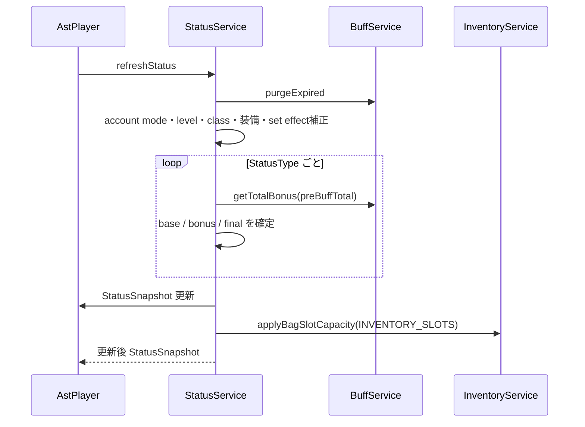
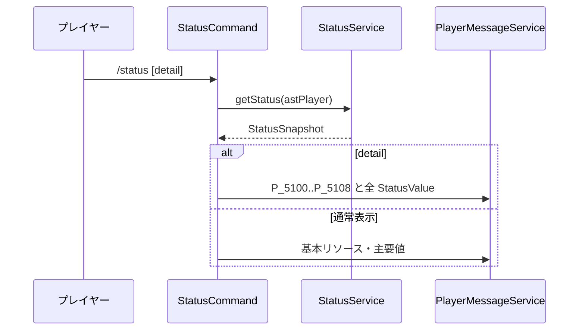
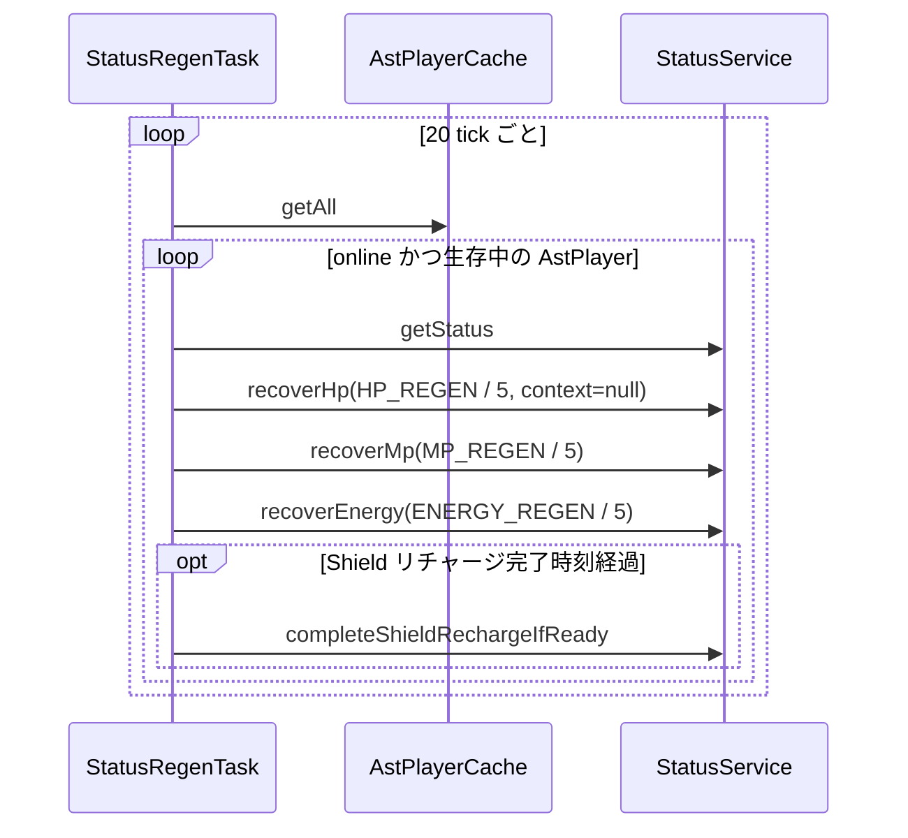
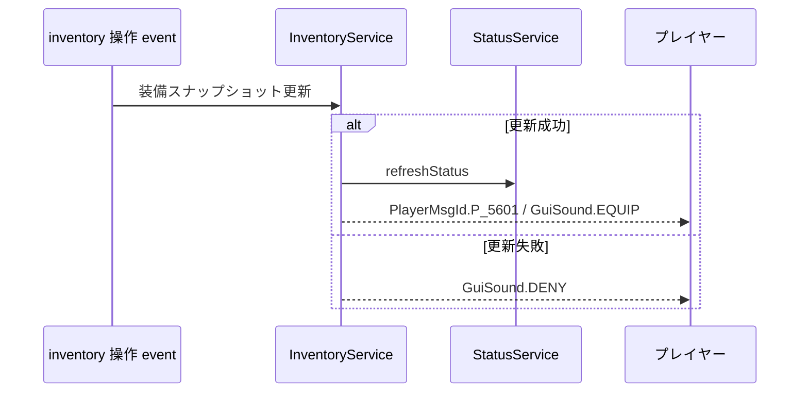
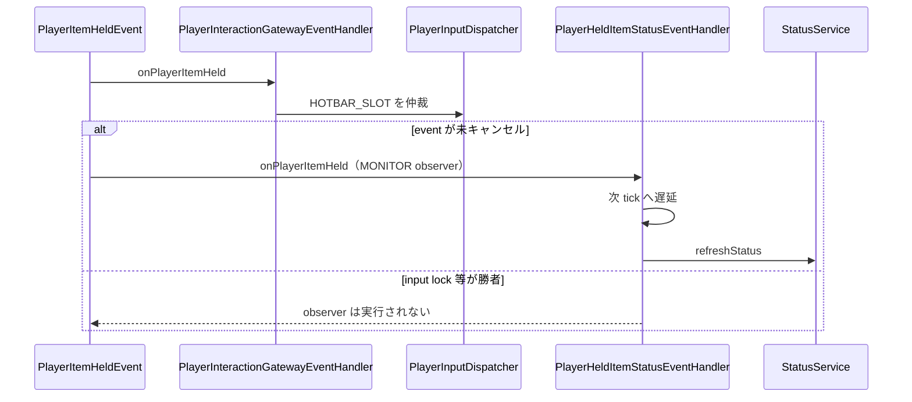

# 07_4-統合フロー

## 1. ステータス再計算

### シーケンス

### 処理要点

- `MAX_HEALTH` / `MAX_MANA` / `MAX_ENERGY` / `MAX_SHIELD` の最大値を再計算する。`MAX_SHIELD` は上限候補として保持する。
- シールドアクティベートの使用許可とパッシブ設定が揃わない場合は現在 Shield を `0` とし、既存のShieldリチャージ状態を破棄する。揃っている場合だけ、既存スナップショットの現在 Shield を新最大値へ clamp して引き継ぐ。
- 既存セッションでシールドアクティベートを無効から有効へ変化させた場合、または `MAX_SHIELD` が 0 以下から正数へ変化した場合は現在 Shield を 0 のまま維持し、開始時点の `SHIELD_RECHARGE_REDUCTION` を固定した Player 基礎30秒の通常全回復を開始する。正数の `MAX_SHIELD` が上昇した場合も増加を検知し、現在 Shield が正数かつ新しい最大値未満なら設定済みパッシブの段階リチャージを開始し、現在 Shield が0なら通常全回復を開始する。正数から 0 へ変化した場合はリチャージ状態と表示capacityを破棄し、再装備でも即時満タンにはしない。Shield破壊時の通常全回復は再充填パッシブの設定値から独立する。
- 初回スナップショットは HP / MP / ENG を最大値へ設定し、シールドアクティベートが有効な場合だけShieldを最大値へ設定する。
- `INVENTORY_SLOTS` の最終値は BAG の実効容量へ反映する。

### 例外・終了条件

- status 未初期化時の `getStatus` は `refreshStatus` を呼び、必ずスナップショットを返す。

## 2. `/status` 表示

### シーケンス

### 処理要点

- `/status` と `/status detail` を提供し、`StatusType` の表示名、カテゴリ色、単位、小数桁を使って整形する。
- Shield の最大値は `MAX_SHIELD` として status 値一覧に含まれる。

## 3. 定期自然回復

### シーケンス

### 処理要点

- HP / MP / ENG の regen 値は「5秒あたり」のため、1秒 task では `1/5` を回復する。
- HP 自然回復は常時回復のため、回復数値の TextDisplay と HP 回復チャット通知を発生させない。
- シールドアクティベートが有効なShieldの破壊時、同スキルの有効化後、または `MAX_SHIELD` 0 以下から正数への遷移時に現在Shieldが0の場合は、パッシブ設定にかかわらず基礎30秒を使い、開始時点の `SHIELD_RECHARGE_REDUCTION` を `0..100%` に clamp して一度だけ短縮する。正数の `MAX_SHIELD` 上昇時に現在Shieldが残り、新しい最大値未満の場合は設定済みパッシブの待機時間と毎秒回復量を使う段階リチャージを開始する。
- 設定済みパッシブの待機秒数と `rechargeAmount` は、シールドアクティベートが有効で、Shieldダメージ後または正数の `MAX_SHIELD` 上昇後も現在Shieldが残る段階回復状態だけに適用する。段階回復は最大値到達時に状態を破棄し、通常状態は待機完了時に `MAX_SHIELD` を一括設定する。無効化中は完了処理を行わない。
- 攻撃による追加秒数には、追加時点の被ダメ側短縮率を毎回適用する。

### 例外・終了条件

- オフライン・死亡状態ではリチャージ状態を破棄する。完了処理は状態を先に取り除くため二重付与しない。

## 4. インベントリ変更時の装備反映

### シーケンス

### 処理要点

- 通常 hotbar の slot `0..7` を装備割当、slot `8` を inventory 切替に使用する。
- 切替対象は所持数 1 以上の通常 item（ルーンを含む）または `EQUIPMENT` とする。
- hotbar、offhand、防具、装備可能 item の変更後に装備スナップショットを更新し、成功時だけ status を再計算する。

## 5. HOTBAR_SLOT 変更後の status observer

### シーケンス

### 処理要点

- observer は入力候補を返さず、入力所有権や勝者選択に影響しない。
- 次 tick に遅延し、選択後の main hand item を含めて status を再計算する。
