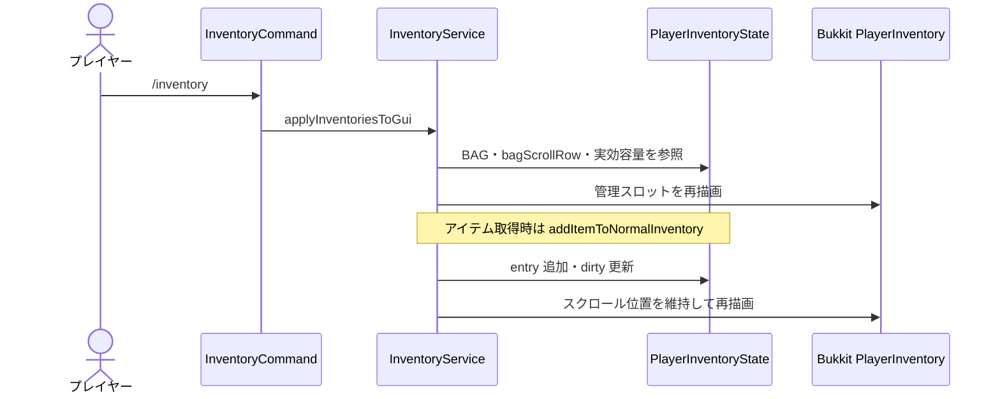
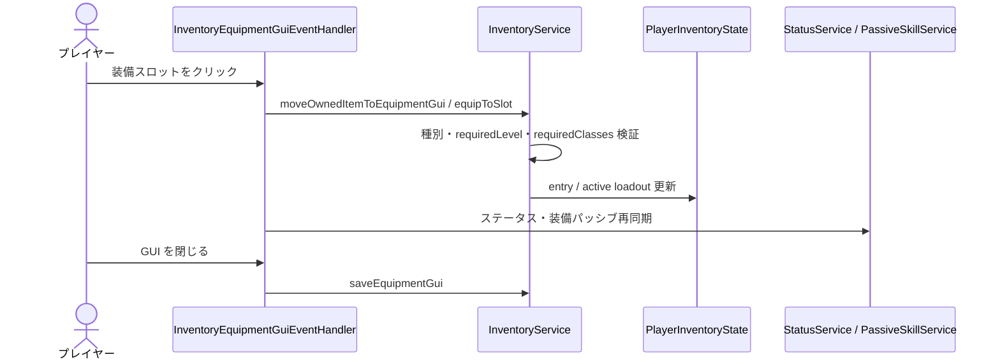
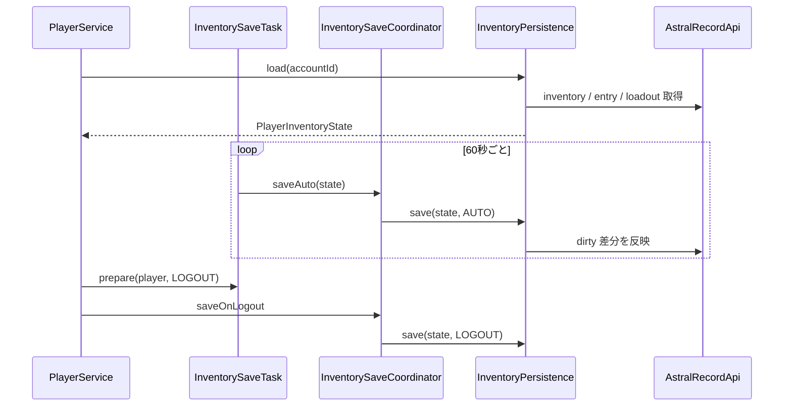
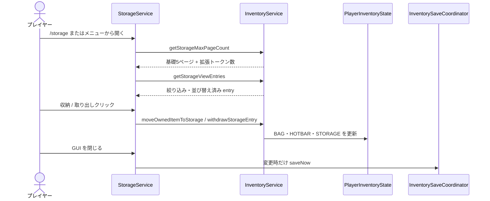

# 08_4-統合フロー

## 1. 所持品表示とアイテム取得

### シーケンス

### 処理要点

- 通貨は `CURRENCY`、それ以外は原則 `BAG` に格納する。
- BAG の空き判定は `INVENTORY_SLOTS` の実効容量内だけで行い、容量外 entry は移動・破棄のみ許可する。
- 装備は instanceId を保持し、通常アイテム（ルーンを含む）は既存 stack と統合する。
- 非同期で装備個体を生成する経路は、API 呼出し前に BAG slot を予約し、予約済み slot を他の追加・移動処理から除外する。

### 例外・終了条件

- state 未登録または対象外モードでは表示を開始しない。
- 容量不足時の通知と未取得アイテムの扱いは呼び出し元の報酬契約に従う。Mob / gathering ドロップは [[12_3-戦闘]].ドロップ配布対象と演出 を正本とする。

## 2. 装備 GUI 編集

### シーケンス

### 処理要点

- 防具とオフハンドは Bukkit 装備へ反映し、種類別アクセサリは仮想装備として state / loadout に保持する。
- `ACCESSORY_SLOT.slotIndex 1..10` は loadout の `ACCESSORY.slotIndex 0..9` に対応する。
- `PlayerItemHeldEvent` observer は入力調停後の未 cancel イベントだけを装備 GUI 表示へ反映する。

### 例外・終了条件

- 装備条件またはアクセサリ tag が不一致なら state を変更せず、理由を通知する。
- 100ms の click guard を取得できなければ操作を無音で打ち切る。

## 3. join・autosave・logout

### シーケンス

### 処理要点

- Bukkit API を読む snapshot 取得はメインスレッド、API 永続化は非同期キューで行う。
- 同一アカウントの保存は直列化し、autosave 要求は coalesce する。
- logout 保存失敗時は retained state を残し、再ログイン時に新 state より先に未保存差分を調停する。

### 例外・終了条件

- 保存失敗時は dirty を復元し、次回保存対象に戻す。
- plugin disable 時は新規保存受付を閉じ、待機上限を超えた場合 `W_5257` を出力する。

## 4. ストレージ収納・取り出し

### シーケンス

### 処理要点

- 左クリックは1個、右クリックは半分、Shift+左は1 stack、Shift+右は空き容量までの全量を対象とする。
- Shift+右収納は BAG・HOTBAR 全体の同一通常アイテムを対象とし、個体 ID 付きアイテムは統合しない。
- ストレージの収納上限は基礎5ページ（225 entry）で、`CURRENCY` inventory にある `storage_expansion_token` 1個ごとに1ページ加算する。通常アイテムを既存の同一 storage entry へ統合できる場合を除き、実効容量に達した新規 entry 追加は拒否する。
- BAG の entry が全量移動で消えた場合は、容量外 entry を含む後続 entry を表示順のまま前詰めする。部分移動と HOTBAR の固定位置は変更しない。
- フィルター、ソート、ページ状態は GUI holder の値を引き継いで再描画する。

### 例外・終了条件

- 取り出し先に空きがなければ state を変更しない。
- GUI を変更せず閉じた場合は即時保存を行わない。
