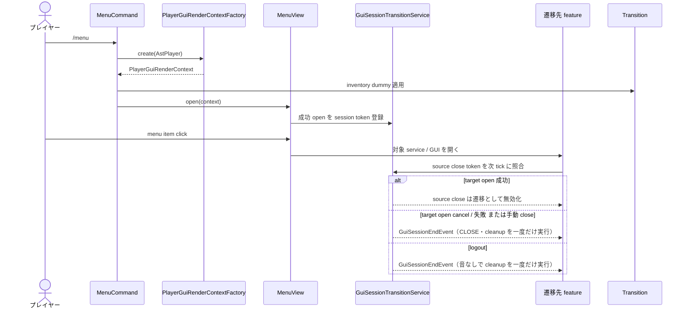
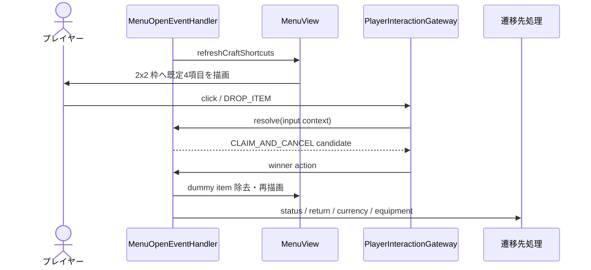
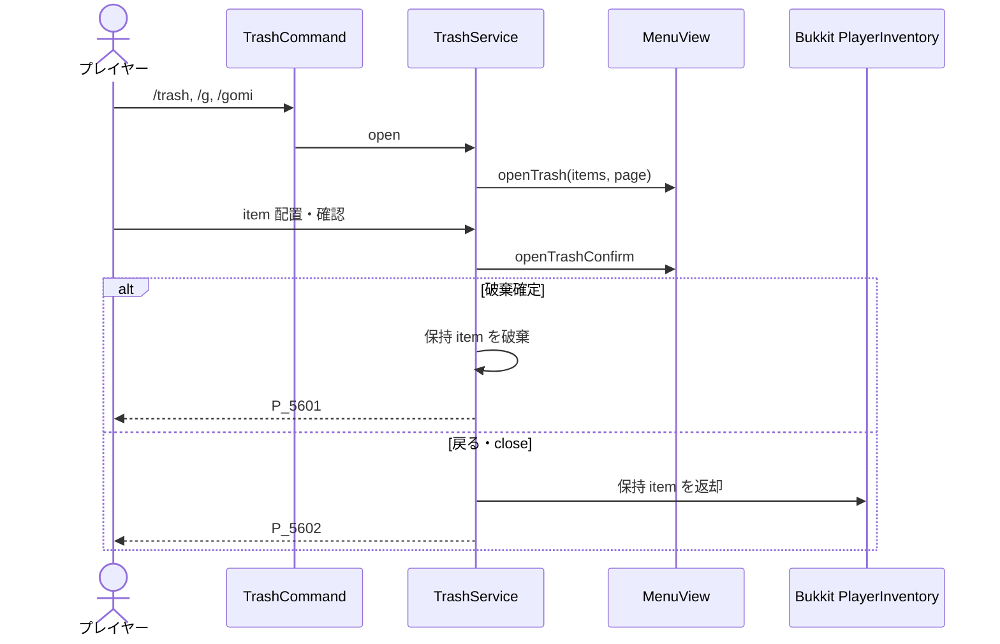

# 09_4-統合フロー

## 0. 参加時メニュー導線

プレイヤー参加時の非同期ロード中に、選択アカウントの CURRENCY インベントリから `nox_city_pass` を確認する。未所持の場合は `nox_menu_tool` の装備インスタンスを準備し、メインスレッドで `nox_menu_tool` を先に通常インベントリへ追加し、その後 `nox_city_pass` を CURRENCY インベントリへ追加する。通行証を所持している場合は追加処理を行わない。参加処理が中断・失敗した場合は、準備済みで未登録の装備インスタンスを削除する。

`nox_menu_tool` は `EQUIPMENT` の `TOOL` であり、共有タグ `MAIN_MENU` を持つ。共通入力 gateway は右クリックを検出すると、既存のメインメニュー表示へ委譲する。

## 1. メインメニュー表示・画面遷移

### シーケンス

メインメニューのクエスト項目（slot `23`）は`QuestGuiEventHandler.openList`へ切り替え、既存のクエスト一覧GUIで受領中クエストを表示する。クエスト一覧の項目クリックは`QuestService.abandon`へ委譲し、成功時に一覧を再描画する。

### 処理要点

- 画面は `MenuInventoryHolder.screen` で識別し、ページ・detail ID を holder へ保持する。
- 画面間遷移では session token で source close を評価する。遷移成功時は `CLOSE` と feature 固有 cleanup を実行せず、cancel・失敗・手動 close 時だけ終了を一度確定する。
- logout は active session を音なしで一度だけ終了し、ゴミ箱・売却・ストレージ・dummy inventory などの共通 cleanup を `GuiSessionEndEvent` へ委譲する。
- 業務処理は遷移先 feature へ委譲し、menu は表示と navigation に限定する。

### 例外・終了条件

- gameplay player でなければ menu を開かない。
- menu open の例外は `E_5600`、shared GUI 操作の例外は `E_5601`（`player`, `operation`）として記録し、Bukkit event loop へ送出しない。

## 2. クラフトショートカット

### シーケンス

### 処理要点

- shortcut は gameplay player にだけ表示し、現行値は `MenuShortcutSettings.defaults()` 固定とする。
- DROP 入力は player-interaction の勝者選択を経由する。
- spawn / pickup された shortcut marker item は削除し、world item 化を防ぐ。

### 例外・終了条件

- `CRAFTING` view でない場合は再描画しない。
- quit・world 変更・plugin disable では shortcut と一時状態を除去する。

## 3. ゴミ箱確定・返却

### シーケンス

### 処理要点

- 確認前の item は GUI が保持し、意図しない close では必ず返却する。
- page 移動と確認遷移でも保持 item を新しい inventory へ引き継ぐ。

### 例外・終了条件

- inventory に戻せない item はプレイヤー位置へ drop し、消失させない。
- content placeholder は item として扱わない。
