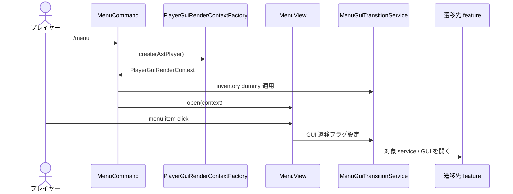
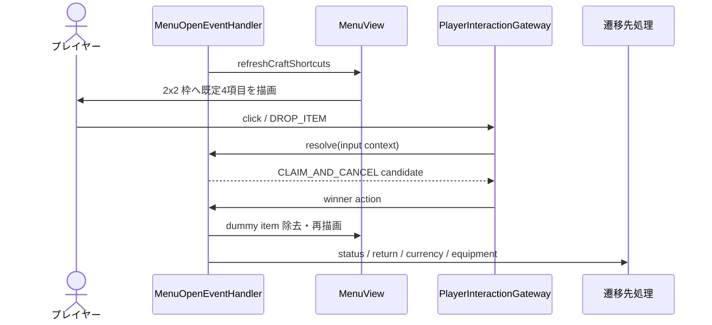
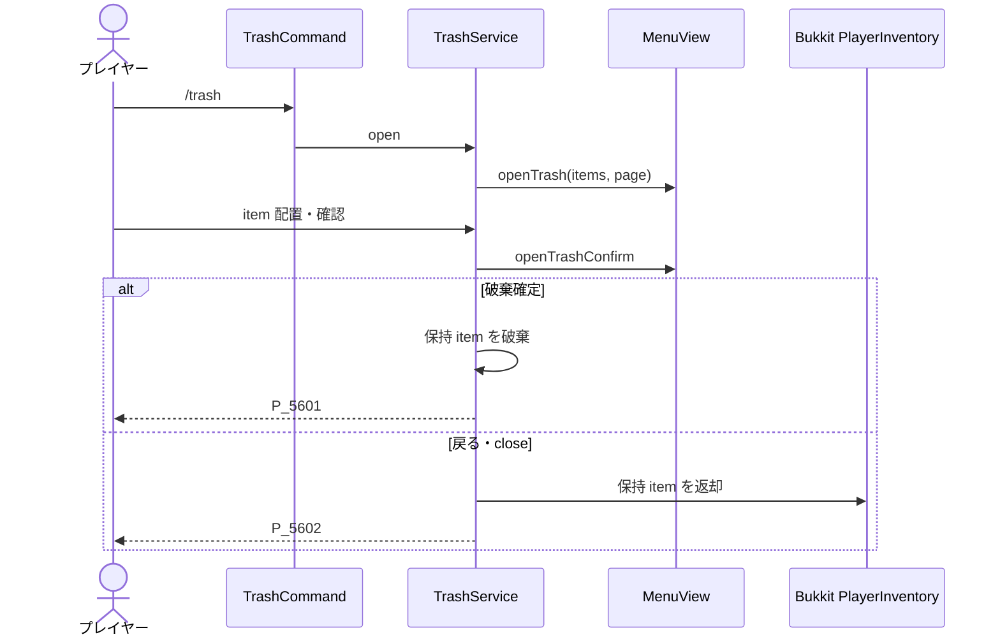

# 09_4-統合フロー

## 1. メインメニュー表示・画面遷移

### シーケンス

### 処理要点

- 画面は `MenuInventoryHolder.screen` で識別し、ページ・detail ID を holder へ保持する。
- 画面間遷移では close event による inventory 再ロードと close sound を一度だけ抑止する。
- 業務処理は遷移先 feature へ委譲し、menu は表示と navigation に限定する。

### 例外・終了条件

- gameplay player でなければ menu を開かない。
- menu open の例外は `E_5600`、shared GUI 操作の例外は `E_5601`（`player`, `operation`）として記録し、Bukkit event loop へ送出しない。

## 2. クラフトショートカット

### シーケンス

### 処理要点

- shortcut は gameplay player にだけ表示し、現行値は `MenuShortcutSettings.defaults()` 固定とする。
- DROP 入力は player-interaction の勝者選択を経由する。
- spawn / pickup された shortcut marker item は削除し、world item 化を防ぐ。

### 例外・終了条件

- `CRAFTING` view でない場合は再描画しない。
- quit・world 変更・plugin disable では shortcut と一時状態を除去する。

## 3. ゴミ箱確定・返却

### シーケンス

### 処理要点

- 確認前の item は GUI が保持し、意図しない close では必ず返却する。
- page 移動と確認遷移でも保持 item を新しい inventory へ引き継ぐ。

### 例外・終了条件

- inventory に戻せない item はプレイヤー位置へ drop し、消失させない。
- content placeholder は item として扱わない。
