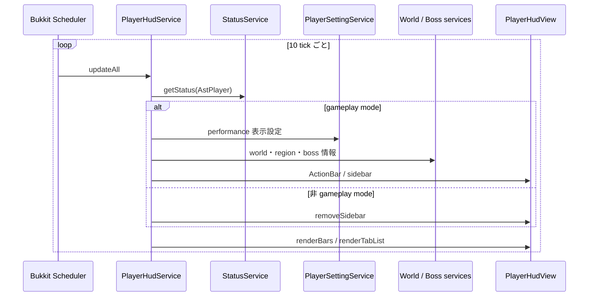
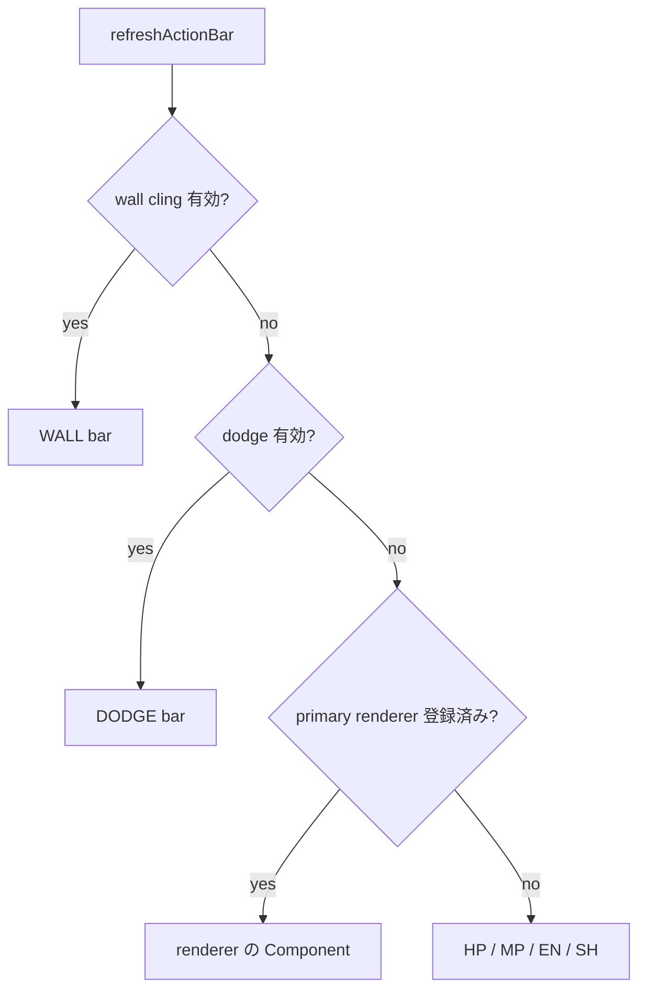

# 10_4.00-統合フロー

## 1. HUD 周期更新

### シーケンス

### 処理要点

- Bukkit 表示更新は同期 task で行う。
- offline session は読み飛ばす。
- gameplay mode の判定は ActionBar と sidebar に適用し、vanilla bar と tab list は全 online session に適用する。

### 例外・終了条件

- `start` 済みの場合は二重 task を作らない。
- `stop` は主 task と一時 ActionBar task をすべて cancel する。

## 2. ActionBar 上書きと復帰

### シーケンス

### 処理要点

- dodge / wall は 1 tick 周期の一時 task で残り割合を更新する。
- 一時 task 終了時は `refreshActionBar` を呼び、primary renderer を含む現在の優先順位を再評価する。
- primary renderer は caller が登録・解除し、HUD は renderer の用途を解釈しない。

### 例外・終了条件

- plugin 未起動、非 gameplay mode、offline player には一時表示を開始しない。
