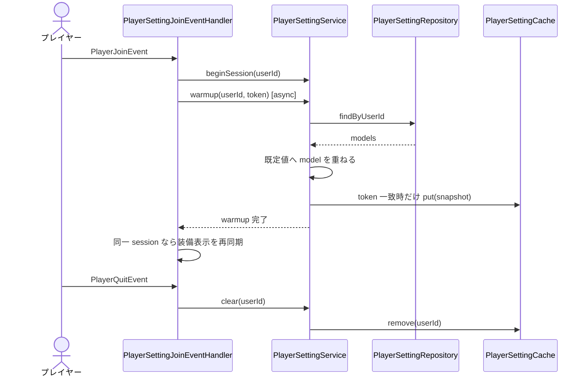
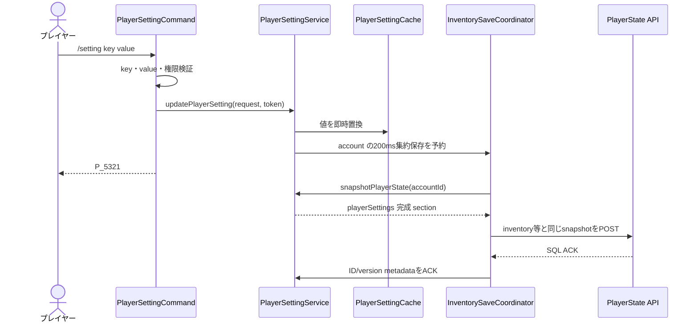
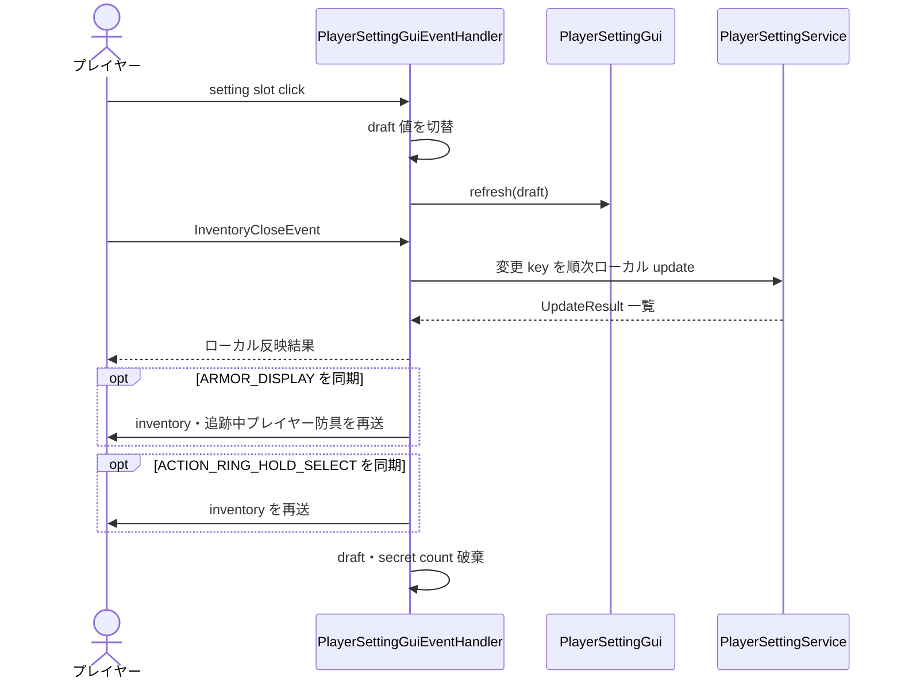

# 11_4-統合フロー

## 1. login warmup・logout cleanup

### シーケンス

### 処理要点

- API I/O は非同期で行い、cache 参照は同期で完結する。
- session token は再ログイン後に旧 warmup が cache を上書きすることを防ぐ。
- warmup 完了後の装備表示再同期は Bukkit メインスレッドで行う。

### 例外・終了条件

- load 失敗時は全 key の既定値 snapshot を使用し、login を止めない。
- token 不一致の完了結果は cache へ登録しない。

## 2. コマンド更新・完成状態保存

### シーケンス

### 処理要点

- 設定値と表示は API 往復を待たず Bukkit 操作内で反映する。
- 同一 user/key の連続変更は最新 revision だけを dirty として保持する。
- ACK は捕捉後の新しい値を戻さず、保存済み ID/version metadata だけを更新する。
- stale session は cache と player 通知のどちらも更新しない。

### 例外・終了条件

- service 未初期化、key / value 不正、super mode 権限不足は state を変更せず終了する。
- 通常保存失敗は dirty を保持して共通 backoff の対象にする。channel 境界で SQL ACK を確認できない場合は移動を中止する。

## 3. GUI draft 保存

### シーケンス

### 処理要点

- click ごとの API 書き込みは行わず、close 時に差分をローカル dirty state へ反映する。
- close 内の複数 key は同一 account の200ms保存窓へ集約し、`playerSettings` は全 key の完成状態として保存する。
- secret slot は管理者の 5 連続 click だけを受理する。
- `ARMOR_DISPLAY` のローカル反映値に従って装備表示へ即時反映する。
- `ACTION_RING_HOLD_SELECT` のローカル反映値に従って本人の inventory を即時再送する。

### 例外・終了条件

- close 時に session / `AstPlayer` がない場合は保存しない。
- stale result を受けた時点で後続 key の保存を打ち切る。
