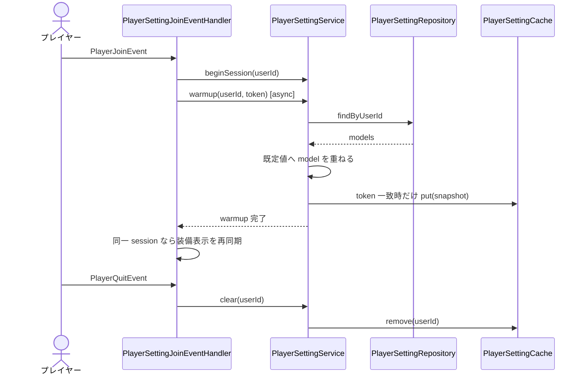
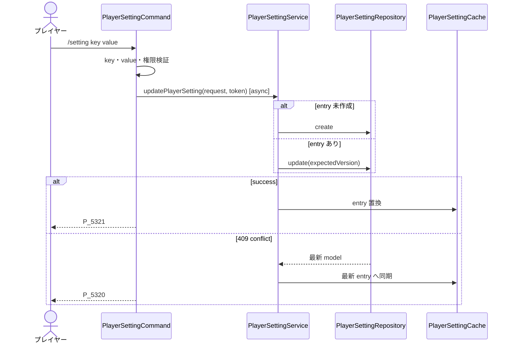
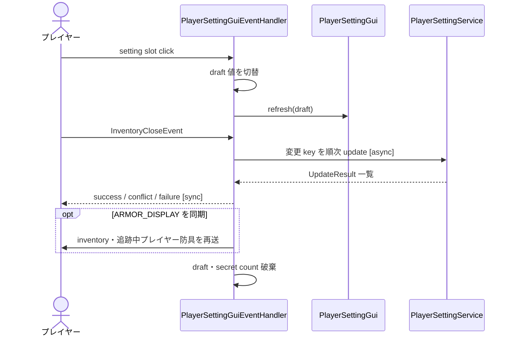

# 11_4-統合フロー

## 1. login warmup・logout cleanup

### シーケンス

### 処理要点

- API I/O は非同期で行い、cache 参照は同期で完結する。
- session token は再ログイン後に旧 warmup が cache を上書きすることを防ぐ。
- warmup 完了後の装備表示再同期は Bukkit メインスレッドで行う。

### 例外・終了条件

- load 失敗時は全 key の既定値 snapshot を使用し、login を止めない。
- token 不一致の完了結果は cache へ登録しない。

## 2. コマンド更新・optimistic lock

### シーケンス

### 処理要点

- callback はメインスレッドへ戻してから player へ通知する。
- stale session は cache と player 通知のどちらも更新しない。

### 例外・終了条件

- service 未初期化、key / value 不正、super mode 権限不足は API を呼ばず終了する。
- API 失敗は `P_5326` を通知する。

## 3. GUI draft 保存

### シーケンス

### 処理要点

- click ごとの API 書き込みは行わず、close 時に差分だけ永続化する。
- secret slot は管理者の 5 連続 click だけを受理する。
- `ARMOR_DISPLAY` の成功・競合結果は cache の確定値に従って装備表示へ即時反映する。

### 例外・終了条件

- close 時に session / `AstPlayer` がない場合は保存しない。
- stale result を受けた時点で後続 key の保存を打ち切る。
