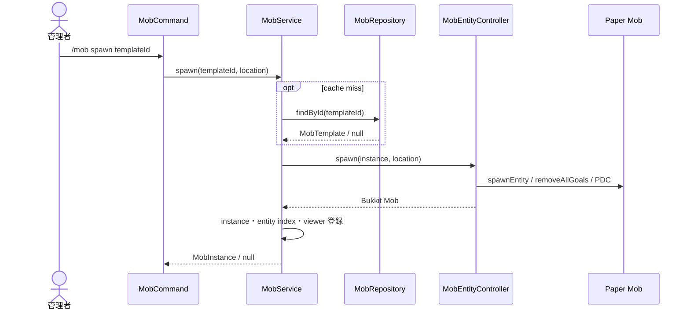
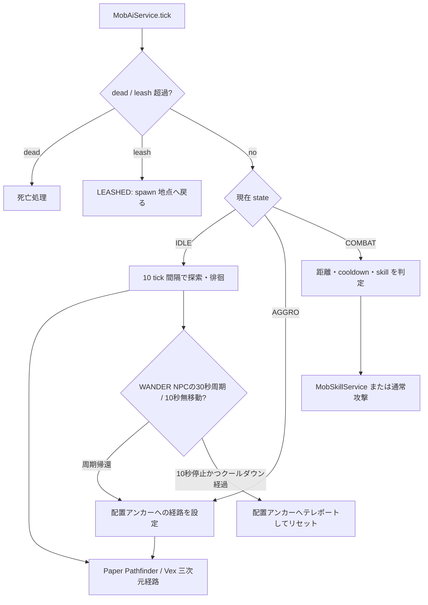
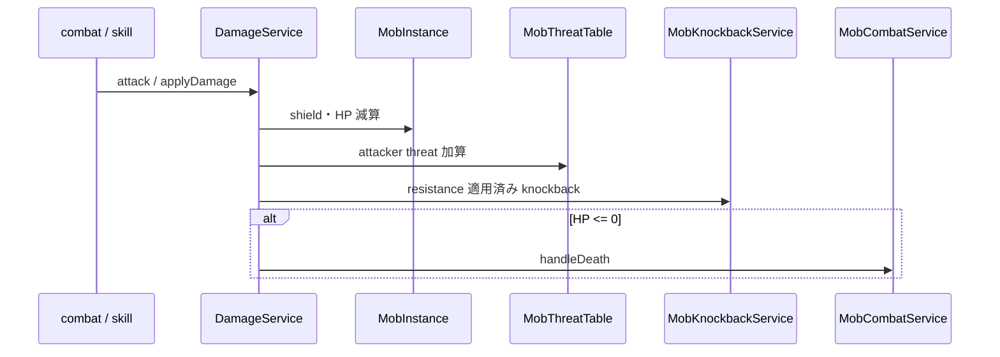
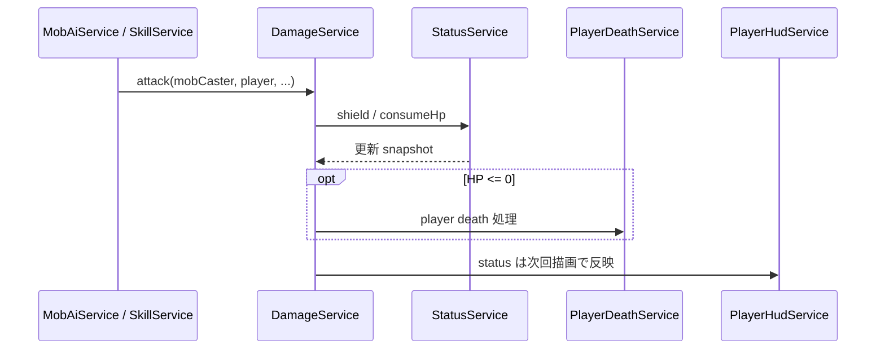
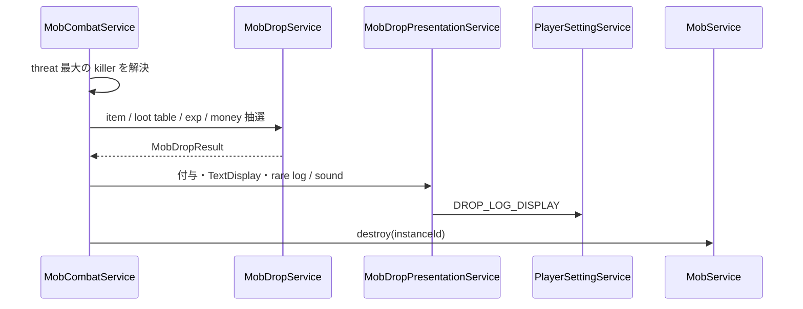
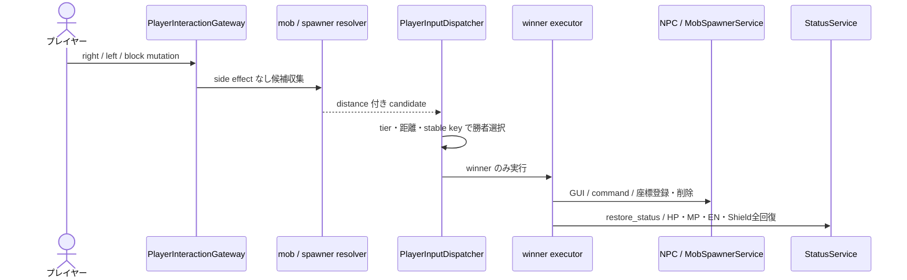
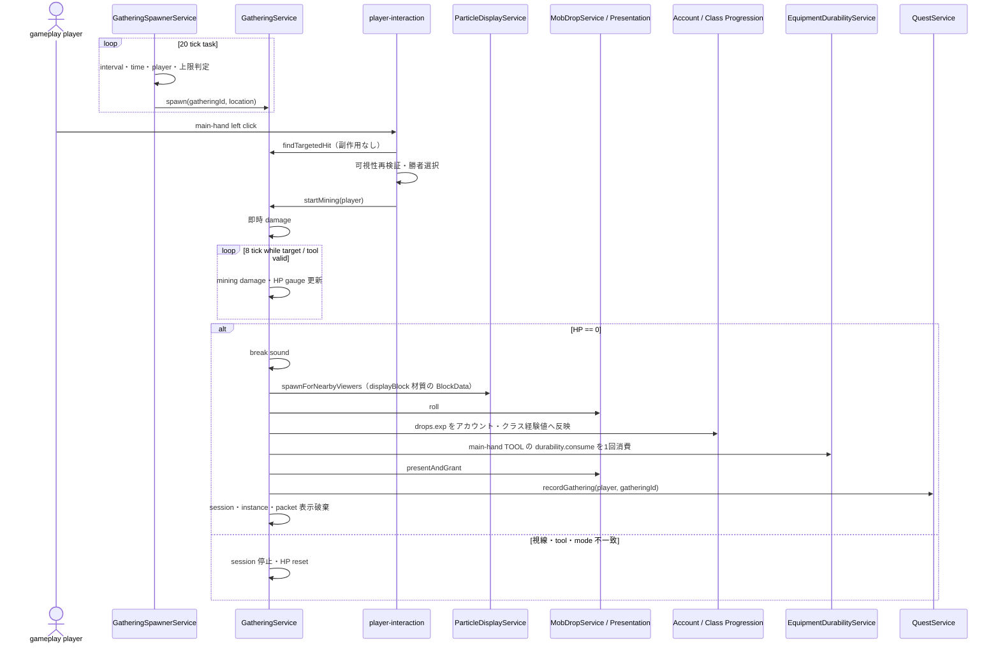

# 12_4-統合フロー

## 1. Mob template load・spawn

### シーケンス

### 処理要点

- `/mob spawn` は `ENEMY` / `BOSS`、保存 NPC は `/mob npc place` に分離する。
- Mob の現在 HP / shield、AI state、threat、spawn location は server session 内だけで保持する。
- 実体は invulnerable とし、バニラ goal とバニラ damage を正本にしない。

### 例外・終了条件

- template 不在または実体生成失敗時は instance index へ登録せず `null` を返す。
- 不明 entity / block type の template は load 対象から除外する。

## 2. AI tick と移動・skill 発動

### シーケンス

### 処理要点

- task 自体は 1 tick、target / path / viewer の重い判定は interval を分散する。
- 地上 Mob の経路は Paper Pathfinder、`VEX` は有界三次元 A* のウェイポイントを毎 tick 追従する。Vex の次 tick 移動線分は実 AABB で衝突検査し、壁・床・天井を横切る速度を適用しない。
- WANDER NPC は 600 tick（30 秒）ごとに配置アンカーへの経路を設定して戻る。現在位置を 10 tick 間隔で観測し、同一目的地へ 200 tick（10 秒）連続で水平移動しない場合だけ詰まりとする。詰まり時の配置アンカーへの緊急テレポートは、前回実行から 3,600 tick（3 分）以上経過している場合に限り行い、クールダウン中はテレポートせず配置アンカーへの経路を再設定する。
- `combat.skills` が利用可能なら `MobSkillService` が Mob 専用 executor を発動し、利用できなければ `normalAttack` へ fallback する。
- `RANGED` / `MAGIC` は近距離で後退し、preferred range 周辺で横移動する。

### 例外・終了条件

- leash、target invalid、deaggro range 超過で IDLE へ戻す。
- instance 単体例外は `W_5702`、tick 全体例外は `E_5702` とし、他 instance の処理を継続する。

## 3. player / skill から Mob への damage

### シーケンス

### 処理要点

- custom damage の正本は `DamageService` と `MobInstance` であり、Bukkit damage event は cancel する。
- shield damage も threat を加算する。
- `damageImmune` NPC は custom combat、built-in attack、skill のいずれでも HP を減算しない。

### 例外・終了条件

- managed victim でない場合は Mob state を変更しない。
- death 済み instance へ重複致死処理を行わない。

## 4. Mob から player への damage

### シーケンス

### 処理要点

- player damage は実装済みで、`StatusService.consumeHp` を通して独自 HP を減算する。
- skill と built-in attack は同じ `DamageService` 経路へ合流する。

### 例外・終了条件

- account mode や無敵条件で対象外の場合は独自 HP を変更しない。

## 5. 致死・drop・破棄

### シーケンス

### 処理要点

- drop 抽選失敗でも death と instance 破棄は確定させる。
- viewer 不在による通常 despawn は討伐 result と drop を発生させない。
- rare log とサウンドは受信者ごとの設定を尊重する。

### 例外・終了条件

- killer を解決できない場合は `W_5703`、drop 例外は `E_5703` を記録する。

## 6. NPC・spawner 入力調停

### シーケンス

### 処理要点

- NPC interaction は `AccountMode.PLAYER` のみ実行し、入力を取得した場合は weapon attack と同時発火させない。
- NPC の `message` / `gui` / `command` / `restore_status` action は winner executor で実行し、`restore_status` は `StatusService.restoreAll` を通して HP / MP / EN / Shield を最大値まで回復する。
- fakeblock NPC は `Interaction` と表示 Entity の二層構造とする。通常 block Material は `BlockDisplay`、`CHEST` / `TRAPPED_CHEST` / `ENDER_CHEST` は元 Material の `ItemDisplay`（`NONE`、`Transformation.translation.y` は `+0.375`、scale `0.75`。world の spawn 座標は変更しない）を使う。spawner は `AccountMode.ADMIN` viewer 向け packet-only display とする。
- spawner 設置・削除は実 block mutation と vanilla item 消費を抑止する。

### 例外・終了条件

- packet display が blocking distance より遠い場合、または権限不足の場合は候補を返さない。
- winner が拒否・失敗しても同じ入力の別候補へ fallback しない。

## 7. 採集スポーン・採集・quest 進捗通知

### シーケンス

### 処理要点

- 採集定義・instance・session・spawner は `feature/gathering`、quest objective の進捗更新だけは `feature/quest` が所有する。
- 同じ player・instance・tool signature の追加クリックは受理済みとして扱うが、8 tick cooldown を迂回する追加 damage は与えない。
- tool tag はメインハンド Astral item の equipment tag と照合し、耐久値切れの TOOL は使用不可とし、`MINING_SPEED` を最低 1 の採集 damage へ変換する。
- HP == 0 のときは break sound 後、報酬処理前に `ParticleDisplayService` で `displayBlock` 材質のブロック破壊パーティクルを表示する。
- object の破壊完了時はメインハンド TOOL の `durability.consume` を1回消費し、`drops.exp` をアカウント経験値とクラス経験値へ反映する。
- 採集 object と HP gauge は packet-only 表示、採集 spawner は `AccountMode.ADMIN` viewer 専用 packet display とする。
- 採集の報酬付与は `MobDropPresentationService` を共用するため、BAG 容量不足時の破棄・残り3枠通知・満杯通知は [[12_3-戦闘]].ドロップ配布対象と演出 と同じ契約に従う。

### 例外・終了条件

- gameplay mode、対象、tool tag、またはツール耐久値のいずれかを満たさない場合は既存 session を終了して object HP を初期化する。
- recipient または drop presentation が解決できない場合は報酬・耐久値消費・quest 通知を行わず、破壊済み instance は破棄する。
- spawner 配置の dirty 保存に失敗した場合は dirty を維持し、次回周期または stop で再試行する。
