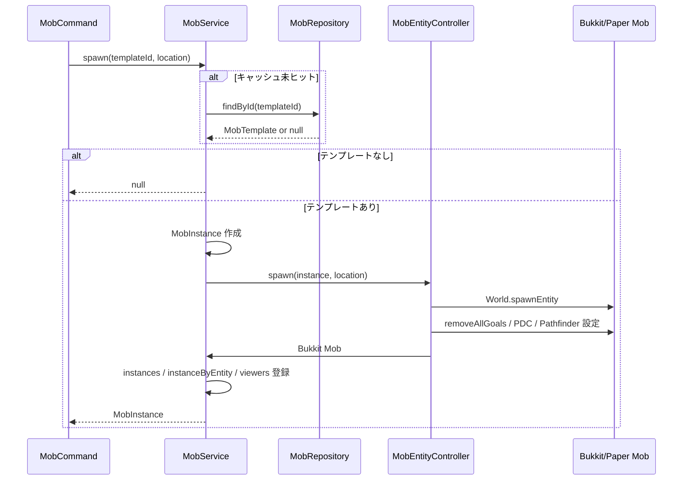
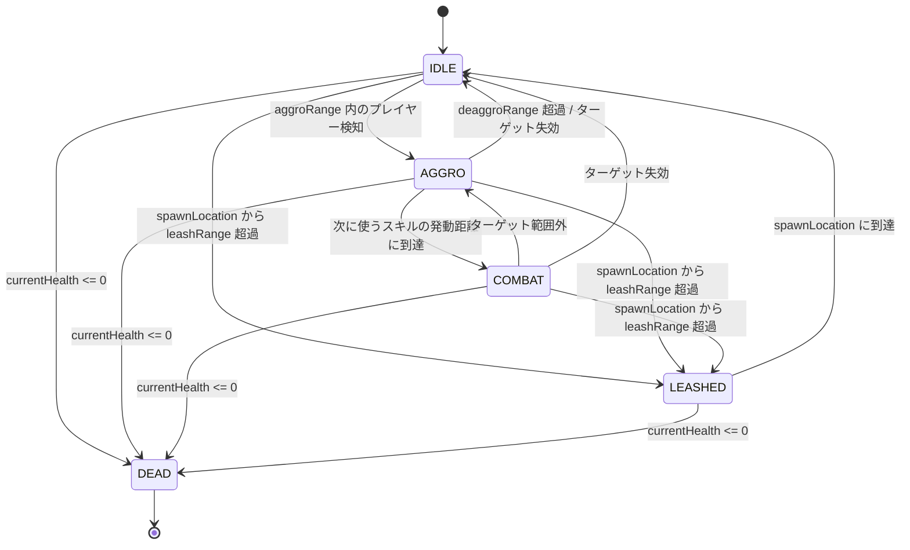
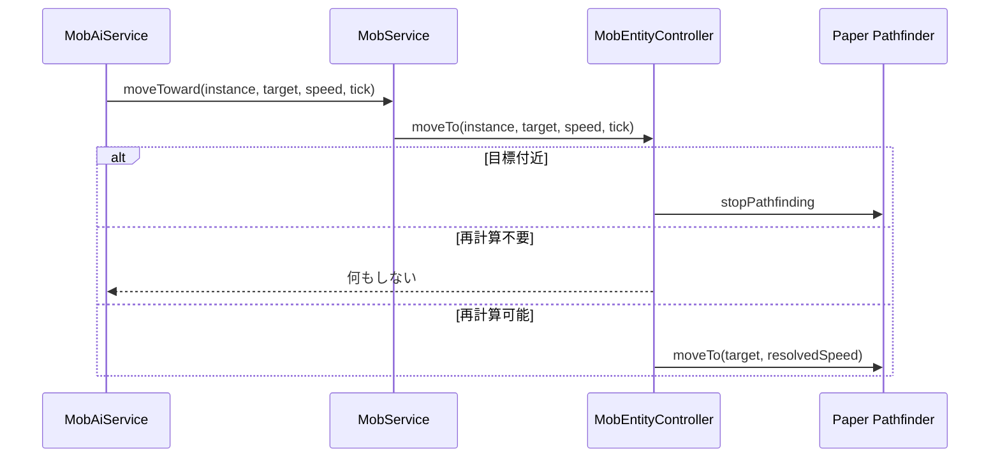
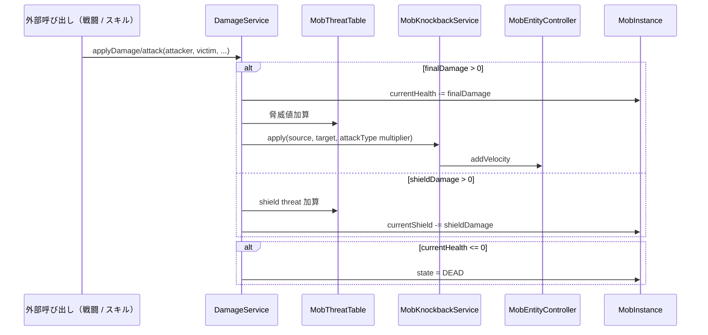
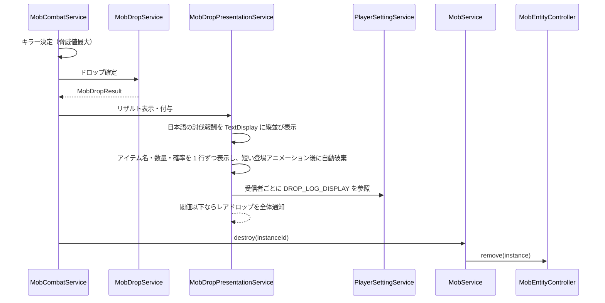

# 12_4.00-統合フロー

## 1. Mob スポーン（command -> service -> entity）

物理名対応:

- Mob スポーン: `spawn`（`MobService`）
- Mob 取得: `findById`（`MobRepository`）
- 実体 Mob 生成・初期化: `spawn` / `configure`（`MobEntityController`）

## 2. AI tick 駆動と状態遷移

`MobAiService.tick` は 1 tick 周期で動くが、100体想定のため以下を分散する。

- `IDLE`: 10 tick 間隔でターゲット探索・徘徊判断
- `AGGRO` / `LEASHED`: 5 tick 間隔で追跡判断
- `COMBAT`: スキルの発動距離内なら近距離でも攻撃を試みる。`RANGED` / `MAGIC` は近すぎる場合に後退補助を入れ、`preferredRange` 付近では左右移動で距離を維持
- `MobService.updateViewers`: 5 tick 間隔で頭上表示用 viewer を更新
- `MobService.destroyEnemiesOutsideViewDistance`: 5 tick 間隔で、64 ブロック以内にオンラインかつ生存している視認者がいない `ENEMY` をリザルトなしで破棄
- Paper Pathfinder の再要求: 10 tick 間隔、または目標 X/Z が 1.5 ブロック以上動いた場合

## 3. 移動要求（AI -> Paper Pathfinder）

AI は「どこへ行くか」だけを決める。段差、障害物、実際の経路探索は Paper Pathfinder に委譲する。

## 4. 被ダメージシーケンス（player/skill -> mob）

Mob 実体は `setInvulnerable(true)` のため、バニラダメージイベントは HP の正本にはしない。

## 5. 致死処理（drop -> destroy）

`MobService.destroy` は実体 Mob を remove し、`instances` / `instanceByEntity` / `viewers` を更新する。

## 6. 頭上表示

1. `MobAiService.tick` が 5 tick ごとに `MobService.updateViewers` を呼ぶ。
2. `MobService` は実体位置を同期し、64 ブロック以内のオンラインかつ生存しているプレイヤー UUID を viewer として保持する。
3. `OverheadDisplayService` は Mob の実体 Entity に `Lv.<level>` と HP テキストを含む TextDisplay を passenger として接続し、テキスト更新 / destroy を行う。
4. Mob 本体の表示・移動・破棄は Bukkit/Paper の entity tracking に任せる。
5. 同じ周期でオンラインかつ生存している視認者が 1 人もいない `ENEMY` は `MobService.destroy` で破棄し、討伐リザルトやドロップ処理は行わない。死亡中プレイヤーのみが範囲内にいる場合も視認者なしとして扱う。

## 7. NPC・Mob spawner入力仲裁

1. [[28_3.01-イベント]]のgatewayが右クリック、左クリック、block mutationを共通contextへ正規化する。
2. mob / spawner resolverがNPC、fakeblock NPC、spawner表示、設置・破壊対象をray入口距離付き候補として返す。entity NPCはrayの太さで拡張した全AABBを比較し、Paperの単発ray結果へ依存しない。
3. `PlayerInputDispatcher`が他featureのworld interaction候補も含め、同一tierでは最も近い候補を選ぶ。同距離のNPCはMob instance UUID、spawnerはlocation keyで決定する。
4. NPC候補の勝者だけがinteraction actionを実行し、Mob spawner候補の勝者だけが座標登録・削除・item消費を行う。
5. 勝者が拒否・失敗しても別NPC、武器、action ringなどを実行しない。
6. packet-only表示は`blockingDistance`より遠い場合に候補から除外する。

同一入力のhand/event重複相関とarm swing fallbackは[[28_4.00-統合フロー]]を正本とする。
