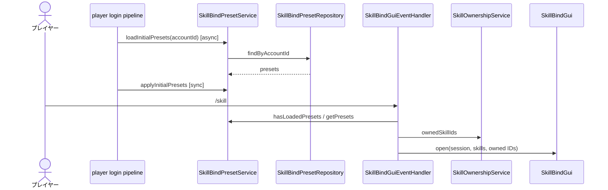
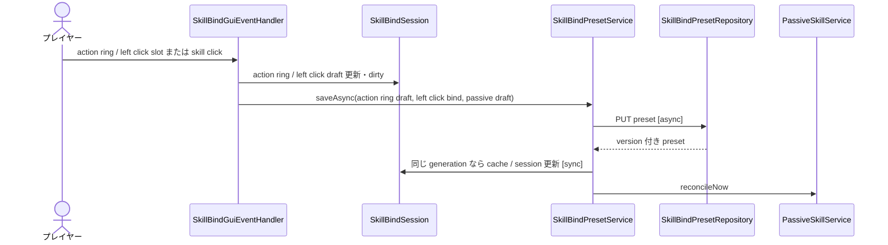
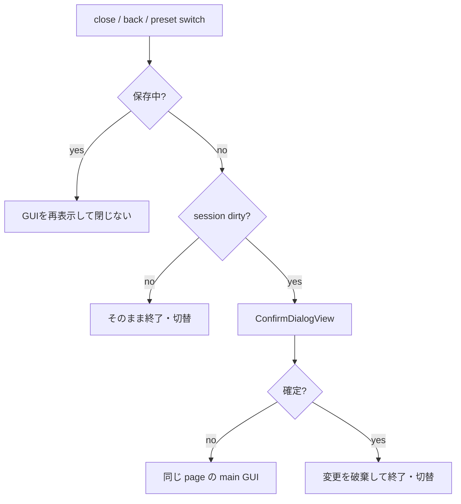

# 13_4-スキルバインドGUI

## 1. preset load・GUI 表示

### シーケンス

### 処理要点

- API 結果は preset 1..6、action ring 6 slot・left click bind・passive 8 slot へ正規化する。旧 active 7・8 番は除外する。
- load 完了前は GUI を開かず `P_5848` を通知する。
- 一覧は所持 active skill と bind-required passive を ID 順に表示する。

### 例外・終了条件

- 未解放の選択 preset は preset 1 へ fallback する。
- load 失敗時は fallback preset を返すが、login pipeline が cache 適用を完了するまで GUI は開かない。

## 2. active bind 編集・保存

### シーケンス

### 処理要点

- 下から2段目の slot 37 は単一の左クリックバインド、slot 39..44 は左から action ring 1..6 として編集する。保存ボタンは置かない。
- 左クリックバインドは既定で現在主手武器の通常攻撃を表す予約値を保持し、取り外し・所持発動スキルへの差替えができる。
- スロット未選択で所持発動スキルをクリックした場合は、action ring の左から最初の空き枠へ自動配置する。action ring がすべて埋まっている場合だけ、空の左クリックバインドへ最後の優先順位で自動配置する。
- 各バインド操作の直後に自動保存する。保存中は次の編集を受け付けず、完了後に最新画面を再描画する。
- passive 8 枠は model / API に存在するが GUI に表示せず、保存時は読み込んだ `passiveDraft` をそのまま送る。
- 未所持 skill と passive skill は active slot へ新規設定できない。
- account ごとに save は 1 件だけ進行可能とする。

### 例外・終了条件

- 自動保存失敗時は session を dirty のまま維持して `P_5849` を通知する。
- save 開始後に session、preset、draft、generation が変化した callback は画面を上書きしない。

## 3. dirty session の破棄確認

### シーケンス

### 処理要点

- GUI 内部遷移の close event は `suppressClose` で一度だけ抑止する。
- 自動保存中の close は破棄確認を表示せず、保存完了まで GUI を再表示して閉じない。close後の再表示は次のユーザー起点 close を抑止しない。
- 最終終了時は session を破棄し、inventory feature に通常 inventory の再描画を委譲する。

### 例外・終了条件

- passive bind-required skill を新規に passive slot へ割り当てる UI は現行 GUI にないため、[[13_9-未決事項]] とする。

## 4. 自動保存中の close 再表示

- 自動保存中に GUI を閉じた場合は、保存完了までメイン GUI を再表示してセッションを維持する。
- この再表示はclose済みのinventoryを置換しないため、close抑止フラグを設定しない。次のユーザー起点closeでは通常どおりsessionを破棄し、player inventoryを復元する。
