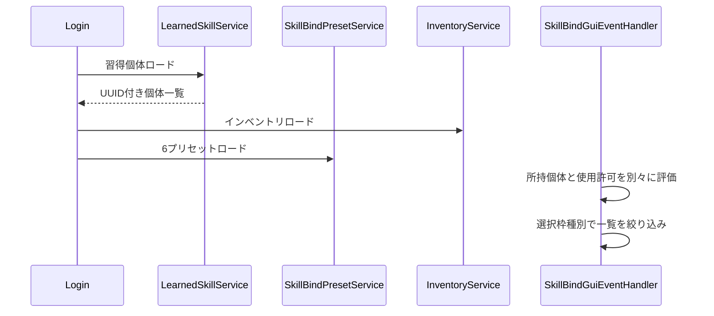
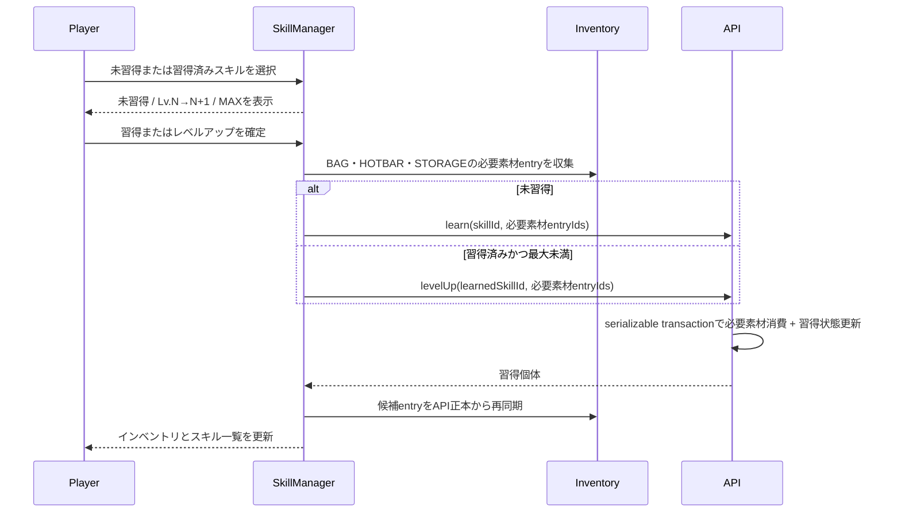
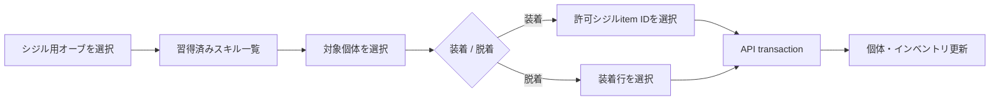

# 13_4-スキルバインドGUI

## 1. ロードと表示

習得個体ロード時にAPIが削除済みskill個体と無効シジルを整合するため、インベントリはその後にロードする。

## 2. バインド

1. passive / left-click / action slotをクリックすると選択状態にし、未選択でも一覧は全てのbind可能個体を表示する。
2. 一覧は選択種別へ絞り込む。passiveはbind-requiredだけを表示し、設定できない通常攻撃も表示しない。
3. 習得個体を左クリックし、選択枠があればその枠、未選択なら種別対応の最初の空き枠へ `learnedSkillId` を設定する。activeはaction ring、最後にleft-click、passiveは現在有効なpassive枠だけを使う。通常攻撃の予約バインドIDはaction ringとleft-clickへ設定でき、passive枠へは設定できない。
4. シジル装着・脱着は、所持オーブ一覧でシジル用オーブを選択して専用GUIを開く。
5. 所持していれば使用許可なしでも保存する。使用不可個体は一覧の後ろへ並べ、薄灰色の羊毛アイコンと統一した使用不可文言で示す。
6. 発動時は所持と使用許可を再検証し、失敗理由を分けて通知する。

現在有効数を超えるpassive枠は既存値を保持するが機能しない。クリックによる解除は可能、新規設定は不可とする。

バインド枠の選択やプリセット切替で一覧を再描画する場合は、再描画前のページを引き継ぐ。passive / active の絞り込みによって現在ページがなくなった場合だけ、最後に存在するページへ補正する。

## 3. スキルマネージャーによる習得・レベルアップ

現在使用許可を持つ未習得スキルは一覧に「未習得」として表示し、左クリックでLv.1へ習得する。習得済みスキルは使用許可がなくても従来どおり灰色アイコンで表示する。習得済みで最大レベル未満のスキルは右クリックで1レベル上げる。APIはskill masterの `learnRequiredItems` / `levelUpRequiredItems` を正本として有効な GAME inventory 全件の所持アイテムを原子的に検証・消費し、未指定時は無条件で実行する。

## 4. シジル合成

シジルは空きslot、許可ID、同一`equipGroupId`なしを満たす場合だけ、対応する SIGIL_ATTACH オーブとともに各1個を消費して装着する。SIGIL_DETACH は対応するオーブを1個消費し、指定した装着シジルを1個返却する。非許可シジルは素材選択へ進めず、理由を表示して合成APIを呼ばない。素材選択中はインベントリ正本を変更せずシジルitem IDだけを保持し、entry IDは保持しない。結果クリック直前にオーブと選択シジルitem IDを通常アイテム共通消費順（BAG優先、後方slot優先、slot未指定は後、同slotは`inventoryEntryId`昇順）でentryへ再解決し、そのentry IDをAPIへ渡す。戻る・close・失敗なら選択状態を破棄する。先行インベントリ同期が失敗しても、オーブentryと素材entryをAPI正本が検証するため、シジルmutationはその後に続行して必ず両entryを再同期する。成功時の API 正本再同期で削除された素材 entry の後続 entry は通常収納と同じ前詰め規則で詰める。結果クリックが確定操作であり、別の確認ダイアログは出さない。

## 5. クラス・スキルツリー変更

クラス変更またはノード再ロックで使用許可を失ってもプリセット値は変更しない。GUIは使用不可を表示し、active発動とbind-required passive発動を止める。許可が戻れば同じバインドが再び機能する。

## 6. 自動保存中の close 再表示

- 自動保存中に GUI を閉じた場合、`SkillBindGuiEventHandler` は close の最初に `GuiSessionContinuationRequestEvent` を共有基盤へ発行する。feature 自身は `GuiSessionEndEvent` 後の再表示 Runnable を予約しない。
- 共有基盤は次 tick に同じ SkillBind session の再表示 inventory を生成して開く。成功時は通常の GUI 遷移のため、古い close token による `CLOSE` 音、navigation 履歴消去、SkillBind cleanup を発生させない。
- 再表示が cancel・失敗した場合や、その前に別 GUI へ移った場合は継続 token を無効化し、通常の終了処理だけを一度行う。保存 callback も現在の SkillBind GUI が表示中の場合だけ再描画し、古い callback が別 GUI を上書きしない。

## 7. 未保存変更の close 確認

- 未保存変更のある MAIN 画面を手動 close した場合も、`SkillBindGuiEventHandler` は close event 内で `GuiSessionContinuationRequestEvent` を発行し、次 tick に破棄確認 inventory を生成して開く。確認画面を実際に開けた場合だけ `GuiSound.CONFIRM` を再生する。
- 確認画面への遷移中は source session を終了しないため、`CLOSE` 音、navigation 履歴消去、SkillBind の素材復元・player inventory 復元は行わない。確認の cancel は同じ session の MAIN 画面へ戻る。
- 破棄確認の確定または確認画面の手動 close で初めて session 終了を確定し、共有基盤が `CLOSE` と cleanup を一度だけ実行する。確認画面の target open が cancel・失敗した場合や、別 GUI が先に開かれた場合は古い continuation を実行せず、source の通常終了だけを一度確定する。
