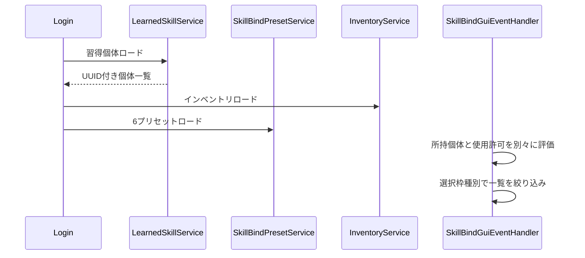
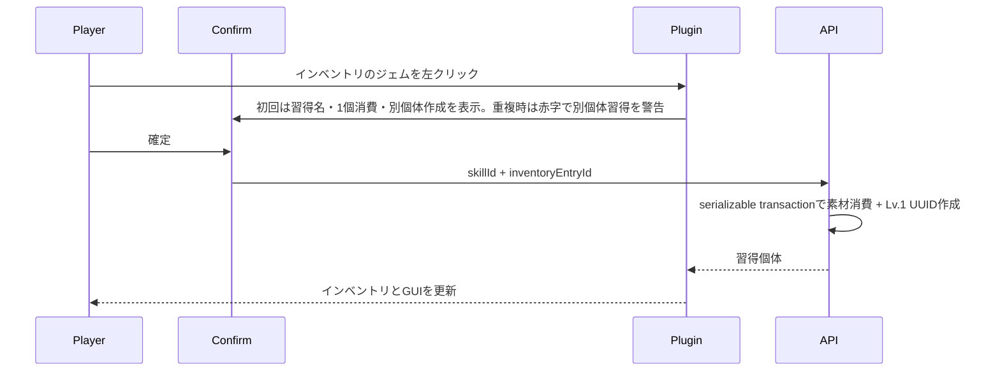
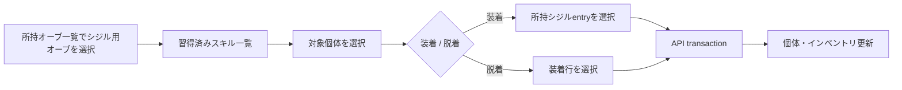

# 13_4-スキルバインドGUI

## 1. ロードと表示

習得個体ロード時にAPIが削除済みskill gem、削除済みskill個体、無効シジルを整合するため、インベントリはその後にロードする。

## 2. バインド

1. passive / left-click / action slotをクリックすると選択状態にし、未選択でも一覧は全てのbind可能個体を表示する。
2. 一覧は選択種別へ絞り込む。passiveはbind-requiredだけを表示し、設定できない通常攻撃も表示しない。
3. 習得個体を左クリックし、選択枠があればその枠、未選択なら種別対応の最初の空き枠へ `learnedSkillId` を設定する。activeはaction ring、最後にleft-click、passiveは現在有効なpassive枠だけを使う。通常攻撃の予約バインドIDはaction ringとleft-clickへ設定でき、passive枠へは設定できない。
4. 習得個体の右クリックは拒否し、スキルマネージャーから合成画面を開かない。
5. 所持していれば使用許可なしでも保存する。使用不可個体は一覧の後ろへ並べ、薄灰色の羊毛アイコンと統一した使用不可文言で示す。
6. 発動時は所持と使用許可を再検証し、失敗理由を分けて通知する。

現在有効数を超えるpassive枠は既存値を保持するが機能しない。クリックによる解除は可能、新規設定は不可とする。

バインド枠の選択やプリセット切替で一覧を再描画する場合は、再描画前のページを引き継ぐ。passive / active の絞り込みによって現在ページがなくなった場合だけ、最後に存在するページへ補正する。

## 3. ジェムから新規習得

確認画面は短い色変換済みComponentで表示し、開く時と習得成功時にサウンドを鳴らす。すでに同じスキルを習得済みの場合は、タイトルと確定ボタンの説明を赤文字で警告する。キャンセルまたはcloseでは消費しない。右クリックは確認画面を開かない。

## 4. シジルオーブによる装着・脱着

装着は空きslot、許可ID、同一`equipGroupId`なしを満たす場合だけ選択したシジルentryを1個消費する。脱着は選択した有効な装着行を論理削除し、同じtransactionでシジルをGAME/BAGへ1個返却する。非許可シジルは素材選択へ進めず、理由を表示してAPIを呼ばない。API処理中はGUI操作と持ち替えをロックし、完了後に習得個体と対象entryだけを正本へ同期する。装着用・脱着用のオーブ自体は消費しない。

## 5. クラス・スキルツリー変更

クラス変更またはノード再ロックで使用許可を失ってもプリセット値は変更しない。GUIは使用不可を表示し、active発動とbind-required passive発動を止める。許可が戻れば同じバインドが再び機能する。

## 6. 自動保存中の close 再表示

- 自動保存中に GUI を閉じた場合、`SkillBindGuiEventHandler` は close の最初に `GuiSessionContinuationRequestEvent` を共有基盤へ発行する。feature 自身は `GuiSessionEndEvent` 後の再表示 Runnable を予約しない。
- 共有基盤は次 tick に同じ SkillBind session の再表示 inventory を生成して開く。成功時は通常の GUI 遷移のため、古い close token による `CLOSE` 音、navigation 履歴消去、SkillBind cleanup を発生させない。
- 再表示が cancel・失敗した場合や、その前に別 GUI へ移った場合は継続 token を無効化し、通常の終了処理だけを一度行う。保存 callback も現在の SkillBind GUI が表示中の場合だけ再描画し、古い callback が別 GUI を上書きしない。

## 7. 未保存変更の close 確認

- 未保存変更のある MAIN 画面を手動 close した場合も、`SkillBindGuiEventHandler` は close event 内で `GuiSessionContinuationRequestEvent` を発行し、次 tick に破棄確認 inventory を生成して開く。確認画面を実際に開けた場合だけ `GuiSound.CONFIRM` を再生する。
- 確認画面への遷移中は source session を終了しないため、`CLOSE` 音、navigation 履歴消去、SkillBind の素材復元・player inventory 復元は行わない。確認の cancel は同じ session の MAIN 画面へ戻る。
- 破棄確認の確定または確認画面の手動 close で初めて session 終了を確定し、共有基盤が `CLOSE` と cleanup を一度だけ実行する。確認画面の target open が cancel・失敗した場合や、別 GUI が先に開かれた場合は古い continuation を実行せず、source の通常終了だけを一度確定する。
