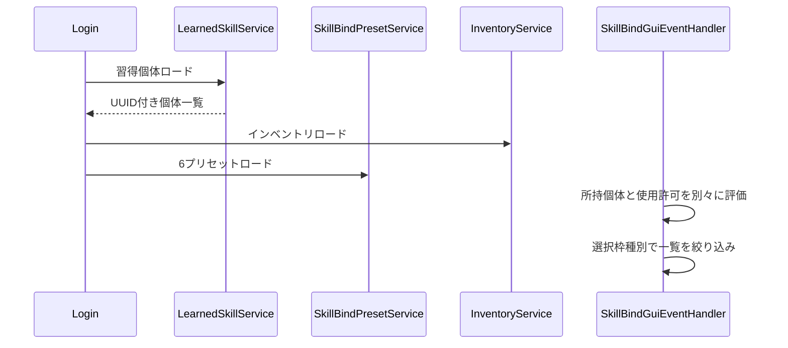
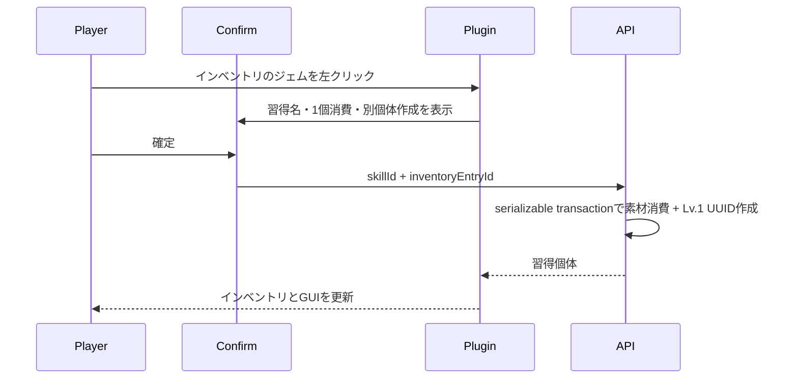
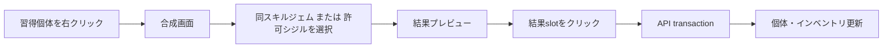

# 13_4-スキルバインドGUI

## 1. ロードと表示

習得個体ロード時にAPIが削除済みskill gem、削除済みskill個体、無効シジルを整合するため、インベントリはその後にロードする。

## 2. バインド

1. passive / left-click / action slotをクリックすると選択状態にし、未選択でも一覧は全てのbind可能個体を表示する。
2. 一覧は選択種別へ絞り込む。passiveはbind-requiredだけを表示する。
3. 習得個体を左クリックし、選択枠があればその枠、未選択なら種別対応の最初の空き枠へ `learnedSkillId` を設定する。activeはaction ring、最後にleft-click、passiveは現在有効なpassive枠だけを使う。
4. 習得個体を右クリックした場合だけ合成画面を開く。
5. 所持していれば使用許可なしでも保存する。
6. 発動時は所持と使用許可を再検証し、失敗理由を分けて通知する。

現在有効数を超えるpassive枠は既存値を保持するが機能しない。クリックによる解除は可能、新規設定は不可とする。

## 3. ジェムから新規習得

確認画面は短い色変換済みComponentで表示し、開く時と習得成功時にサウンドを鳴らす。キャンセルまたはcloseでは消費しない。右クリックは確認画面を開かない。

## 4. レベルアップ・シジル合成

同スキルジェムは選択個体だけを1レベル上げる。シジルは空きslot、許可ID、同一`equipGroupId`なしを満たす場合だけ消費装着する。素材選択中は正本を削除せず表示だけを隠し、戻る・close・失敗なら復元する。先行インベントリ同期が失敗しても、素材entryをAPI正本が検証するため、合成・習得mutationはその後に続行して必ず再同期する。成功時の API 正本再同期で削除された素材 entry の後続 entry は通常収納と同じ前詰め規則で詰める。結果クリックが確定操作であり、別の確認ダイアログは出さない。

## 5. クラス・スキルツリー変更

クラス変更またはノード再ロックで使用許可を失ってもプリセット値は変更しない。GUIは使用不可を表示し、active発動とbind-required passive発動を止める。許可が戻れば同じバインドが再び機能する。

## 6. 自動保存中の close 再表示

- 自動保存中にGUIを閉じた場合は、保存完了までスキルマネージャーを再表示してセッションを維持する。
- この再表示はclose済みinventoryを置換しないため、close抑止フラグを設定しない。次のユーザー起点closeでは通常どおりsessionを破棄し、player inventoryを復元する。
