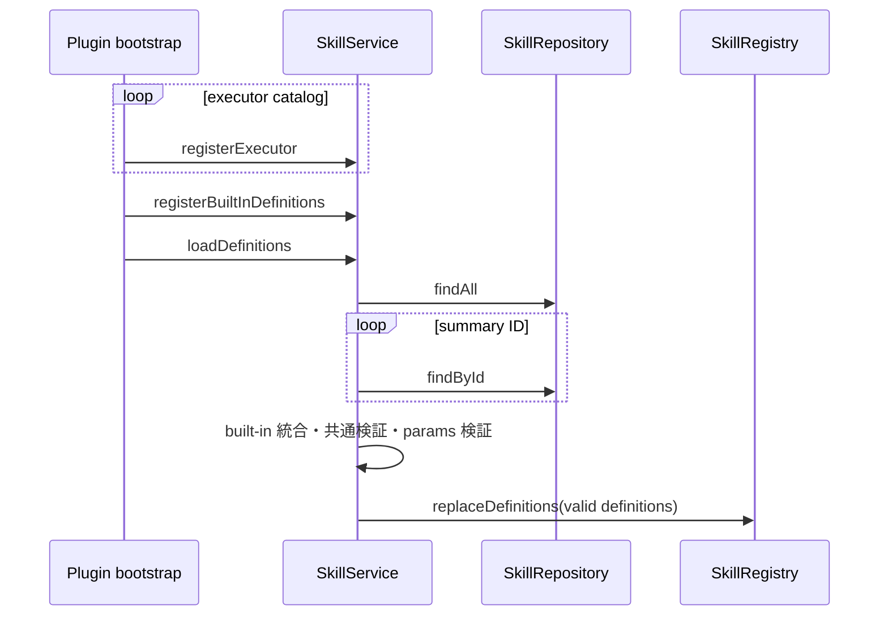
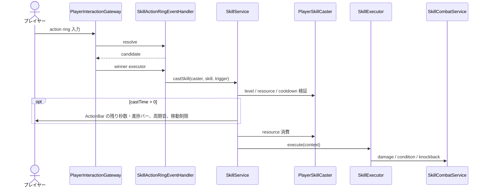
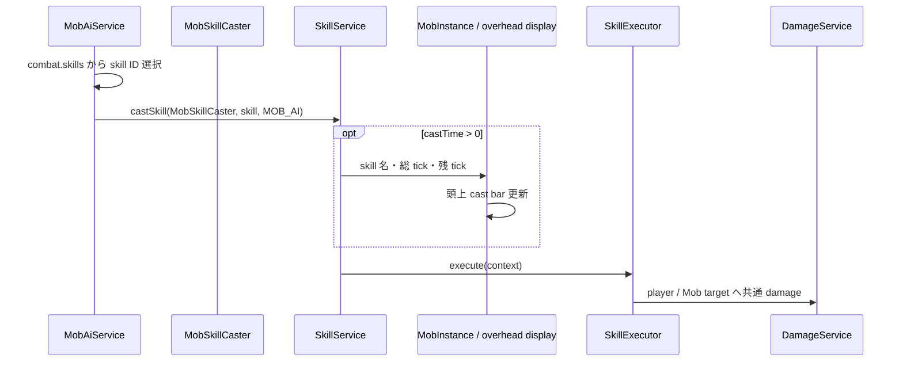
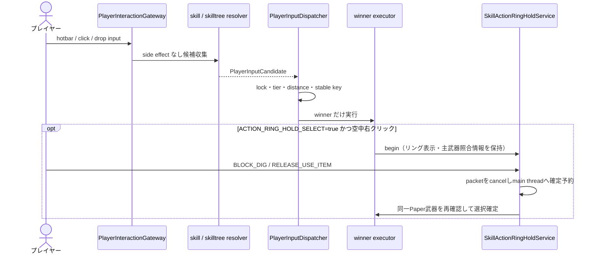

# 13_4-統合フロー

## 1. 起動時 definition load

### シーケンス

### 処理要点

- executor を先に登録し、definition の implementation ID を検証可能にする。
- 不正 definition だけを `W_5801` で除外し、他 definition の load を継続する。

### 例外・終了条件

- API 一覧・詳細の通信異常は repository ログを残して load 失敗として伝播する。

## 2. player skill 発動

### シーケンス

### 処理要点

- 入力の所有権は player-interaction の winner selection を経由する。
- プレイヤー起点の action ring と左クリック bind は、発動候補の取得時と実行直前に main-hand weapon を再確認し、武器なし、装備条件（プレイヤーレベル・クラス・クラスレベル）不足、または耐久値切れなら cast しない。
- player の詠唱 ActionBar は HUD の primary renderer として表示し、完了または中断時に解除して通常 HUD へ戻す。
- 進捗バーは完了部分をライム色の太字・難読化装飾、未完了部分を灰色の太字とし、0.5 秒ごとの詠唱音は進捗に応じて高くする。
- executor は Bukkit damage / 独自 Mob 検索を再実装せず active support services を利用する。
- 成功時だけ cooldown と共通 sound を適用する。

### 例外・終了条件

- 未所持、resource 不足、cooldown、別 skill 詠唱中、definition / executor 不在は executor を呼ばない。
- quit / death / world 変更は lifecycle event から cast と一時 effect を解除する。

## 3. Mob skill 発動

### シーケンス

### 処理要点

- Mob caster は level / MP / EN 制約を実質スキップするが、caster / skill 単位 cooldown は共有する。
- player と Mob は同じ definition、registry、cast lifecycle、executor を通る。

### 例外・終了条件

- Mob death / destroy、target invalid、cast cancel 時は cast 表示と task を破棄する。

## 4. action ring・skilltree 入力調停

### シーケンス

### 処理要点

- action ring と skilltree item は候補収集時に GUI、teleport、cast を実行しない。
- winner が失敗しても同一入力の別候補を実行しない。
- 長押し開始候補は `CLAIM`（Bukkit右クリックをcancelしない）にして、事前に選択中主武器だけを仮想トライデントとして送信しておく。これにより初回右クリックからクライアントが使用状態を開始できる。解除だけを ProtocolLib で受け、確定後の発動は次の左クリックに分離する。

### 例外・終了条件

- input lock、account mode、world 制約、未所持 skill の場合は候補を返さないか executor で拒否する。
- 解除時に武器・slot・setting・ring session が一致しない場合、または選択項目がない場合は選択確定せずリングを閉じる。持ち替え・offhand swap・drop・inventory open・world change・death・quitも同じく待機を破棄する。
