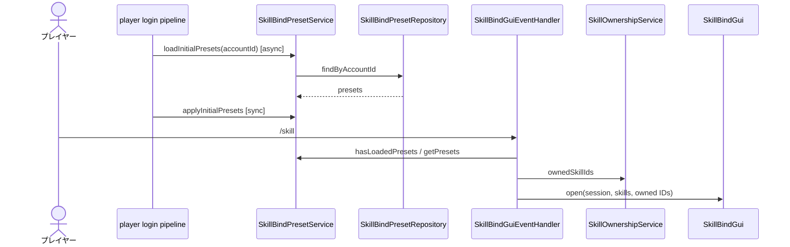
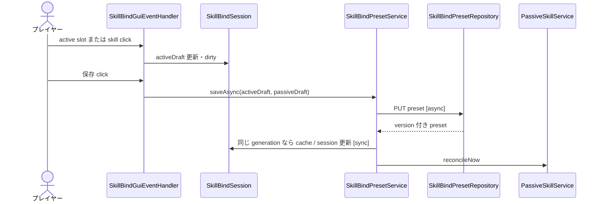
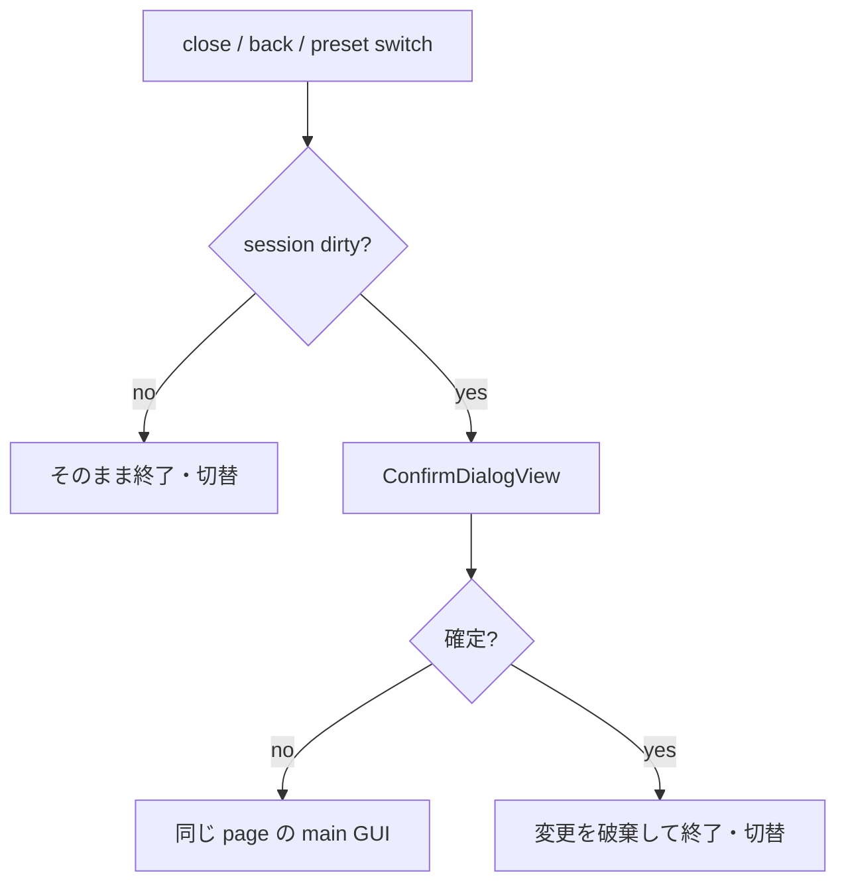

# 13_4.01-スキルバインドGUI

## 1. preset load・GUI 表示

### シーケンス

### 処理要点

- API 結果は preset 1..6、active / passive 各 8 slot へ正規化する。
- load 完了前は GUI を開かず `P_5848` を通知する。
- 一覧は所持 active skill と bind-required passive を ID 順に表示する。

### 例外・終了条件

- 未解放の選択 preset は preset 1 へ fallback する。
- load 失敗時は fallback preset を返すが、login pipeline が cache 適用を完了するまで GUI は開かない。

## 2. active bind 編集・保存

### シーケンス

### 処理要点

- GUI slot 36..43 は active 8 枠だけを編集する。
- passive 8 枠は model / API に存在するが GUI に表示せず、保存時は読み込んだ `passiveDraft` をそのまま送る。
- 未所持 skill と passive skill は active slot へ新規設定できない。
- account ごとに save は 1 件だけ進行可能とする。

### 例外・終了条件

- 保存失敗時は session を dirty のまま維持して `P_5849` を通知する。
- save 開始後に session、preset、draft、generation が変化した callback は画面を上書きしない。

## 3. dirty session の破棄確認

### シーケンス

### 処理要点

- GUI 内部遷移の close event は `suppressClose` で一度だけ抑止する。
- 最終終了時は session を破棄し、inventory feature に通常 inventory の再描画を委譲する。

### 例外・終了条件

- passive bind-required skill を新規に passive slot へ割り当てる UI は現行 GUI にないため、[[13_9.00-未決事項]] とする。
