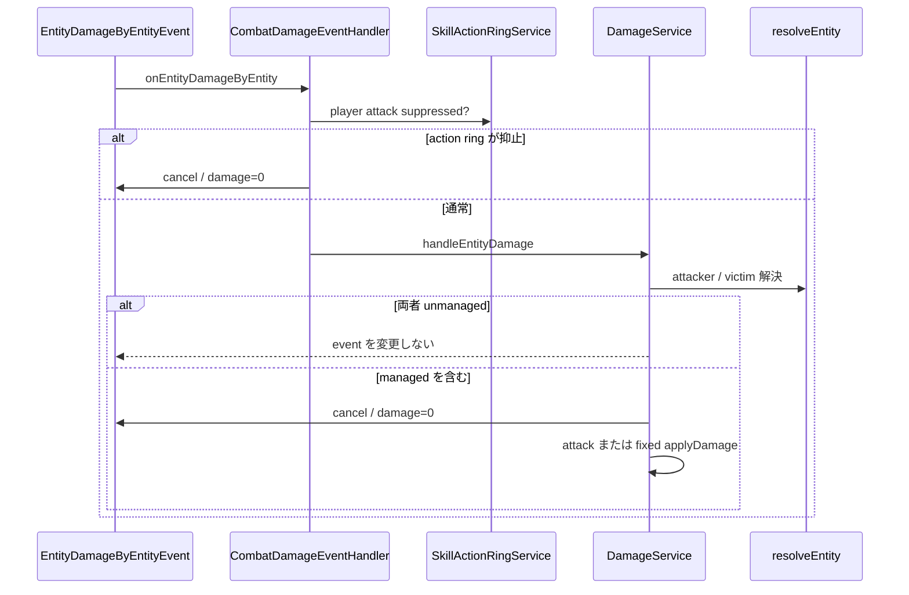
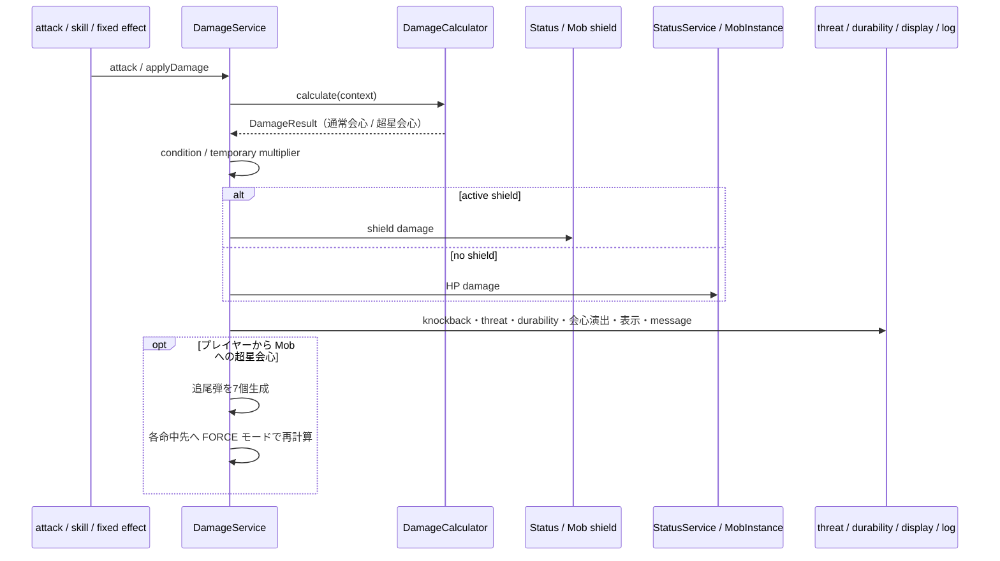
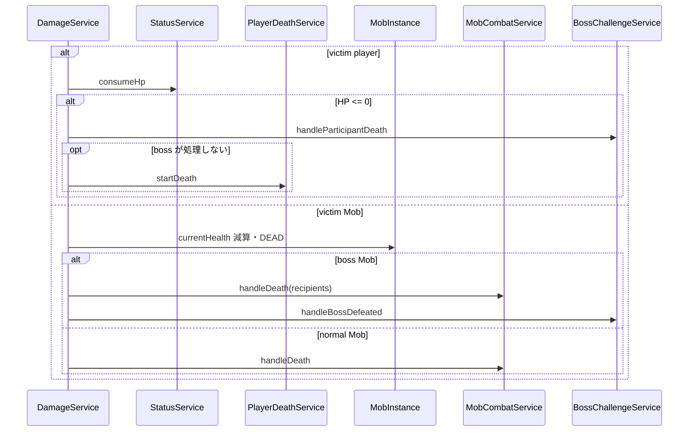

# 14_4-統合フロー

## 1. Bukkit damage event 変換

### シーケンス

### 処理要点

- player semantic input の winner selection は event 発生前の player-interaction を正本とする。
- Mob -> player は AI / skill の直接呼び出しを正本とし、Bukkit event 経路では再適用しない。

### 例外・終了条件

- damage-immune Mob、managed victim でない event は custom HP を変更しない。
- handler 例外は `E_5900` を記録して event loop へ伝播しない。

## 2. damage 計算・shield / HP 反映

### シーケンス

### 処理要点

- 1 hit は shield または HP のどちらか一方へ適用する。
- hit / 通常会心 / 超星会心情報は shield result にも保持し、表示・durability 判定で共有する。
- damage または shield damage が成立した会心は、共通 particle definition / display service と会心種別ごとの sound で被弾中心へ演出する。両会心の同時成立時は両演出を重ねる。
- 追尾弾の再計算は超星会心倍率を強制適用するが、超星会心判定と追加弾生成は行わない。
- damage number と詳細 message は player setting を確認する。

### 例外・終了条件

- evade、0 damage、dead player、damage immune、condition immunity は副作用を最小化して終了する。

## 3. lethal damage

### シーケンス

### 処理要点

- player 独自 HP 反映は実装済みで、Bukkit health damage の将来対応ではない。
- boss は participant death / reward recipient / defeated lifecycle を通常 death と分岐する。

### 例外・終了条件

- death flow 中 player は `resolveEntity` で managed player に戻さず、重複 death を防ぐ。
