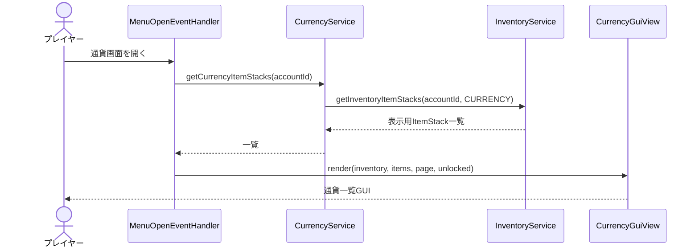
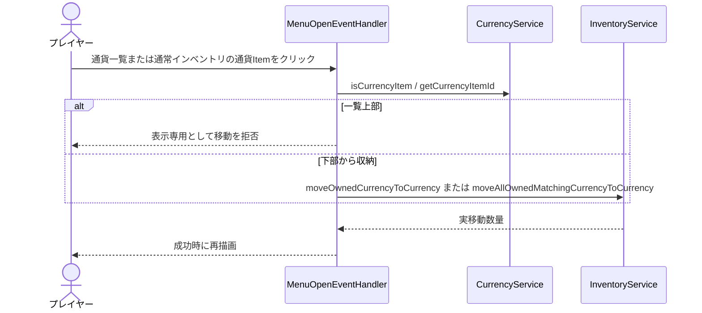
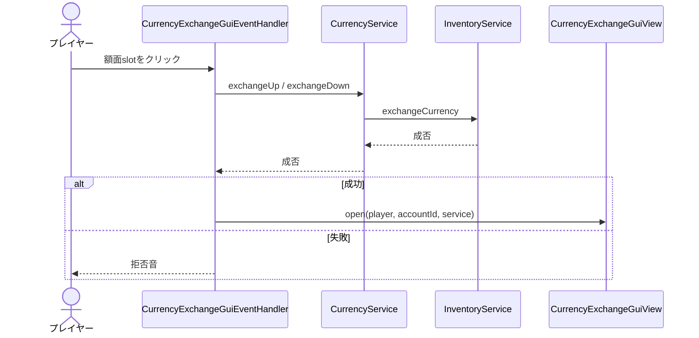
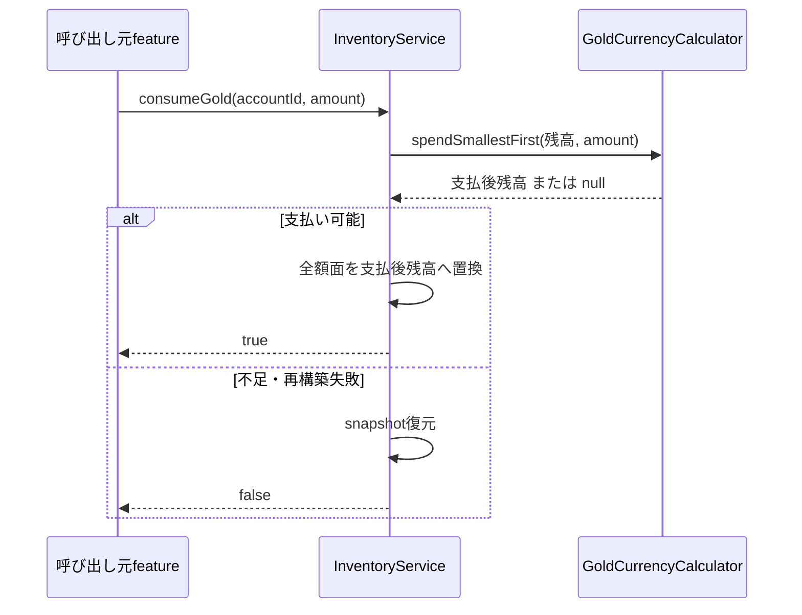

# 16_4-統合フロー

## 1. 通貨一覧表示

### シーケンス

### 処理要点

- `CURRENCY` が未作成、または基本額面が未所持でも 0 個の `gold` 表示を補完する。
- slot 51 の両替アイコンは常時描画し、`yggdrasil_star_core` の所持有無で表示と利用可否を変える。
- ページ番号は表示可能範囲へ正規化する。

### 例外・終了条件

- `AstPlayer` が未ロードなら空の一覧導線として扱い、両替は開かない。
- ロック中の両替アイコンを押すと `PlayerMsgId.P_6800` を表示する。

## 2. 通貨一覧表示・通常インベントリからの収納

### シーケンス

### 処理要点

- 通貨一覧 item は残高表示専用であり、`CURRENCY` から BAG へ取り出す操作を提供しない。
- 下部からの収納は Bukkit GUI の標準移動ではなく、inventory state に対する明示的な移動を行う。
- Shift+右クリックの収納だけ BAG・ホットバー全体の同一 item ID を対象にする。
- 成功後は最新 state から通貨一覧を再取得する。

### 例外・終了条件

- 通貨一覧 item のクリック、通貨 item 未解決、state 未ロード、移動数 0 では拒否音を鳴らす。
- 片側更新に失敗した場合は snapshot を復元する。

## 3. 額面交換

### シーケンス

### 処理要点

- 左クリックは上位、右クリックは下位、Shift 付きは交換可能な全量を対象にする。
- `exchangeCurrency` は交換元・先が組み込み額面であり、総価値が同じことを検証する。

### 例外・終了条件

- 最小額面の下位交換、最大額面の上位交換、残高不足、桁あふれでは変更しない。
- 交換途中の失敗は inventory snapshot へ戻す。

## 4. ゴールド支払い

### シーケンス

### 処理要点

- 低額面を優先し、不足時だけ上位額面を崩す。
- 呼び出し元は `true` の場合だけ商品付与・テレポート等の後続処理へ進む。

### 例外・終了条件

- 0 以下の要求額は変更せず成功する。
- state / `CURRENCY` 未ロード、合計不足、再構築失敗は `false` を返す。
