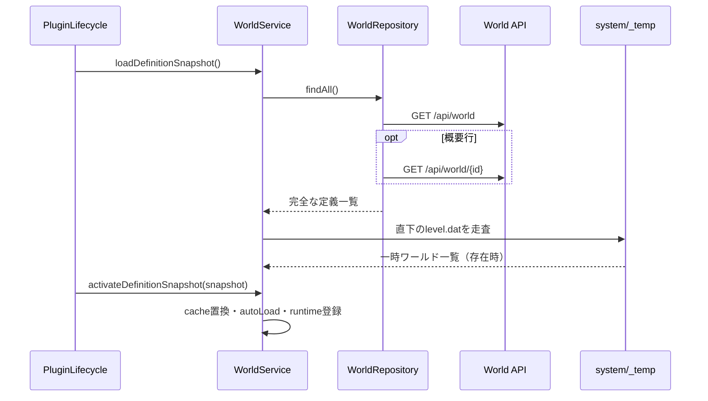
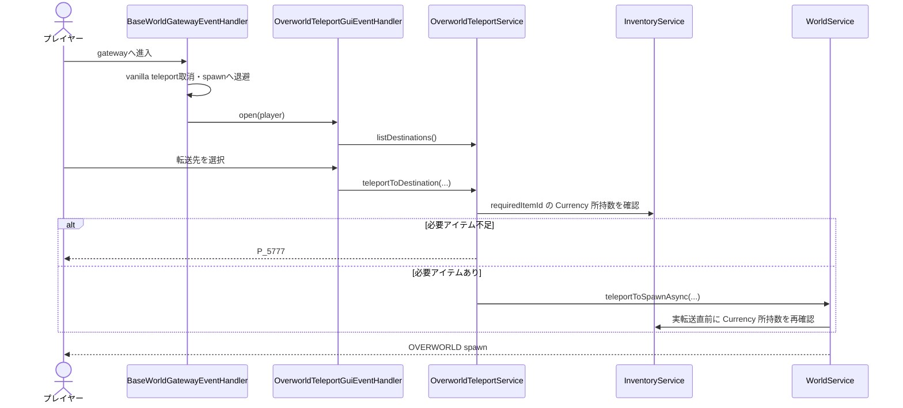
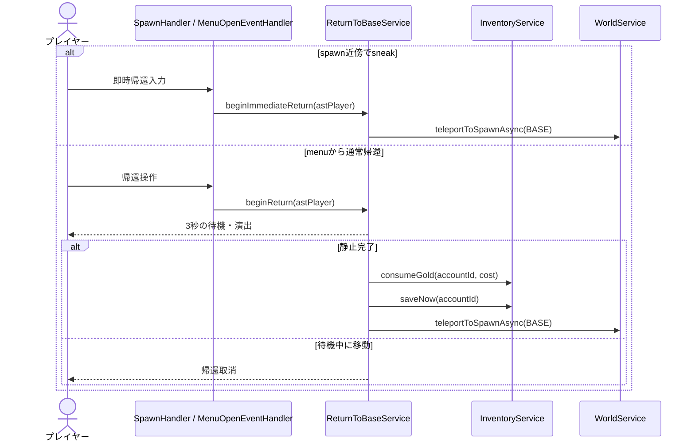
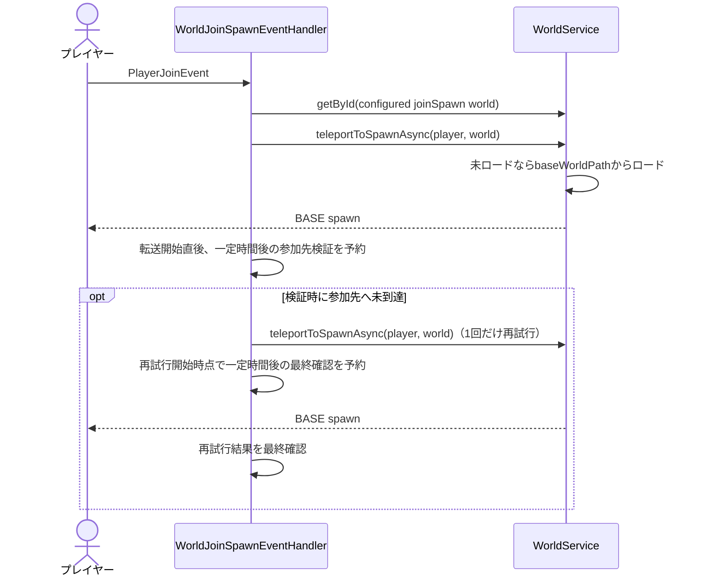
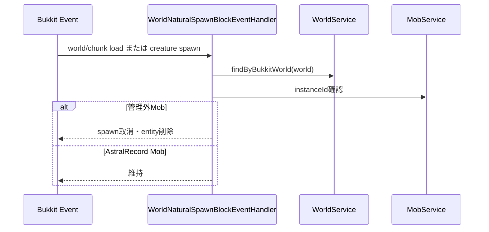
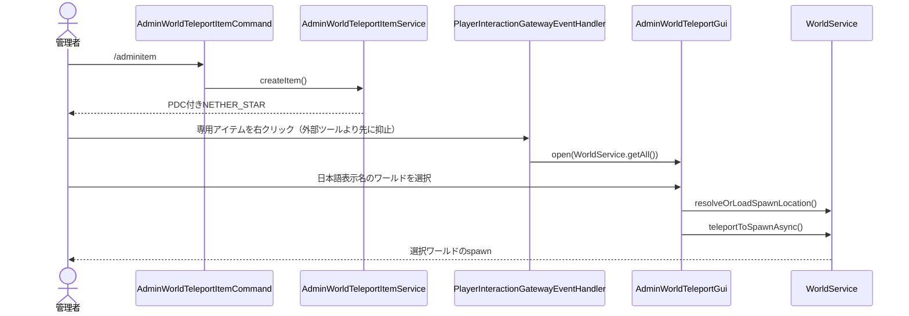

# 17_4-統合フロー

## 1. 定義ロード

### シーケンス

### 処理要点

- 一覧と詳細を組み合わせ、完全な `WorldMasterData` を snapshot に入れる。`system/_temp` のワールドは `WorldType.TEMP` の合成定義として追加し、マスターデータを要求しない。master ID とフォルダ名が同じ場合も `[temp]` 接頭辞で内部 ID を分離して追加する。
- cache 置換と runtime 有効化を段階化し、reload 中の中間索引を公開しない。

### 例外・終了条件

- API または変換失敗時は旧 snapshot を維持したまま lifecycle 側へ失敗を返す。
- auto load に失敗した world は runtime 解決できない。

## 2. BASE から OVERWORLD へ移動

### シーケンス

### 処理要点

- BASE 内のネザーポータルイベントだけ cancel する。
- gateway 内の連続 open を player UUID 単位で抑止する。
- BASE spawn 近傍の sneak 入力候補からも同じ GUI を開ける。
- ネザーポータルへの進入完了時に発生する `PlayerPortalEvent` を検知し、BASE 内の `NETHER_PORTAL` をキャンセルして同じ GUI 起動要求へ接続する。プレイヤー UUID 単位の GUI 起動待機状態で同一ポータルイベントの重複起動を抑止する。BASE 初期スポーン付近の SNEAK でも同じ転送 GUI を表示し、視界エフェクトは付与しない。
- ゲート退避テレポートに成功した場合は GUI 起動待機状態を解放し、次回のポータルイベントで転送 GUI を再度表示する。退避に失敗した場合は、同じイベントの再発火による再起動を抑止する。

### 例外・終了条件

- ゲート接触後の BASE スポーンへの退避テレポートに失敗しても、プレイヤーがオンラインかつ BASE にいる場合は転送 GUI の表示を試行する。
- `requiredItemId` の必要アイテム不足は `P_5777` を通知し、転送を開始しない。待機中に所持条件が失効した場合も実転送を行わない。
- 無効 world ID、OVERWORLD 以外、必要アイテム条件を満たした転送の失敗は `P_5766` を通知する。
- GUI slot 重複・不正値は先着採用または除外し、警告ログを記録する。

## 3. OVERWORLD から BASE へ帰還

### シーケンス

### 処理要点

- spawn の水平半径 2 block 以内を候補とし、interaction resolver の `WORLD_INTERACTION` tier から即時帰還する。
- menu の通常帰還は待機完了時に残高を再検証し、転送失敗時はゴールドを返して保存する。

### 例外・終了条件

- BASE 定義／spawn 不在、offline では開始または完了しない。通常帰還は残高不足でも開始しない。
- spawn の即時帰還は待機・費用なしで同じ BASE spawn へ送る。
- ダンジョンセッション参加中、またはボス挑戦の準備中・進行中・結果待ち・終了処理中は、通常帰還と即時帰還を拒否する。ただし、挑戦待機ハブから離脱して `waitingAbsent` と記録された player は許可する。

## 4. 参加時の拠点スポーン転送

### シーケンス

### 処理要点

- 参加・再参加のたびに `plugin.joinSpawn.world` のスポーン地点へ転送する。
- `plugin.joinSpawn.world` は WorldMasterData ID とし、既定値は BASE の `starlit_nox` とする。旧構成の `world` は実行時に現行 BASE ID へ読み替える。
- 参加時ハンドラーはロード済み判定で中断せず、`teleportToSpawnAsync` にオンデマンド world 読込と転送を委譲する。
- 非同期転送の完了を待たず、参加した同一プレイヤーが一定時間後に対象 Bukkit ワールドへ到達しているかを検証する。未到達の場合だけ転送を1回再試行し、再試行後に最終確認する。
- 検証時点で同一参加セッションの転送が進行中なら重複転送を開始せず、完了後の検証へ回して転送試行を直列化する。

### 例外・終了条件

- 設定 ID に対応する world master がない場合は警告ログを記録して終了する。world の読込・転送に失敗した場合は警告ログを記録し、参加後の検証で未到達なら1回だけ再試行する。再試行後も対象 Bukkit ワールドへ到達できない場合は警告ログを記録して終了する。

## 5. 管理ワールドの Mob 抑止

### シーケンス

### 処理要点

- TEMP 以外の world load 時に RPG gamerule を適用する。TEMP は gamerule と自然 Mob 抑止を変更せず、ロードと転送だけを行う。
- `CUSTOM` spawn は次 tick に識別子を再確認する。

### 例外・終了条件

- world master に対応しない Bukkit world は対象外。

## 6. 管理者用ワールドテレポートアイテム

### シーケンス

### 処理要点

- `/adminitem` とアイテム使用時の両方で管理者権限を確認する。右クリック候補はプレイヤーモードのブロッククリックguardより先に選択する。
- GUI はワールド定義を ID 順にページ表示し、表示名は `displayName` またはワールド種別の日本語名を使う。一時ワールドは `[temp]` 付きのフォルダ名を表示する。補完と GUI は同じ `WorldService.getAll()` を入力にする。
- 選択後のワールドロード・スポーン解決・プレイヤー転送は `WorldService` と `PlayerTeleportService` の既存契約へ委譲する。
