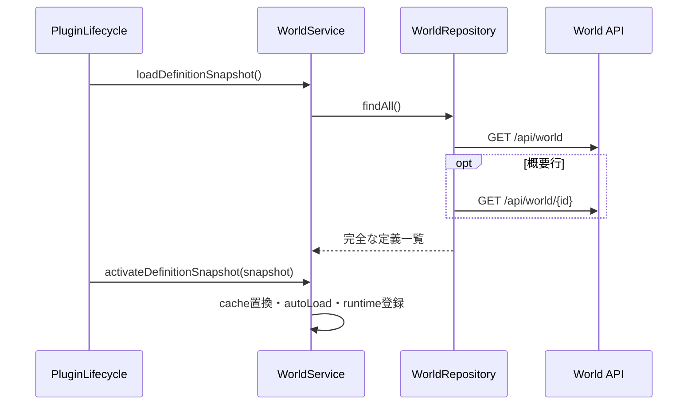
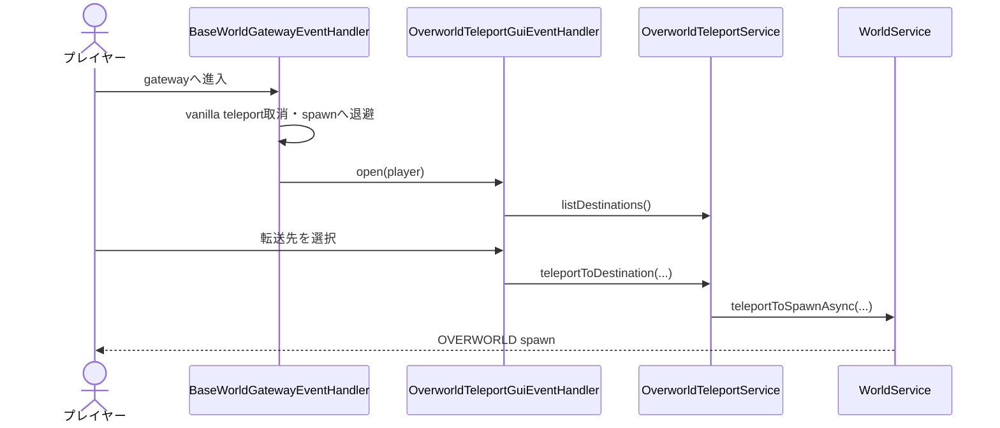
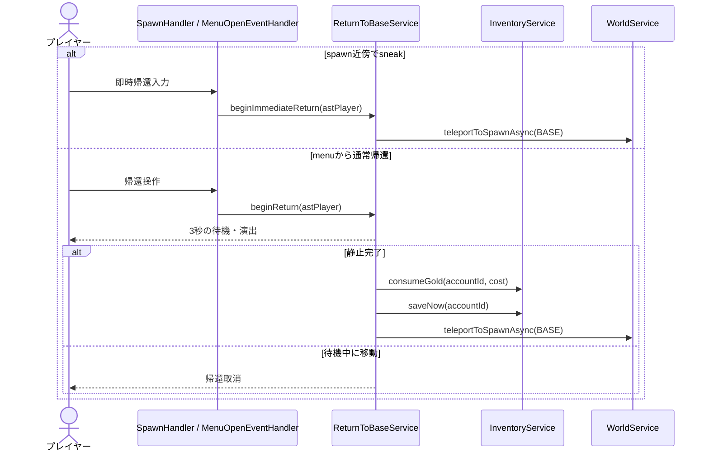
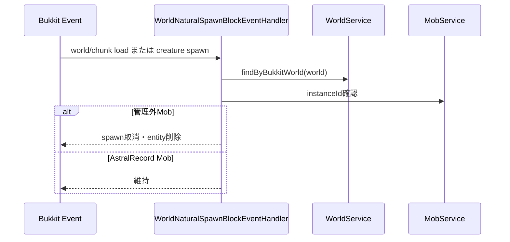
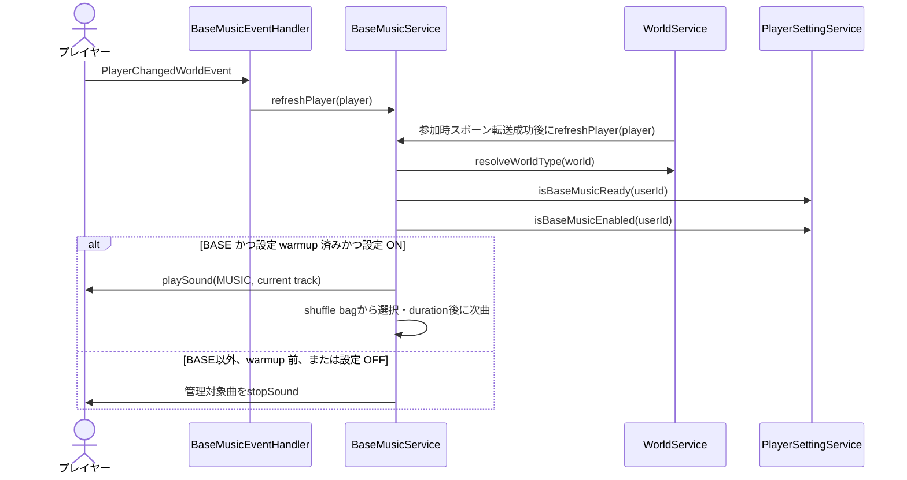

# 17_4-統合フロー

## 1. 定義ロード

### シーケンス

### 処理要点

- 一覧と詳細を組み合わせ、完全な `WorldMasterData` だけを snapshot に入れる。
- cache 置換と runtime 有効化を段階化し、reload 中の中間索引を公開しない。

### 例外・終了条件

- API または変換失敗時は旧 snapshot を維持したまま lifecycle 側へ失敗を返す。
- auto load に失敗した world は runtime 解決できない。

## 2. BASE から OVERWORLD へ移動

### シーケンス

### 処理要点

- portal 系 Bukkit teleport を BASE 内だけ cancel する。
- gateway 内の連続 open を player UUID 単位で抑止する。
- BASE spawn 近傍の sneak 入力候補からも同じ GUI を開ける。

### 例外・終了条件

- 無効 world ID、OVERWORLD 以外、転送失敗は `P_5766` を通知する。
- GUI slot 重複・不正値は先着採用または除外し、警告ログを記録する。

## 3. OVERWORLD から BASE へ帰還

### シーケンス

### 処理要点

- spawn の水平半径 2 block 以内を候補とし、interaction resolver の `WORLD_INTERACTION` tier から即時帰還する。
- menu の通常帰還は待機完了時に残高を再検証し、転送失敗時はゴールドを返して保存する。

### 例外・終了条件

- BASE 定義／spawn 不在、offline では開始または完了しない。通常帰還は残高不足でも開始しない。
- spawn の即時帰還は待機・費用なしで同じ BASE spawn へ送る。
- ダンジョンセッション参加中、またはボス挑戦の準備中・進行中・結果待ち・終了処理中は、通常帰還と即時帰還を拒否する。

## 4. 管理ワールドの Mob 抑止

### シーケンス

### 処理要点

- world load 時に RPG gamerule も適用する。
- `CUSTOM` spawn は次 tick に識別子を再確認する。

### 例外・終了条件

- world master に対応しない Bukkit world は対象外。

## 5. 拠点音楽

### シーケンス

### 処理要点

- Join 時の初回同期は `PlayerSettingJoinEventHandler` の設定 warmup 完了後に行い、永続設定 OFF のプレイヤーを既定値で一時再生しない。
- BASE 到着が Join 後のスポーン転送で先行しても、`isBaseMusicReady` が false の間は eligible listener に含めず、warmup 完了後の同期まで再生を開始しない。
- 参加時スポーン転送が設定 warmup より先に完了した場合も、転送成功後に拠点音楽を再同期して再生開始を保証する。同じ曲の重複同期では再生を再起動しない。
- プレイリストは `OTHERSIDE`、`WAIT`、`MELLOHI`、`RELIC`、`CHIRP` とし、`MUSIC` category、音量 0.35、pitch 1.0 で再生する。音源イベント自体は音楽ディスクのものを使う。
- シャッフル袋は全曲を一度ずつ消化し、袋を補充する際も直前曲を先頭にしない。
- 拠点へ入ったプレイヤーは、その時点の current track を先頭から個別再生する。プレイヤーごとの設定 OFF はそのプレイヤーだけを停止する。
