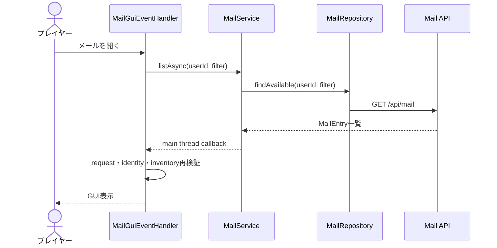
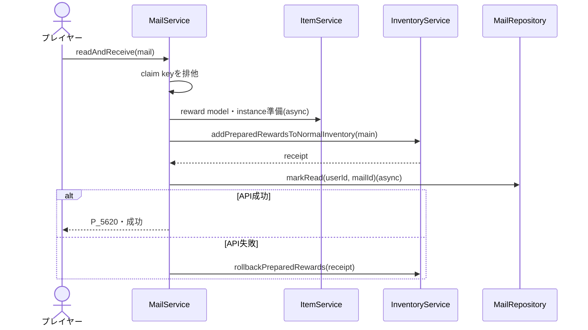
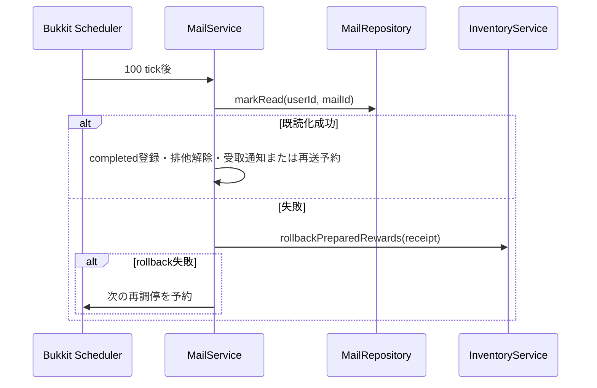
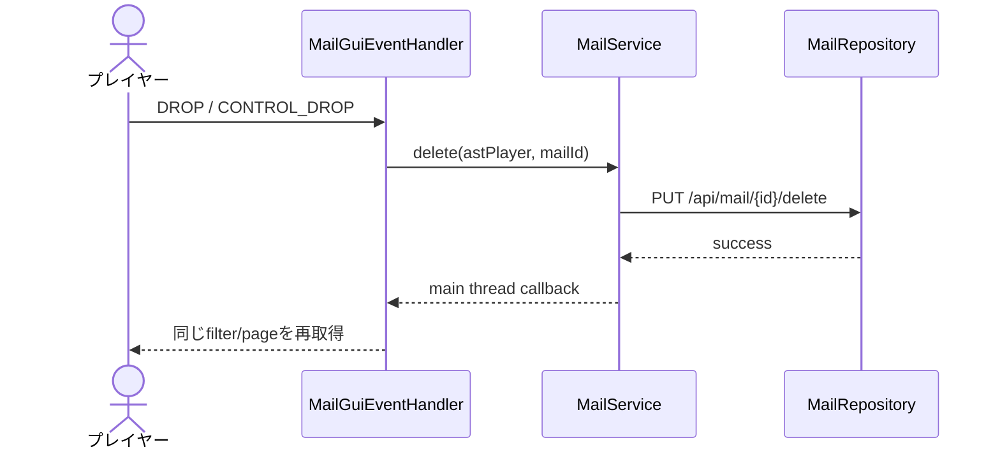

# 18_4-統合フロー

## 1. 一覧表示

### シーケンス

### 処理要点

- API 通信と reward model preload は async で行う。
- request object と開いていた inventory の同一性で古い response を排除する。

### 例外・終了条件

- `AstPlayer` 不在、切断、user／account 変更、GUI 遷移後は開かない。
- API 失敗時は拒否音だけを鳴らし、現在 GUI を上書きしない。

## 2. 未読メールの報酬受取

### シーケンス

### 処理要点

- equipment は付与前に API instance を生成する。ルーンは通常スタック item として付与する。
- 現在 player の UUID、user ID、account ID を付与直前に再検証する。
- 既読または `receiveOnRead=false` は報酬なしで既読処理へ進む。
- inventory 反映は当該 claim が追加した entry を識別できる receipt を返す。既読化失敗時の rollback は receipt に記録された mutation だけを戻し、報酬付与後に別処理が追加・変更した inventory entry は維持する。
- 既読化成功時は報酬 mutation がある場合だけ受取成功 listener を呼ぶ。listener に渡せる online の `AstPlayer` がない場合は通知を保留し、ログイン完了後に一度だけ再送する。

### 例外・終了条件

- model 解決、instance 生成、inventory capacity のいずれかが失敗した場合は `P_5623`。
- API 404 は `P_5622`。付与 rollback も失敗した場合は reconciliation へ移る。

## 3. reconciliation

### シーケンス

### 処理要点

- API 状態か inventory 状態の一方が確定するまで同じ claim key を維持する。
- player が offline でも user と receipt を使って調停する。
- 既読化成功時に player が offline なら、報酬受取通知だけを保留し、次回ログイン完了後に一度だけ listener へ渡す。

### 例外・終了条件

- API 既読化成功または inventory rollback 成功で終了する。rollback 失敗時に報酬が残った場合、初回 callback は `success=false`／`rewardReceived=true` とし、既読化成功後に受取通知を確定する。

## 4. 削除

### シーケンス

### 処理要点

- 削除は mail master 自体の物理削除ではなくユーザー単位の削除状態更新である。

### 例外・終了条件

- 404、通信失敗、identity 変更では成功 GUI 更新を行わない。
