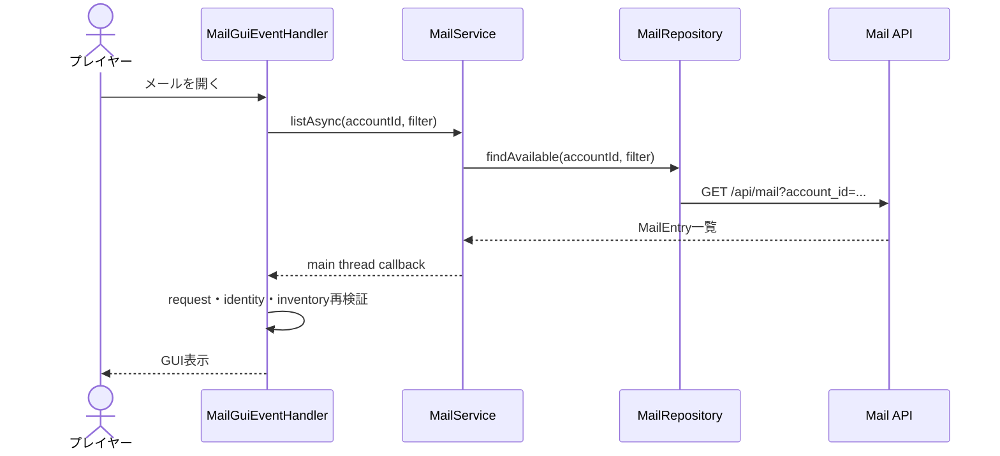
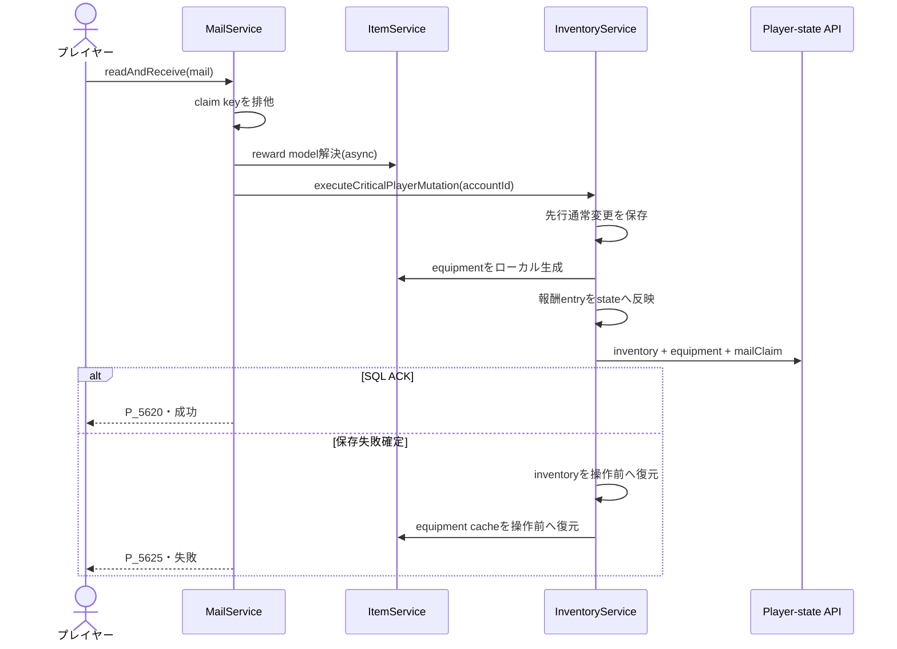
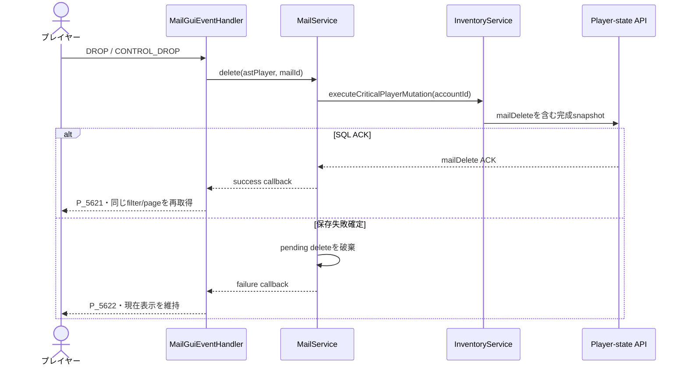

# 18_4-統合フロー

## 1. 一覧表示

### シーケンス

### 処理要点

- API 通信と reward model preload は async で行う。
- request object と開いていた inventory の同一性で古い response を排除する。

### 例外・終了条件

- `AstPlayer` 不在、切断、user／account 変更、GUI 遷移後は開かない。
- API 失敗時は拒否音だけを鳴らし、現在 GUI を上書きしない。

## 2. 未読メールの報酬受取

### シーケンス

### 処理要点

- equipmentのUUIDと能力値は重要操作内で一度だけローカル生成する。ルーンは通常スタック item として付与する。
- 現在 player の UUID、user ID、account ID を付与直前に再検証する。
- 既読メールは報酬なしで成功終了し、`receiveOnRead=false`は報酬なしの`mailClaim`を保存する。
- APIはmail masterまたは個別配送、公開期間、初回ログイン条件、未読状態を検証する。
- POST応答が不明な場合はsnapshot IDで結果照会し、未完了なら同じpayloadを再送する。
- SQL ACK後、`rewardReceived=true`では`GuiSound.ITEM_RECEIVE`、`false`では`GuiSound.SELECT`を再生する。報酬がある場合だけ受取成功listenerを呼び、offlineならログイン完了後の通知として保留する。

### 例外・終了条件

- model解決、ローカルinstance生成、inventory capacityのいずれかが失敗した場合は`P_5623`。
- SQL保存、version競合、結果照会後も確定できない通信失敗は`P_5625`とし、成功通知を出さない。

## 3. 削除

### シーケンス

### 処理要点

- 削除は mail master 自体の物理削除ではなくアカウント単位の削除状態更新である。
- `mailDelete`は`accountId`、操作ごとに一度生成したUUIDの`clientRevision`、`mailId`を持つ。APIは公開中で削除されていないメールだけを更新し、対応するACKを返す。
- POST応答が不明な場合はsnapshot IDで結果照会し、未完了の場合だけ同じpayloadを一度再送する。

### 例外・終了条件

- identity 変更、409、ACK不正、結果照会後も確定できない通信失敗では成功 GUI 更新を行わず、対象メールを現在の一覧に残す。
