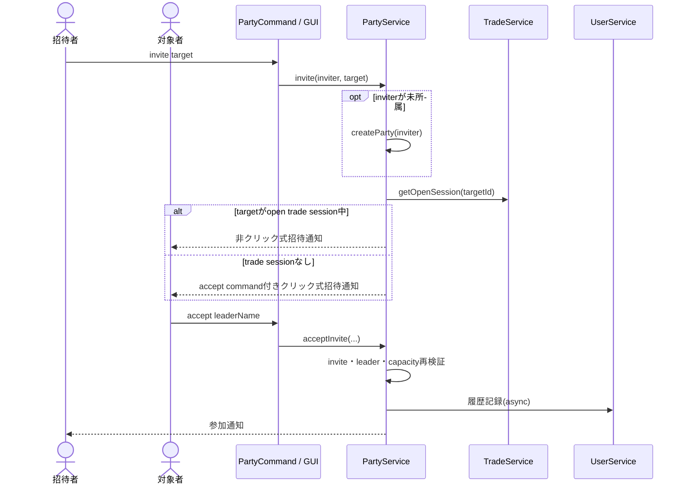
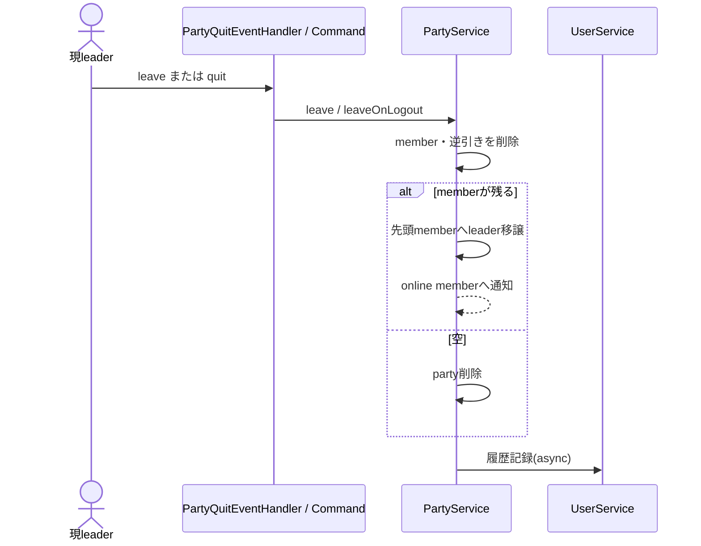
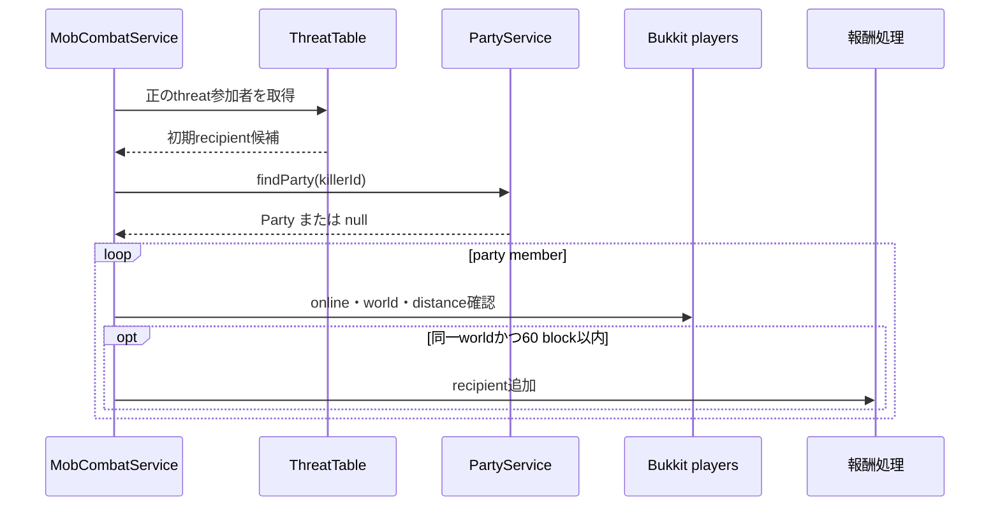
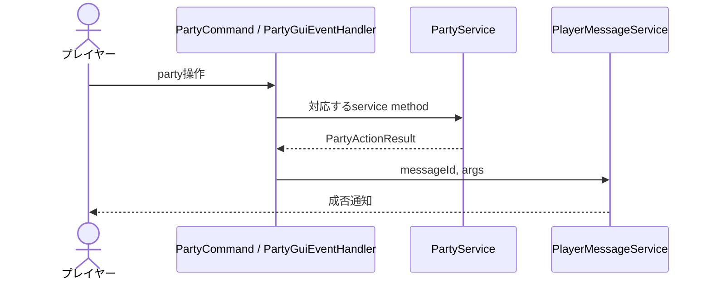
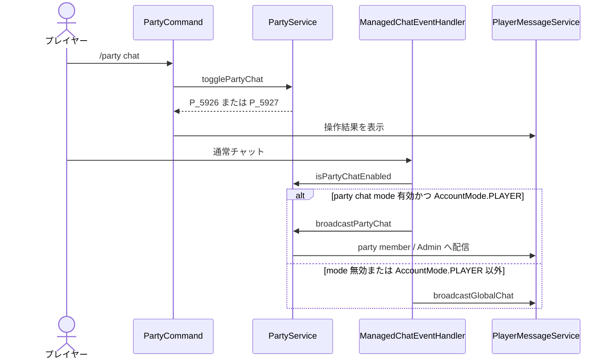

# 19_4-統合フロー

## 1. 招待・参加

### シーケンス

### 処理要点

- membership と invite map の更新は service の synchronized 区間で行う。
- open trade session 中の target へは、チャット画面の open による inventory close と中止導線が競合しない非クリック式通知を送る。
- 承認時点で target の未所属と party 上限を再確認する。

### 例外・終了条件

- `AccountMode.PLAYER` 以外、offline leader／target、自己招待、leader 以外、満員では変更しない。Dungeon／Boss の作成開始後の participant に対する招待・承認も `P_7024` で変更しない。待機ハブでメンバーを揃えている `PREPARING` は PartyService 通知による構成同期を維持する。
- invite の時間経過失効は現在実装しない。

## 2. leader 脱退・切断

### シーケンス

### 処理要点

- offline member を保持しないため、quit は待機期間なしで脱退となる。
- leader 選出順は `LinkedHashSet` の加入順で安定する。

### 例外・終了条件

- 履歴 API が失敗しても membership 更新は rollback しない。

## 3. Mob 報酬共有

### シーケンス

### 処理要点

- party なしの場合は正の threat 参加者へ討伐者を追加する。
- 距離判定・報酬計算は mob feature の責務である。

### 例外・終了条件

- party 展開では offline、別 world、討伐者から 60 block 超過の member は追加対象外。共通 recipient 追加時は死亡中または `AstPlayer` 未ロードも除外する。

## 4. GUI／command 共通操作

### シーケンス

### 処理要点

- command と GUI は同じ service の validation を使う。

### 例外・終了条件

- event 例外は `E_6100`、履歴失敗は `W_6100` へ記録する。

## 5. パーティーチャット切替・管理者一覧

### パーティーチャット

- `AsyncChatEvent` の判定と Bukkit 配信は main thread で行う。
- party 脱退・追放・解散・logout 時は mode も解除する。

### 管理者 party 一覧

1. Admin が `/party list` を実行する。
2. `PartyService.getParties` の snapshot を作成時刻順に並べる。
3. 各 party の ID・人数・leader を一覧行へ表示し、参加者一覧を hover text へ付与する。
4. Admin 以外は自身の party member 一覧を表示する。
