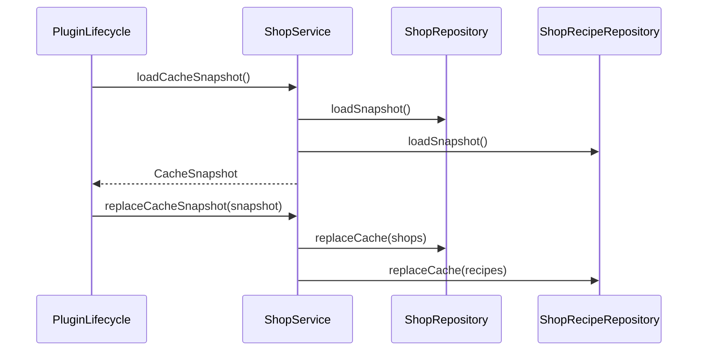
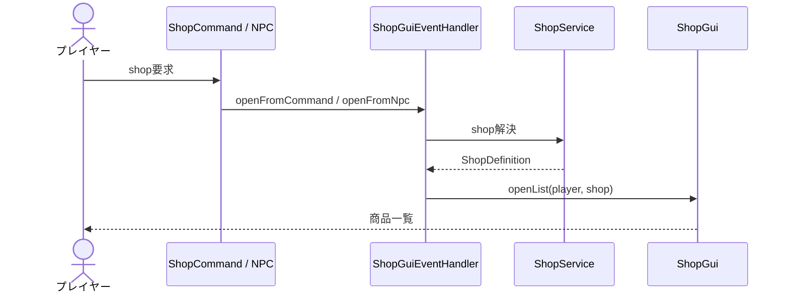
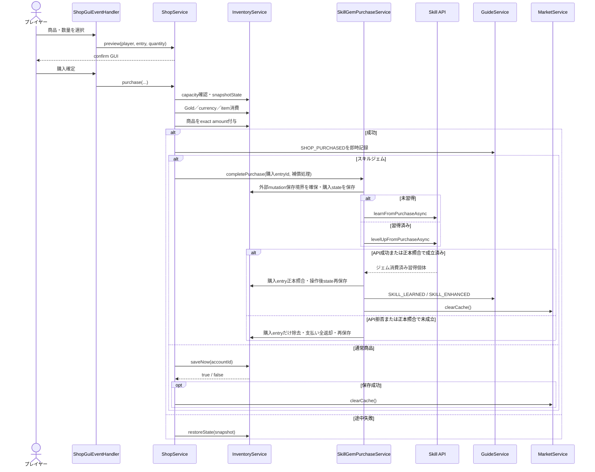
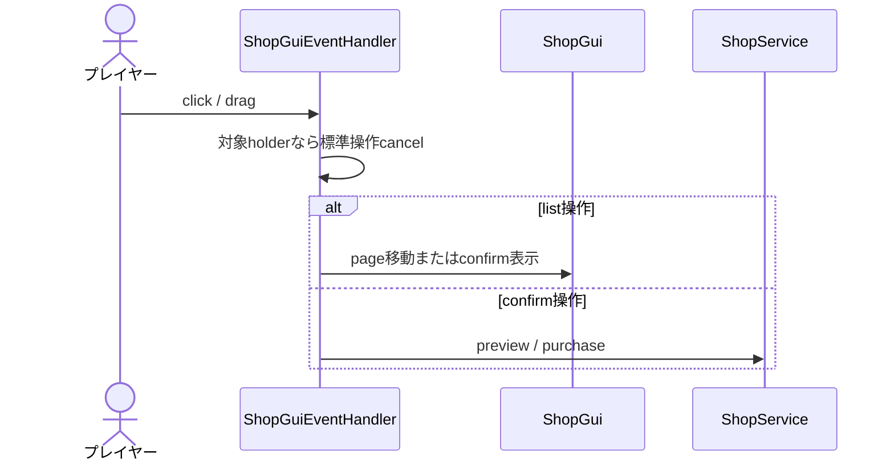

# 20_4-統合フロー

## 1. Cache 準備

### シーケンス

### 処理要点

- shop と recipe の取得完了後に cache を公開する。

### 例外・終了条件

- 片方の読込に失敗した snapshot は公開しない。

## 2. Shop を開く

### シーケンス

### 処理要点

- command は `PUBLIC`、NPC は `NPC_ONLY` も許可する。
- open 時に `AccountMode.PLAYER` を検証する。

### 例外・終了条件

- 未知 ID／名前、command からの `NPC_ONLY` は開かない。

## 3. Preview・購入

### シーケンス

### 処理要点

- confirm 表示後も確定時に残高と空きを再検証する。
- payment と grant は単一 inventory snapshot で補償する。
- 購入成功時の `SHOP_PURCHASED` 通知は即時に行う。通常商品は `saveNow(accountId)`、スキルジェムは習得・正本照合・操作後再保存まで完了した場合に保存済み購入通知を行う。保存済み購入通知はマーケット概要 cache の無効化に使用する。
- `astrald_shop` は `astrald` currency を消費し、購入したトークンは CURRENCY inventory に保存する。購入数に制限はなく、枠への反映上限は market API が判定する。
- required currency／item は通常の所持先を先に使用し、CURRENCY inventory に `storage_cloud_access_token` を1個以上所持している場合だけ不足分を STORAGE から使用・消費する。
- 商品選択・数量変更は `GuiSound.SELECT`、ページ移動は `GuiSound.PAGE`、購入成功は `GuiSound.PURCHASE`、購入失敗は `GuiSound.DENY` を再生する。
- 購入確定時に所持品の空き容量が不足している場合は、購入を行わず `PlayerMsgId.P_5241`（インベントリに空きがありません）を表示する。`ShopService.purchase` の容量検証でも拒否するため、支払い・商品付与・保存は行わない。
- スキルジェムは数量1に固定し、ローカル支払い・付与直後に外部 mutation 保存境界を確保する。その購入で新規作成されたentry UUIDを指定して、事前保存、習得またはレベルアップ、entry正本照合、操作後再保存を直列実行する。境界確保後のlogout保存は操作後再保存より先へ進めない。API拒否または正本照合で未成立なら購入entryだけを除去し、支払ったGold・通貨・通常素材を全返却する。API mutation中は同じaccountの追加ジェム購入を拒否し、完了時はオンラインかつ同一accountのショップだけを再描画する。
- スキルジェム一覧と確認画面は次の購入効果を表示する。最大レベルでは `※ すでにレベルMAXのため購入できません。` を表示し、確定操作をcancelするため支払い・商品付与・保存・API mutationは発生しない。

### 例外・終了条件

- mode 不正、model 不在、残高／素材／空き不足、スキル最大レベル、習得状態未解決、購入反映中では mutation 前または restore 後に `false`。
- restore 失敗は warning reason に `rollback_failed` を付ける。
- スキル購入の正本結果が矛盾する場合、または購入取消の全補償に失敗した場合は、失敗ログを残して購入予約・mutation lock・prepared 外部操作境界を解放し、同一accountの次回操作とログアウト保存を再試行可能にする。

## 4. GUI event

### シーケンス

### 処理要点

- holder の shop ID／entry ID／quantity／page を使い、表示 item の自由入力を契約にしない。

### 例外・終了条件

- event 例外は `E_5601` と `shop_gui_click`／`shop_gui_drag` で記録する。
