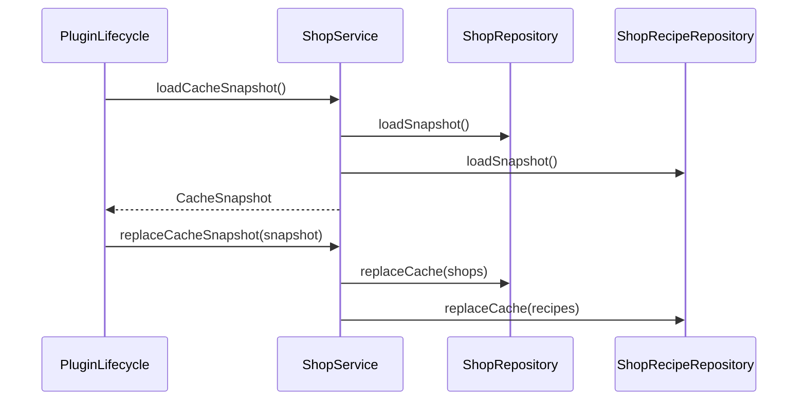
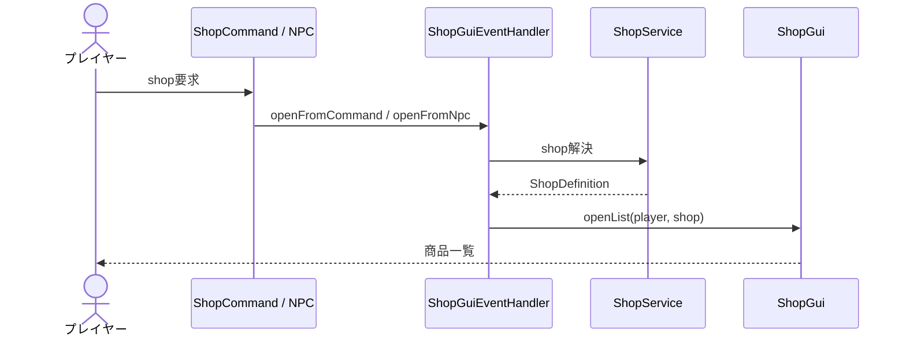
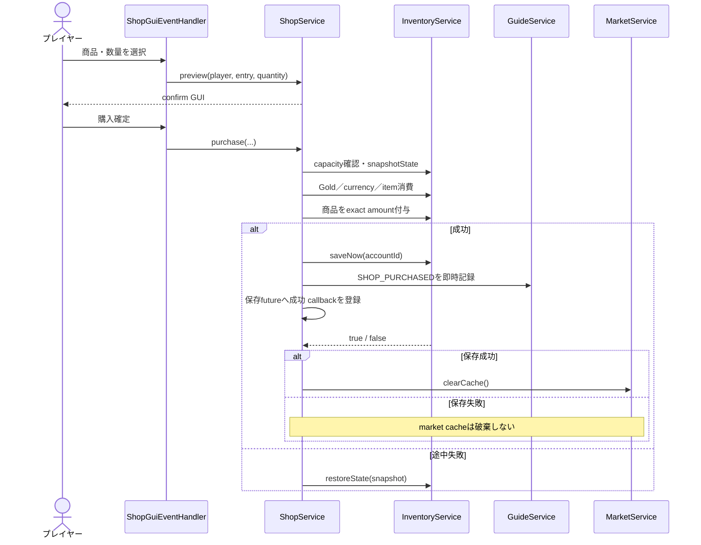
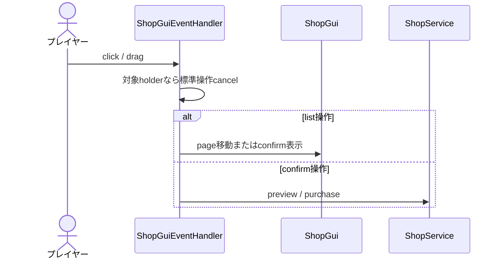

# 20_4-統合フロー

## 1. Cache 準備

### シーケンス

### 処理要点

- shop と recipe の取得完了後に cache を公開する。

### 例外・終了条件

- 片方の読込に失敗した snapshot は公開しない。

## 2. Shop を開く

### シーケンス

### 処理要点

- command は `PUBLIC`、NPC は `NPC_ONLY` も許可する。
- open 時に `AccountMode.PLAYER` を検証する。

### 例外・終了条件

- 未知 ID／名前、command からの `NPC_ONLY` は開かない。

## 3. Preview・購入

### シーケンス

### 処理要点

- confirm 表示後も確定時に残高と空きを再検証する。
- payment と grant は単一 inventory snapshot で補償する。
- 購入成功時の guide 通知は即時に行い、`saveNow(accountId)` の成功 future 完了後に保存済み購入通知を行う。保存済み購入通知はマーケット概要 cache の無効化に使用する。
- `requiredItems` は通常の所持先を先、STORAGEを後に消費し、いずれかの支払いまたは商品付与に失敗した場合はSTORAGEを含むsnapshotを復元する。
- `astrald_shop` は `astrald` currency を消費し、購入したマーケット拡張トークンまたはストレージクラウドアクセストークンは CURRENCY inventory に保存する。購入数に制限はなく、マーケット枠への反映上限は market API が判定する。
- 商品選択・数量変更は `GuiSound.SELECT`、ページ移動は `GuiSound.PAGE`、購入成功は `GuiSound.PURCHASE`、購入失敗は `GuiSound.DENY` を再生する。
- 購入確定時に所持品の空き容量が不足している場合は、購入を行わず `PlayerMsgId.P_5241`（インベントリに空きがありません）を表示する。`ShopService.purchase` の容量検証でも拒否するため、支払い・商品付与・保存は行わない。

### 例外・終了条件

- mode 不正、model 不在、残高／素材／空き不足では mutation 前または restore 後に `false`。
- restore 失敗は warning reason に `rollback_failed` を付ける。

## 4. GUI event

### シーケンス

### 処理要点

- holder の shop ID／entry ID／quantity／page を使い、表示 item の自由入力を契約にしない。

### 例外・終了条件

- event 例外は `E_5601` と `shop_gui_click`／`shop_gui_drag` で記録する。
