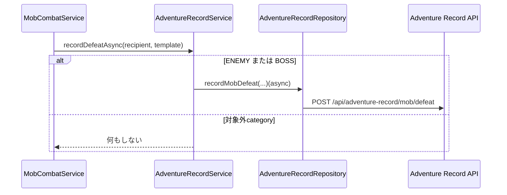
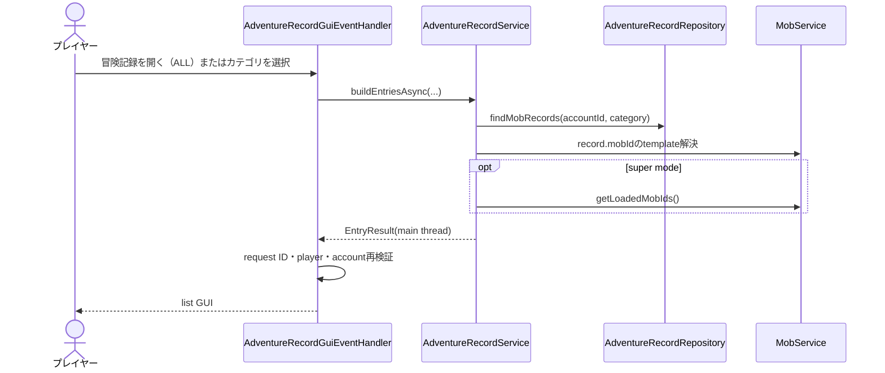
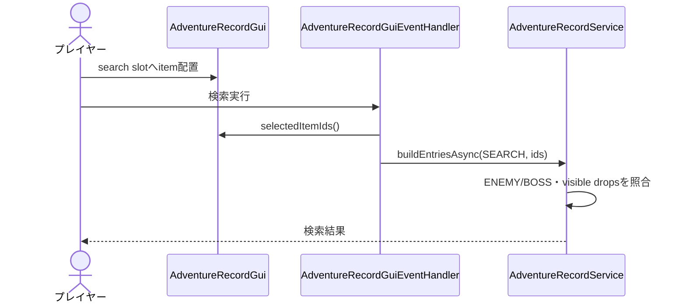
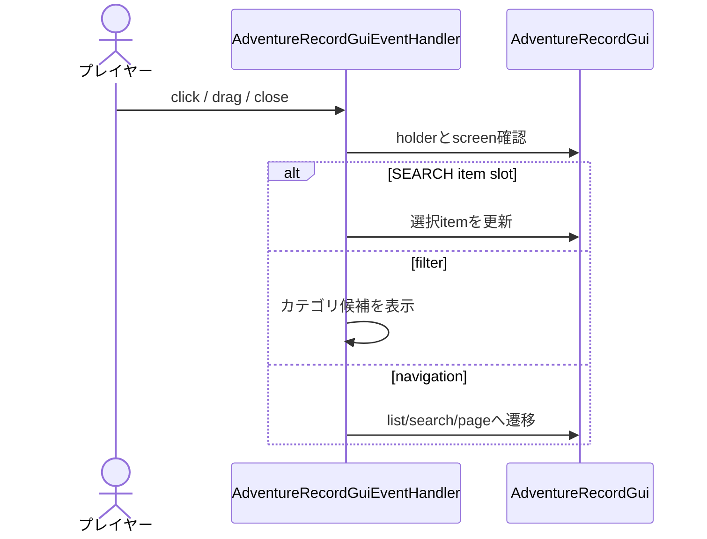

# 21_4-統合フロー

## 1. 討伐保存

### シーケンス

### 処理要点

- party 報酬 recipient ごとに各 account の記録を加算する。
- API 通信は Bukkit main thread 外で行う。

### 例外・終了条件

- 保存失敗は gameplay を rollback せず `LogId.E_6550` に mob ID と例外を記録する。

## 2. 冒険記録一覧表示

### シーケンス

### 処理要点

- API record に対応する template が未ロードなら表示しない。
- page 移動は取得済み entries を holder に保持して再描画する。

### 例外・終了条件

- API 失敗、古い request、account 変更、GUI close 後は response を表示しない。

## 3. Drop item 検索

### シーケンス

### 処理要点

- hidden drop は検索対象外。
- 複数 item は OR 条件。
- empty IDs は ENEMY／BOSS 全件条件となる。

### 例外・終了条件

- AstralRecord item ID を解決できない item は検索条件にならない。

## 4. GUI event 保護

### シーケンス

### 処理要点

- click、drag、close はそれぞれ `E_5601` の固有 operation を持つ。

### 例外・終了条件

- holder が対象外なら event を変更しない。
