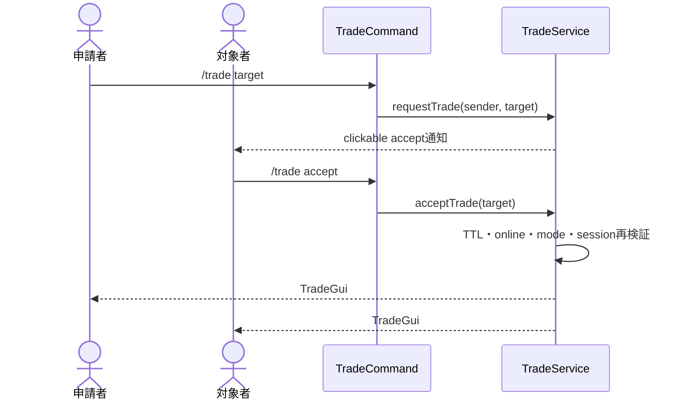
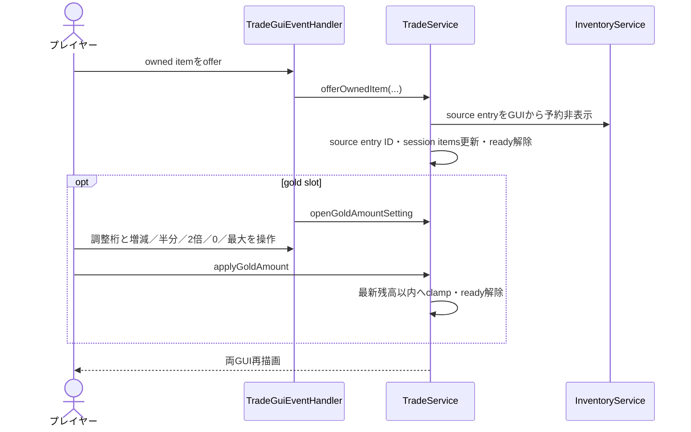
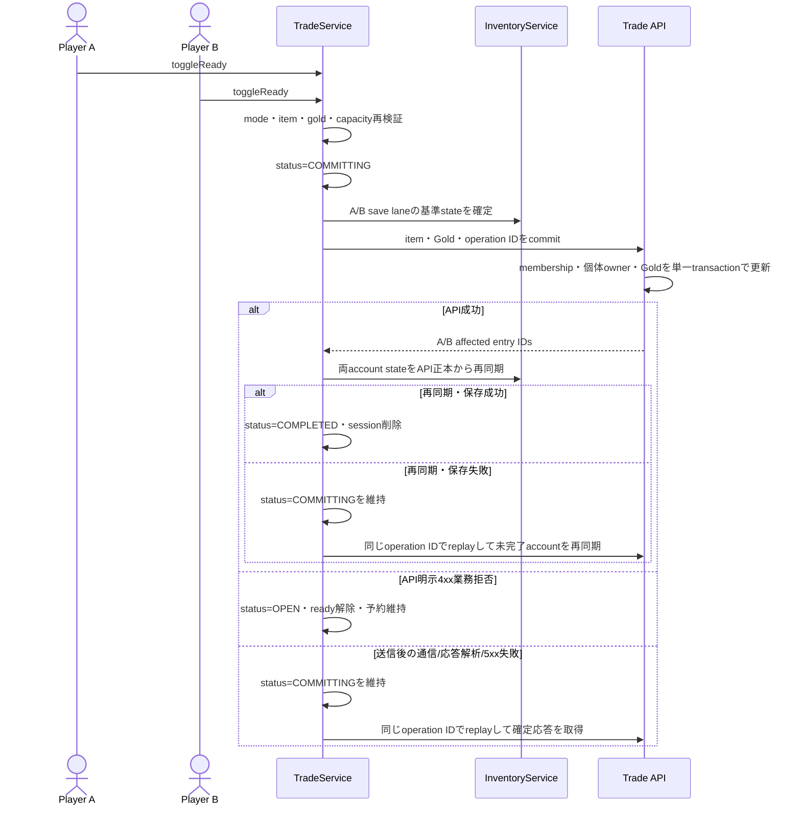
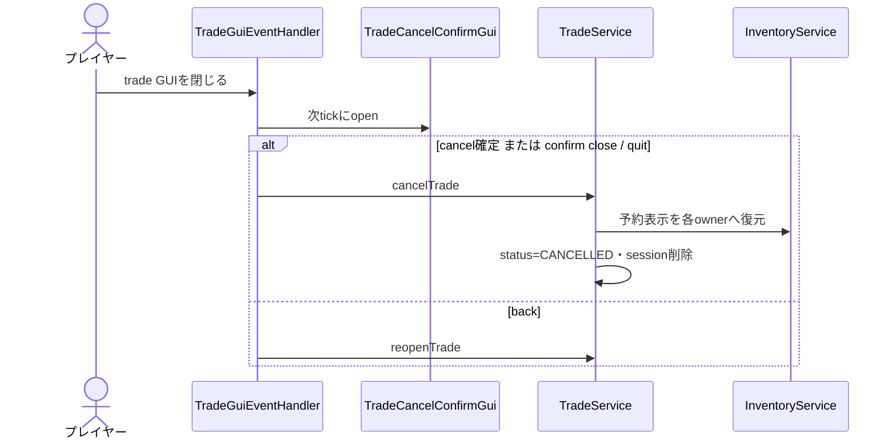

# 22_4-統合フロー

## 1. 招待から session 開始

### シーケンス

### 処理要点

- request status は `PENDING -> ACCEPTED`、期限到達時は `EXPIRED`。
- session へ両 player UUID と account ID を固定する。

### 例外・終了条件

- 60 秒超過、sender offline、mode 不正、既存 session では開始しない。

## 2. Item／gold 提示

### シーケンス

### 処理要点

- unTradeable item は escrow に入れない。
- 予約は local inventory state を変更しないため、autosave が API commit 前の ownership を送信しない。
- Gold 金額設定は 1 から 10^18 の調整単位を切り替え、飽和演算と残高上限 clamp で1桁から大額まで扱う。
- 相手側 slot は表示専用。
- item／gold の提示変更は、同一 session の Trade GUI を開いている参加者だけを再描画する。相手が Gold 金額設定または中止確認 GUI を開いている場合、その操作画面は維持する。

### 例外・終了条件

- holder session／viewer 不一致、session 非 OPEN、inventory mutation 失敗では更新しない。

## 3. Commit

### シーケンス

### 処理要点

- GUI で見た内容ではなく commit 時点の source entry ID・数量 snapshot を使う。
- API は装備／ルーン個体の `account_id` と inventory entry membership を同一 transaction で移管するため、受取側の resolver が owner 不一致で空表示／再ログイン時削除となる経路を防ぐ。
- A/B の save lane は相互待機せず、各 account の baseline を先に保存して未解決境界を保持した後、API transaction と各 account の再同期・保存を future で連結する。single-thread executor でも lane worker は相手 lane を `join` しない。
- capacity 判定は対象 player が全量送付する source entry の予約数量を state snapshot から先に差し引く。部分送付は既存 stack の空きを増やし、同一 source の複数明細は合算してから相手 item の stack 併合／slot 消費を判定する。
- item／gold 変更後は ready が reset されるため、両者が同じ内容へ同意する。

### 例外・終了条件

- API が明示する 4xx 業務拒否だけは DB 未変更として `OPEN` へ戻し再操作可能。送信後の通信喪失・応答解析失敗・5xx は API transaction 未確定を証明しないため、`COMMITTING` と account の未解決保存境界を維持し、同じ session ID の冪等 replay で確定応答を取得する。API 成功後の再同期・保存失敗も同じ replay で未完了 account だけを再同期する。

## 4. Close・cancel

### シーケンス

### 処理要点

- internal reopen では suppressed close set を使い、意図しない confirm 再表示を防ぐ。
- amount GUI close は trade GUI へ戻す。

### 例外・終了条件

- plugin disable は `cancelAll()` で同じ予約解除を全 session に適用する。
