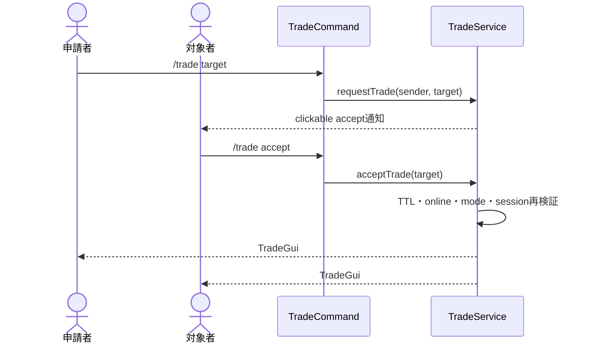
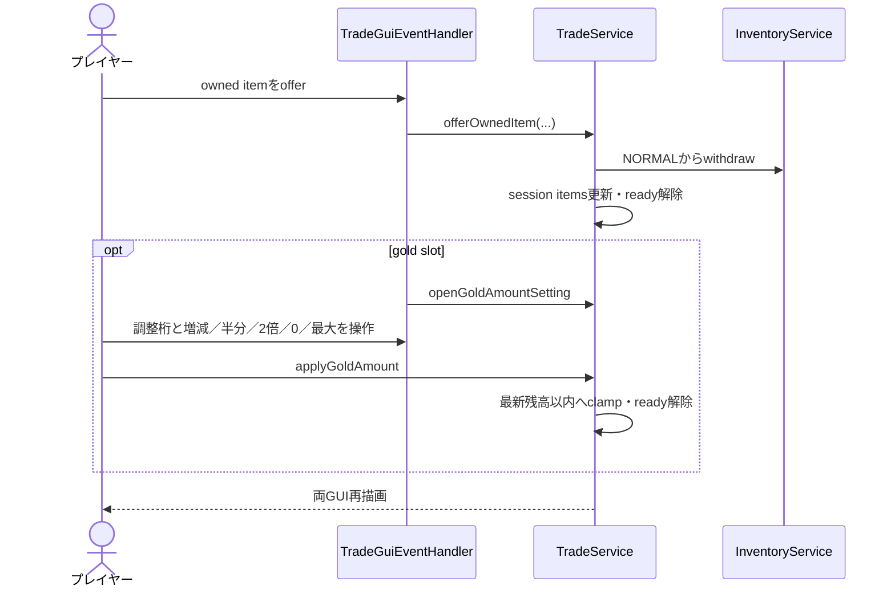
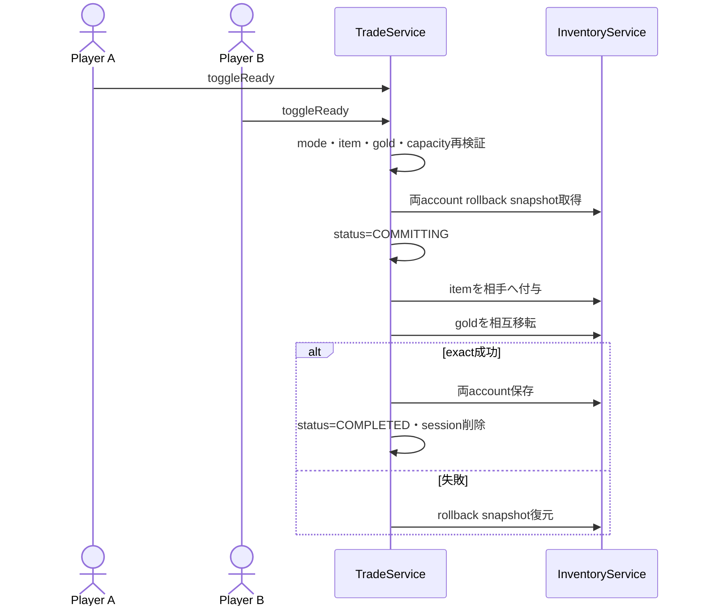
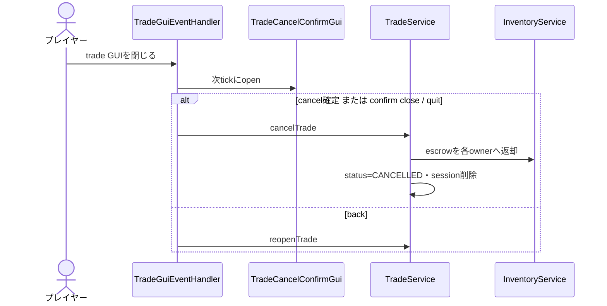

# 22_4-統合フロー

## 1. 招待から session 開始

### シーケンス

### 処理要点

- request status は `PENDING -> ACCEPTED`、期限到達時は `EXPIRED`。
- session へ両 player UUID と account ID を固定する。

### 例外・終了条件

- 60 秒超過、sender offline、mode 不正、既存 session では開始しない。

## 2. Item／gold 提示

### シーケンス

### 処理要点

- unTradeable item は escrow に入れない。
- 通常 BAG の entry を全数提示して削除した場合は、容量外 entry を含む後続 item を表示順のまま前詰めする。
- Gold 金額設定は 1 から 10^18 の調整単位を切り替え、飽和演算と残高上限 clamp で1桁から大額まで扱う。
- 相手側 slot は表示専用。
- item／gold の提示変更は、同一 session の Trade GUI を開いている参加者だけを再描画する。相手が Gold 金額設定または中止確認 GUI を開いている場合、その操作画面は維持する。

### 例外・終了条件

- holder session／viewer 不一致、session 非 OPEN、inventory mutation 失敗では更新しない。

## 3. Commit

### シーケンス

### 処理要点

- GUI で見た内容ではなく commit 時点の session snapshot を使う。
- item／gold 変更後は ready が reset されるため、両者が同じ内容へ同意する。

### 例外・終了条件

- rollback 成功なら `OPEN` へ戻し再操作可能。rollback failure は未決事項の運用リスクとなる。

## 4. Close・cancel

### シーケンス

### 処理要点

- internal reopen では suppressed close set を使い、意図しない confirm 再表示を防ぐ。
- amount GUI close は trade GUI へ戻す。

### 例外・終了条件

- plugin disable は `cancelAll()` で同じ返却処理を全 session に適用する。
