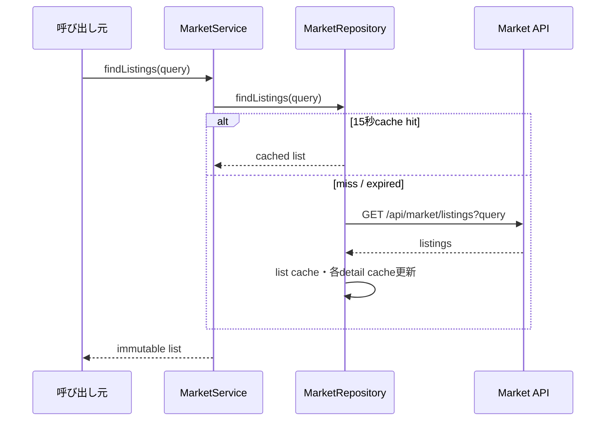
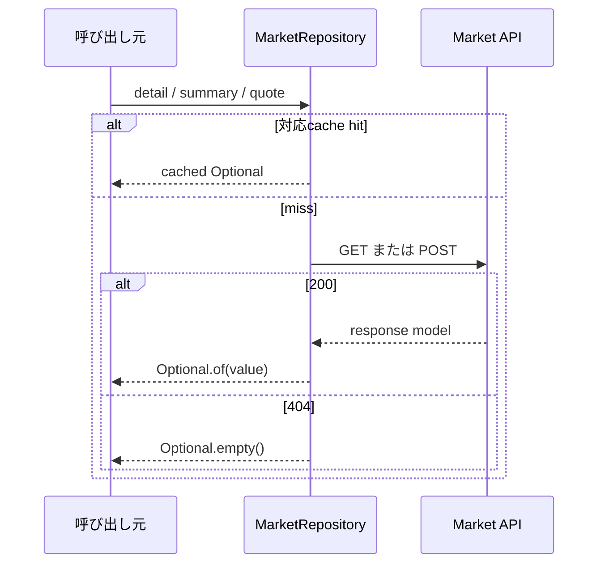
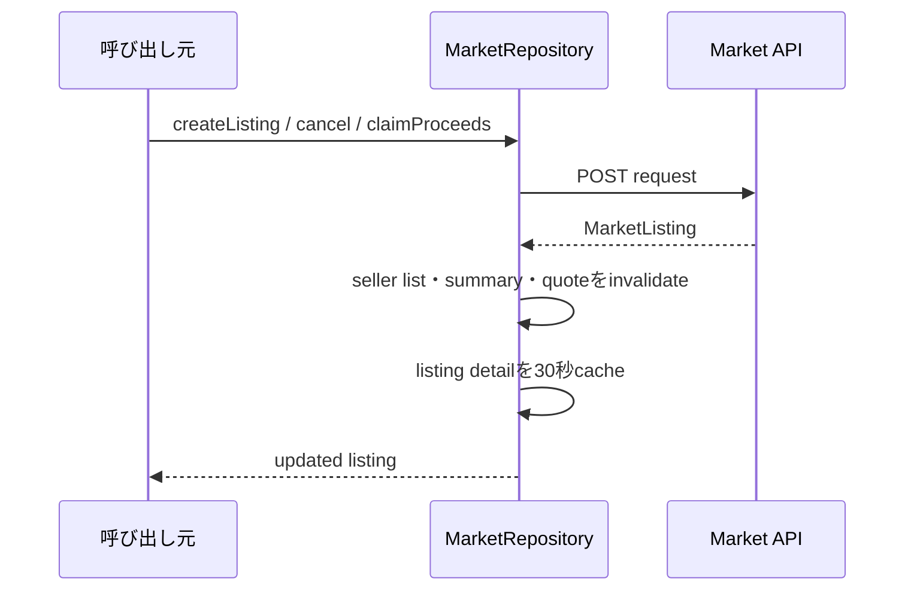
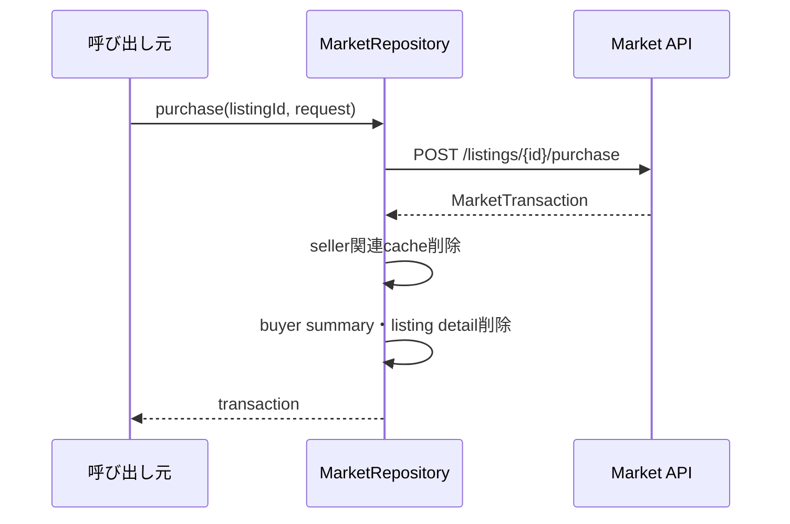
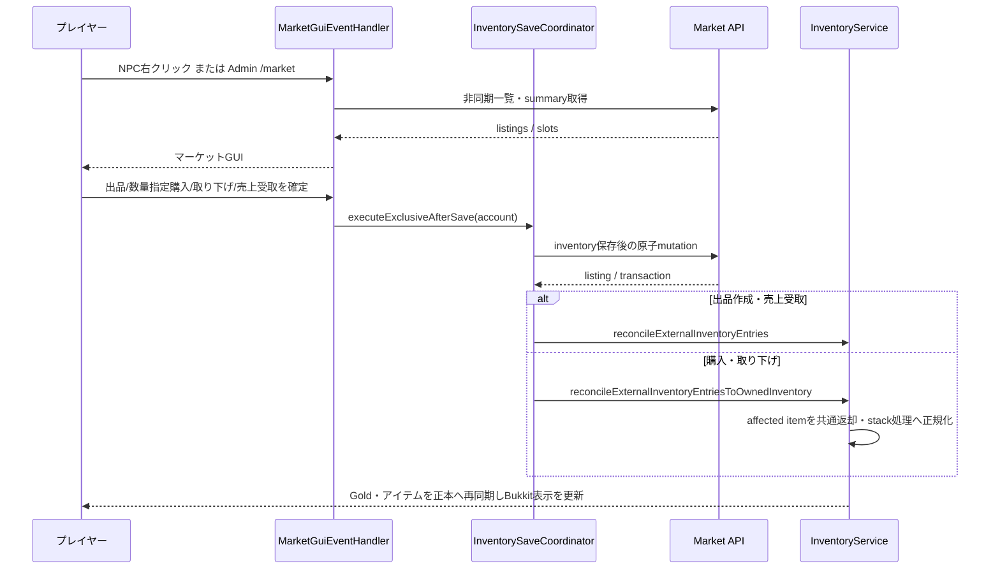

# 23_4-統合フロー

## 1. 出品一覧参照

### シーケンス

### 処理要点

- query の nullable field は省略し、値は URL encode する。
- page／pageSize は query model で正規化する。
- API が返す `sellerAccountName` と `sellerAccountSlotIndex` を `MarketListing` へ保持し、公開一覧・購入確認のアイテム説明欄へ `{accountName}#{slotIndex}`（`#slotIndex` は灰色）として表示する。`sellerAccountId` は画面へ表示しない。

### 例外・終了条件

- cache miss 時の API／JSON failure は caller へ伝播する。

## 2. 詳細・summary・quote 参照

### シーケンス

### 処理要点

- TTL は detail 30 秒、summary 15 秒、quote 5 秒。
- 404 の negative result 自体は cache しない。

### 例外・終了条件

- 200／404 以外は `IllegalStateException`。

## 3. 出品作成・cancel・売上受取

### シーケンス

### 処理要点

- create は 201、cancel / claimProceeds は 200 を成功とする。claimProceeds は listing ID から安定導出した同一 `idempotencyKey` で一度再送できる。
- API が価格 guard・所有権・status transition を確定する。

### 例外・終了条件

- mutation failure 時は cache invalidation を行わない。

## 4. 購入

### シーケンス

### 処理要点

- caller が一意な `idempotencyKey` と `remainingQuantity` 以下の購入数量を request に含める。
- 購入応答を受信できなかった場合は、同一 `idempotencyKey` で一度だけ再送し、API が再生した Gold と購入品の `affectedInventoryEntryIds` を再同期する。配列の欠落・空・不正 UUID は成功として扱わない。
- plugin は API transaction の結果を再計算しない。
- seller Gold は購入成功時には同期せず、seller が `SOLD` 出品をクリックして `claimProceeds` を成功させたときだけ同期する。

### 例外・終了条件

- API が 200 以外を返した場合は transaction を返さず、cache も維持する。

## 5. サーバー内 GUI の出品・購入

### 処理要点

- 出品は BAG/HOTBAR 上の取引可能な item（売却不可 item も可）を選び、stack 品（ルーンを含む）は同じ item の全 entry から選択数量を `sourceEntries` へ割り当てる。API が source ごとに escrow 化する。個体品は `EQUIPMENT` だけで、source entry を削除状態にして escrow 化する。
- 購入では GUI で `1..remainingQuantity` を選択し、保存 lane 内の API 呼出直前にも数量範囲、item model 解決、指定数量を収容できる BAG 容量を検証する。いずれかに失敗した場合は購入 API を呼ばず拒否する。検証成功後、API が購入者 Gold と指定数量の取得 item を更新する。購入者は response の `affectedInventoryEntryIds` を `reconcileExternalInventoryEntriesToOwnedInventory` へ渡し、通常 item はAPIが今回追加した数量だけを共通の所有インベントリ返却・stack 処理へ渡す。操作前から存在する同一 item の各stackは削除・再構築せず、ID・配置・数量を維持したまま空きのあるstackへ追加する。自己出品は GUI と API の両方で拒否する。
- 売却済みの `SOLD` 出品は売上受取待ちとして枠を消費する。出品者が一覧 item をクリックすると API が売上を加算し、Plugin は出品者通貨を再同期して当該枠を削除する。
- 取り下げ時は Plugin が未売却残数を所持品へ収容できるかを確認クリック時と account 保存 lane 内の API 呼出直前に確認する。どちらかで容量不足なら API を呼ばず、保存 lane を外部操作未実行として完了して失敗表示する。API が復元した全 source entry は `reconcileExternalInventoryEntriesToOwnedInventory` で再同期し、BAG の stack 品はAPIが今回復元した数量だけを共通 stack 処理へ渡す。既存の同一 item stackは削除・再構築しない。HOTBAR に復元された entry も個別配置を維持せず、容量確認済みの BAG へ共通返却処理で移動する。売上なしは枠を解放し、部分売却済みは `SOLD` 売上受取待ちを残す。
- `ACTIVE` / `SUSPENDED` / 売上未受取 `SOLD` を含む使用済み出品枠が上限に達した場合、API は新規出品を拒否する。
- マーケットの一覧・出品選択画面は共通ホットバー操作へ参加する。自分の出品一覧では、取り下げ／売上受取へ遷移できるのは一覧上段の出品枠クリックだけとする。player inventory click は BAG の上下スクロール control を先に共通処理へ委譲し、それ以外は常に出品候補選択として出品設定へ遷移する。54 slot 一覧の上段ヘッダー中央に、公開一覧では更新、自分の出品一覧では新規出品を配置する。raw slot `9`〜`44` を一覧領域とし、API の 37 件目を次ページ有無の判定に使って、内容のないページへ遷移できないようにする。ページ操作は紙アイコンと `GuiSound.PAGE` を使う。
- 出品・売上受取は個別の entry 追加処理を持たず `reconcileExternalInventoryEntries` の三者マージだけを使い、部分出品後の source slot／残数量と売上受取の通貨正本を保持する。購入・取り下げは `reconcileExternalInventoryEntriesToOwnedInventory` を使い、通常 item の共通返却・stack 正規化を行う。三者マージのstate反映と共通返却・stack正規化は同一account state lock内で原子的に扱い、正規化失敗時はマージ反映前へ戻すため、同じbaselineの再試行でAPI追加分を重複させない。正本再同期と必要な共通処理の成功後に Bukkit メインスレッドで `refreshManagedInventoryUi` を実行し、画面を閉じた場合でも online player の所持品表示を更新する。
- 一覧・出品選択画面に閉じるボタンは表示しない。出品選択画面の raw slot `49` は自分の出品一覧へ戻る画面内遷移とし、選択中はバッグのスクロール操作を優先する。
- マーケット概要 item は API summary の `completedTradeCount` / `tier` をそのまま表示し、Tier 基本枠と拡張トークンの加算ルールを説明する。拡張トークンは `CURRENCY` inventory の所持数量を正本とし、ショップ購入の inventory 保存 future が成功した後に market cache を破棄する。購入後にマーケットを再表示または更新すると API が返す最大枠へ反映される。
