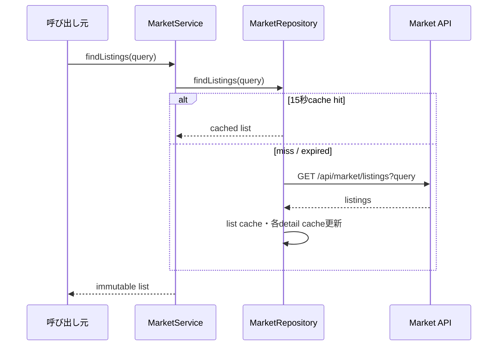
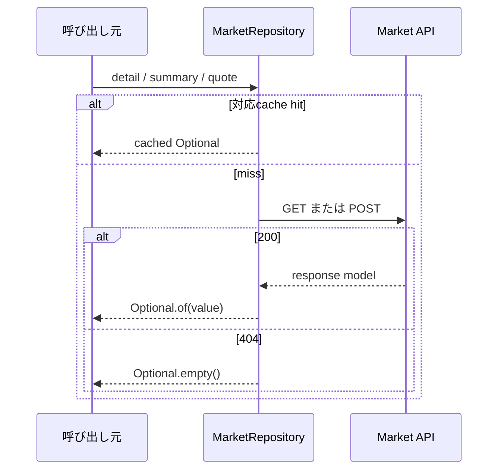
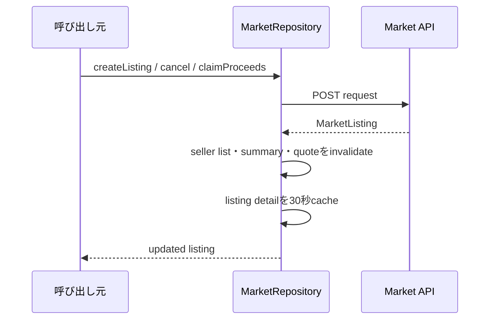
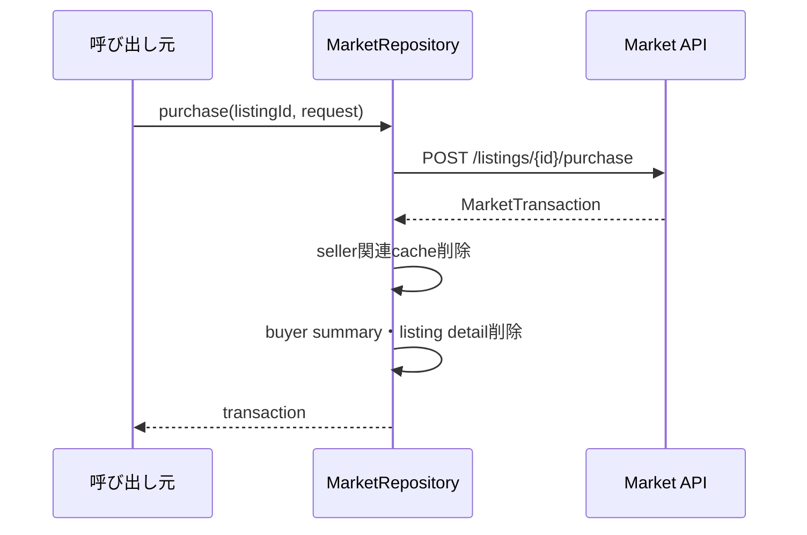
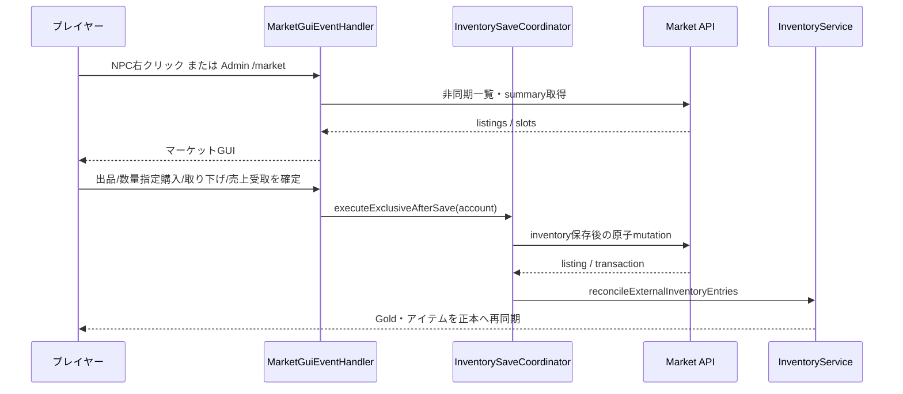

# 23_4-統合フロー

## 1. 出品一覧参照

### シーケンス

### 処理要点

- query の nullable field は省略し、値は URL encode する。
- page／pageSize は query model で正規化する。
- API が返す `sellerAccountName` を `MarketListing` へ保持し、公開一覧・購入確認のアイテム説明欄へ出品者名として表示する。`sellerAccountId` は画面へ表示しない。

### 例外・終了条件

- cache miss 時の API／JSON failure は caller へ伝播する。

## 2. 詳細・summary・quote 参照

### シーケンス

### 処理要点

- TTL は detail 30 秒、summary 15 秒、quote 5 秒。
- 404 の negative result 自体は cache しない。

### 例外・終了条件

- 200／404 以外は `IllegalStateException`。

## 3. 出品作成・cancel・売上受取

### シーケンス

### 処理要点

- create は 201、cancel / claimProceeds は 200 を成功とする。claimProceeds は listing ID から安定導出した同一 `idempotencyKey` で一度再送できる。
- API が価格 guard・所有権・status transition を確定する。

### 例外・終了条件

- mutation failure 時は cache invalidation を行わない。

## 4. 購入

### シーケンス

### 処理要点

- caller が一意な `idempotencyKey` と `remainingQuantity` 以下の購入数量を request に含める。
- plugin は API transaction の結果を再計算しない。
- seller Gold は購入成功時には同期せず、seller が `SOLD` 出品をクリックして `claimProceeds` を成功させたときだけ同期する。

### 例外・終了条件

- API が 200 以外を返した場合は transaction を返さず、cache も維持する。

## 5. サーバー内 GUI の出品・購入

### 処理要点

- 出品は BAG/HOTBAR 上の取引可能な item（売却不可 item も可）を選び、stack 品は同じ item の全 entry から選択数量を `sourceEntries` へ割り当てる。API が source ごとに escrow 化する。個体品（`EQUIPMENT` / `RUNE`）も source entry を削除状態にして escrow 化する。
- 購入では GUI で `1..remainingQuantity` を選択し、API が購入者 Gold と指定数量の取得 item を更新する。購入者は response の `affectedInventoryEntryIds` でローカル状態を再同期する。自己出品は GUI と API の両方で拒否する。
- 売却済みの `SOLD` 出品は売上受取待ちとして枠を消費する。出品者が一覧 item をクリックすると API が売上を加算し、Plugin は出品者通貨を再同期して当該枠を削除する。
- 取り下げ時は Plugin が未売却残数を所持品へ収容できるかを確認クリック時と account 保存 lane 内の API 呼出直前に確認する。どちらかで容量不足なら API を呼ばず、保存 lane を外部操作未実行として完了して失敗表示する。HOTBAR source の元 slot が出品中に再利用されていた場合は、API が返却 entry を容量確認済みの BAG へ移し、Plugin の正本再同期で表示 slot へ配置する。API 成功後は全 source entry を再同期する。売上なしは枠を解放し、部分売却済みは `SOLD` 売上受取待ちを残す。
- `ACTIVE` / `SUSPENDED` / 売上未受取 `SOLD` を含む使用済み出品枠が上限に達した場合、API は新規出品を拒否する。
- マーケットの一覧・出品選択画面は共通ホットバー操作へ参加する。自分の出品一覧の player inventory click では BAG の上下スクロール control を先に共通処理へ委譲し、それ以外の item click を出品自動選択へ使う。54 slot 一覧の上段ヘッダー中央に、公開一覧では更新、自分の出品一覧では新規出品を配置する。raw slot `9`〜`44` を一覧領域とし、API の 37 件目を次ページ有無の判定に使って、内容のないページへ遷移できないようにする。ページ操作は紙アイコンと `GuiSound.PAGE` を使う。
- 一覧・出品選択画面に閉じるボタンは表示しない。出品選択画面の raw slot `49` は自分の出品一覧へ戻る画面内遷移とし、選択中はバッグのスクロール操作を優先する。
