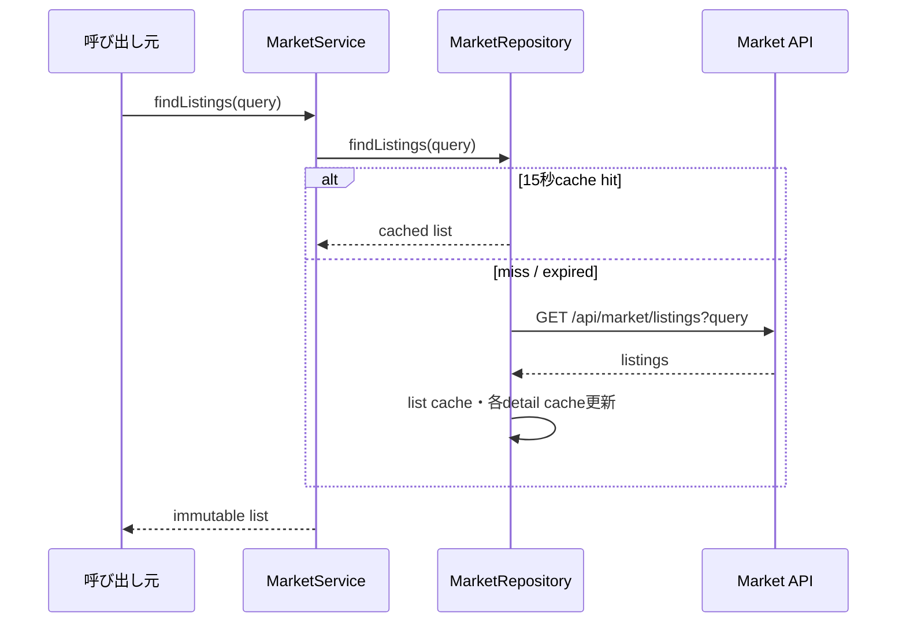
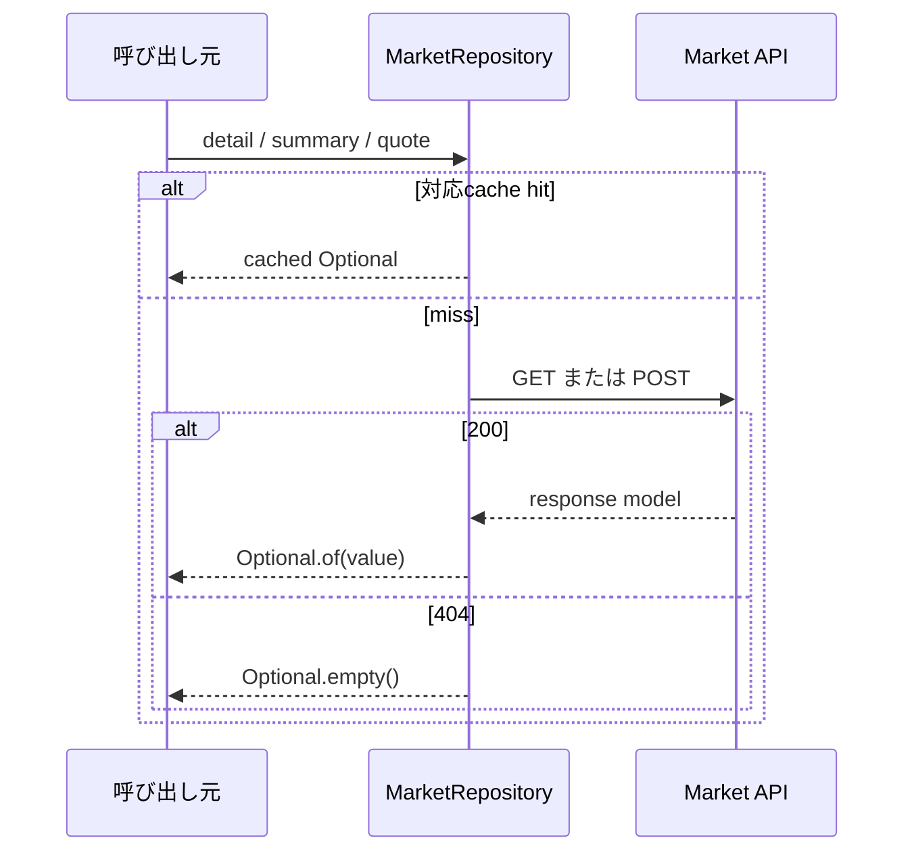
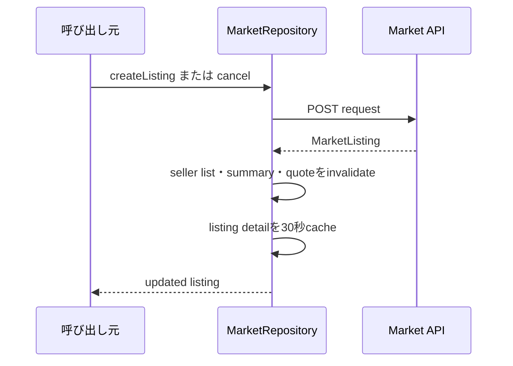
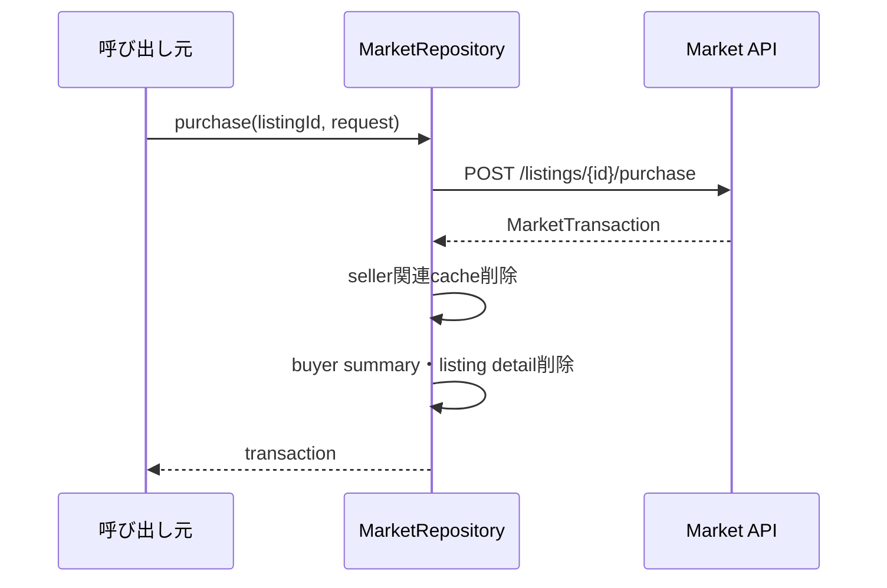
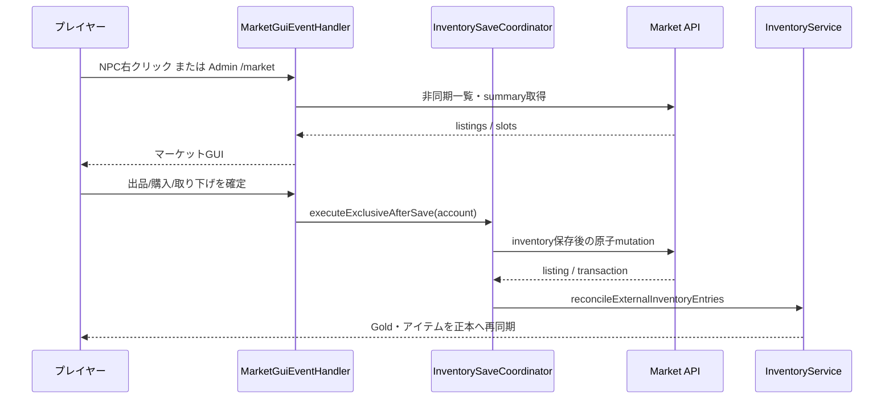

# 23_4-統合フロー

## 1. 出品一覧参照

### シーケンス

### 処理要点

- query の nullable field は省略し、値は URL encode する。
- page／pageSize は query model で正規化する。

### 例外・終了条件

- cache miss 時の API／JSON failure は caller へ伝播する。

## 2. 詳細・summary・quote 参照

### シーケンス

### 処理要点

- TTL は detail 30 秒、summary 15 秒、quote 5 秒。
- 404 の negative result 自体は cache しない。

### 例外・終了条件

- 200／404 以外は `IllegalStateException`。

## 3. 出品作成・cancel

### シーケンス

### 処理要点

- create は 201、cancel は 200 を成功とする。
- API が価格 guard・所有権・status transition を確定する。

### 例外・終了条件

- mutation failure 時は cache invalidation を行わない。

## 4. 購入

### シーケンス

### 処理要点

- caller が一意な `idempotencyKey` を request に含める。
- plugin は API transaction の結果を再計算しない。

### 例外・終了条件

- API が 200 以外を返した場合は transaction を返さず、cache も維持する。

## 5. サーバー内 GUI の出品・購入

### 処理要点

- 出品は BAG/HOTBAR 上の取引可能 item を選び、API が source entry を escrow 化する。Plugin の選択画面は取引不可item・Gold・不正なentry形式だけを除外し、許可カテゴリを固定列挙しない。個体品も source entry を削除状態にして escrow 化する。
- 購入では API が購入者 Gold を減らし、出品者 Gold を増やし、取得 item を購入者 BAG へ移す。購入者は response の `affectedInventoryEntryIds` でローカル状態を再同期する。
- オンライン出品者は API transaction 完了後に `CURRENCY` entry 全件を非同期で再取得し、ローカル加算を行わず API 正本 snapshot を反映する。購入者の GUI / セッションが終了していても再同期は実行する。これにより出品者の古い `expectedUpdatedAt` を次回保存へ送らない。
- `CANCELED` を含む使用済み出品枠が上限に達した場合、API は新規出品を拒否する。`SOLD` と `EXPIRED` は枠を解放する。
- マーケットの一覧・出品選択画面は共通ホットバー操作へ参加する。54 slot 一覧の上段ヘッダー中央に、公開一覧では更新、自分の出品一覧では新規出品を配置する。raw slot `9`〜`44` を一覧領域とし、API の 37 件目を次ページ有無の判定に使って、内容のないページへ遷移できないようにする。ページ操作は紙アイコンと `GuiSound.PAGE` を使う。
- 一覧・出品選択画面に閉じるボタンは表示しない。出品選択画面の raw slot `49` は自分の出品一覧へ戻る画面内遷移とし、選択中はバッグのスクロール操作を優先する。
