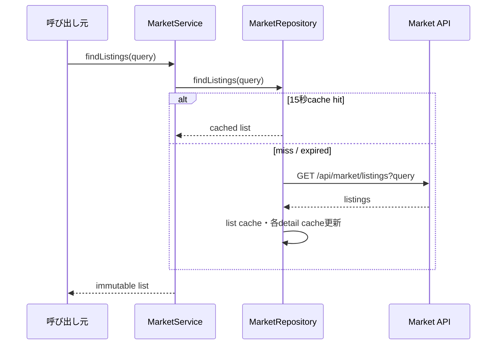
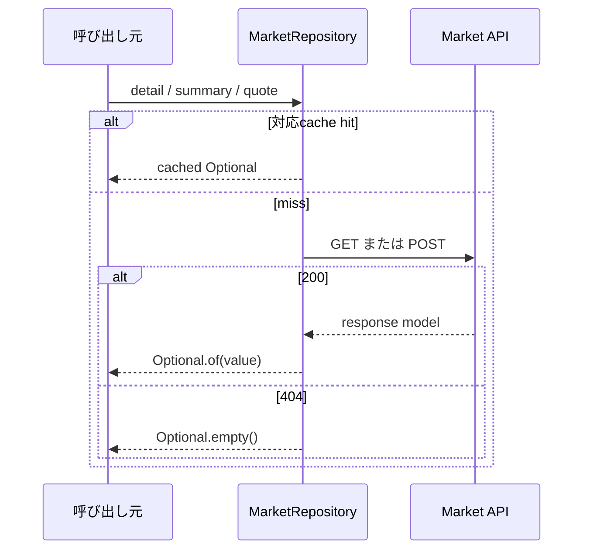
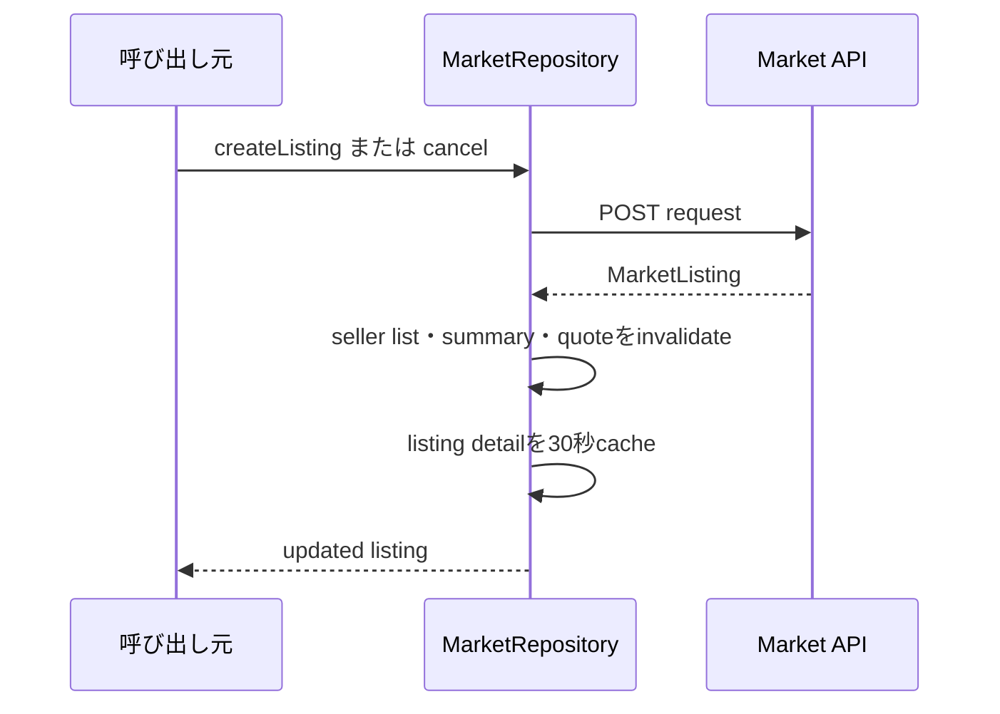
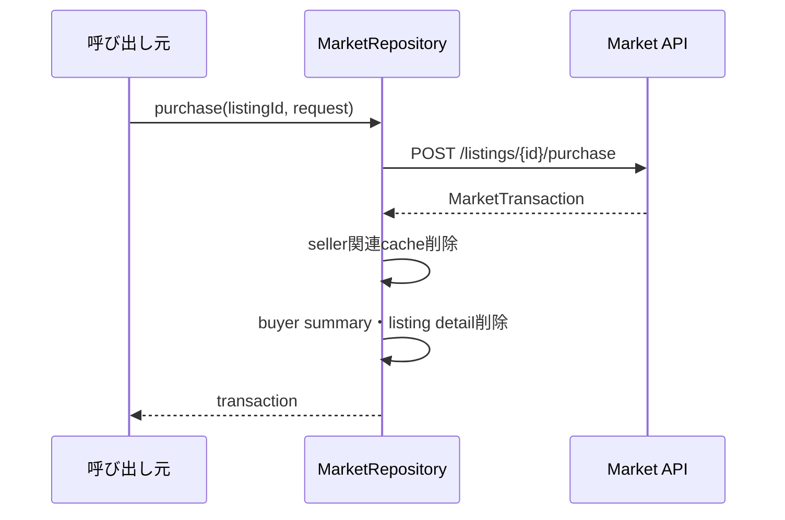

# 23_4.00-統合フロー

## 1. 出品一覧参照

### シーケンス

### 処理要点

- query の nullable field は省略し、値は URL encode する。
- page／pageSize は query model で正規化する。

### 例外・終了条件

- cache miss 時の API／JSON failure は caller へ伝播する。

## 2. 詳細・summary・quote 参照

### シーケンス

### 処理要点

- TTL は detail 30 秒、summary 15 秒、quote 5 秒。
- 404 の negative result 自体は cache しない。

### 例外・終了条件

- 200／404 以外は `IllegalStateException`。

## 3. 出品作成・cancel

### シーケンス

### 処理要点

- create は 201、cancel は 200 を成功とする。
- API が価格 guard・所有権・status transition を確定する。

### 例外・終了条件

- mutation failure 時は cache invalidation を行わない。

## 4. 購入

### シーケンス

### 処理要点

- caller が一意な `idempotencyKey` を request に含める。
- plugin は API transaction の結果を再計算しない。

### 例外・終了条件

- API が 200 以外を返した場合は transaction を返さず、cache も維持する。
