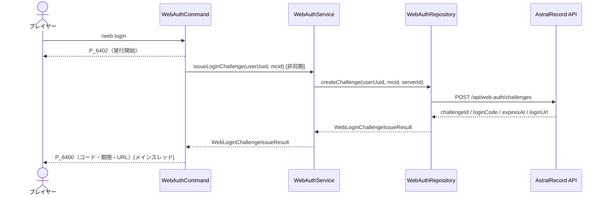
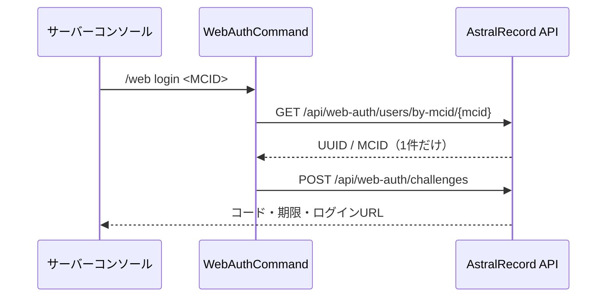

# 24_4-統合フロー

## 1. Web ログインコード発行

### シーケンス

### 処理要点

1. コマンドは user UUID と MCID を確定してから非同期タスクへ渡す。
2. サービスは設定済みの API server ID を補い、リポジトリへ委譲する。
3. リポジトリだけが HTTP 要求と JSON 変換を担当する。
4. プレイヤー通知はメインスレッドへ戻し、オンライン状態を再確認してから行う。
5. コードの保存・消費と Web の Cookie セッションは API / Web 側の責務であり、本フローの対象外とする。

## 2. コンソール指定発行

未登録またはMCID重複は発行しない。ゲーム内プレイヤーがMCIDを指定した場合も発行しない。

### 例外・終了条件

- 引数が `/web login` と一致しない場合は使用方法を表示し、API を呼ばない。
- API 通信、status 検証、JSON 変換のいずれかが失敗した場合は `P_6401` を通知する。
- 非同期処理中にプレイヤーが退出した場合は結果を送信しない。
