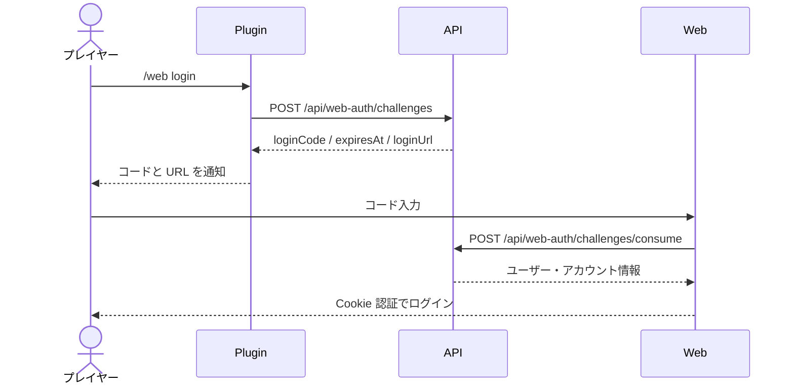

# 24_4.00-統合フロー

```mermaid
sequenceDiagram
    actor Player as プレイヤー
    participant Plugin
    participant API
    participant Web
    Player->>Plugin: /web login
    Plugin->>API: POST /api/web-auth/challenges
    API-->>Plugin: loginCode / expiresAt / loginUrl
    Plugin-->>Player: コードと URL を通知
    Player->>Web: コード入力
    Web->>API: POST /api/web-auth/challenges/consume
    API-->>Web: ユーザー・アカウント情報
    Web-->>Player: Cookie 認証でログイン
```
