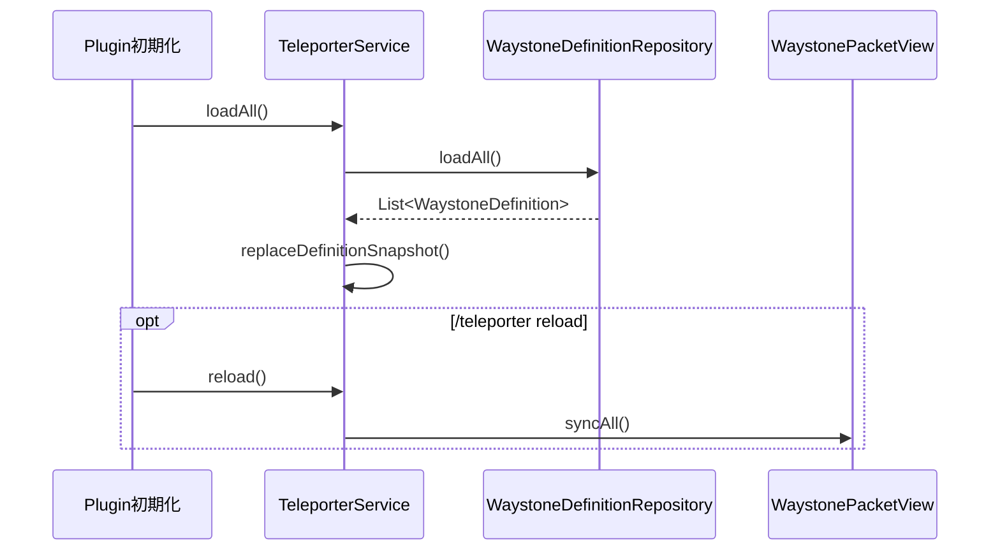
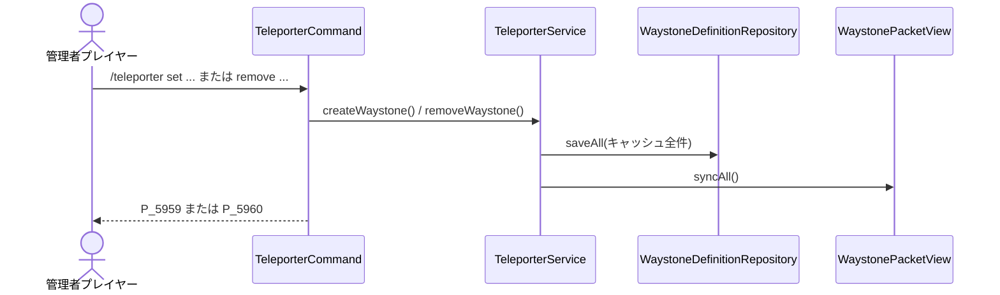
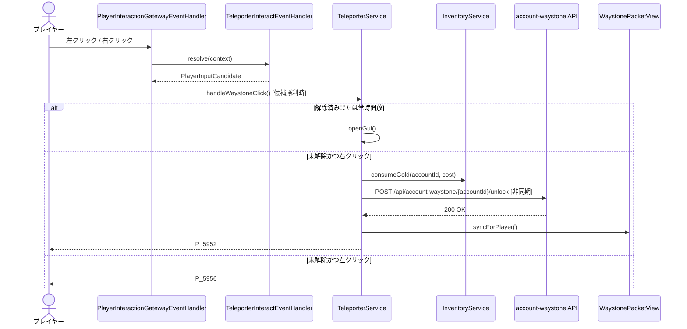
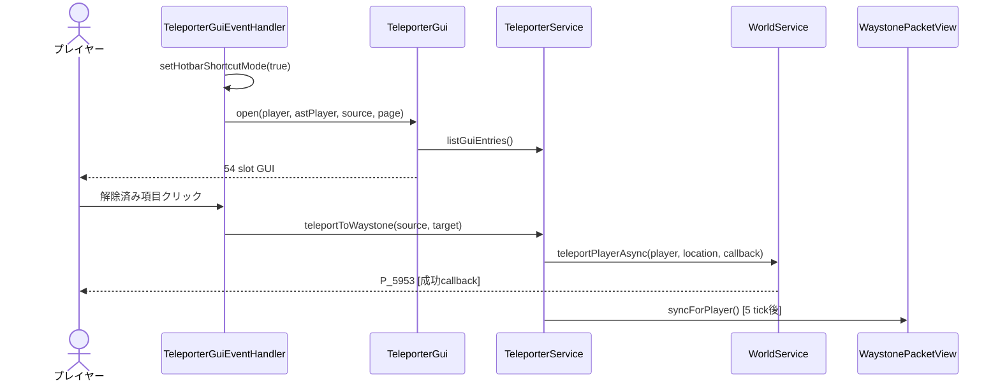
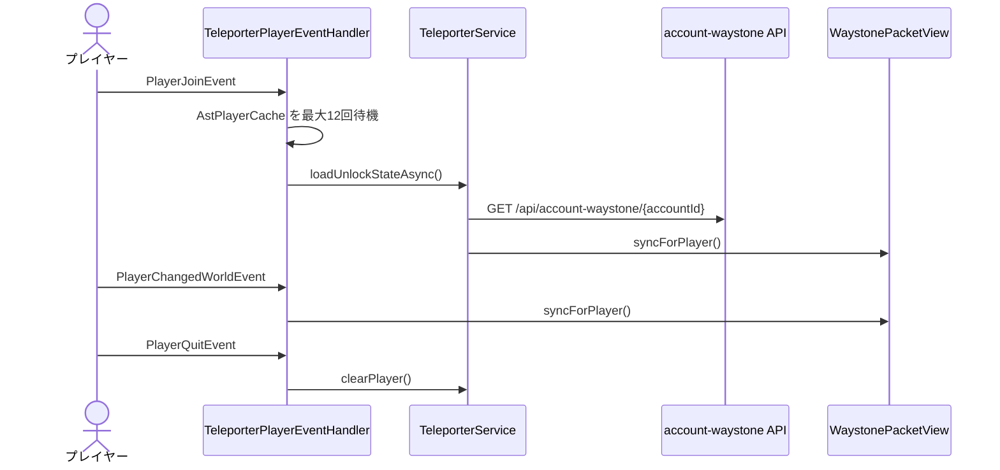

# 25_4-統合フロー

## 1. 起動・再読み込み

### シーケンス

### 処理要点

1. `waystones.yml` が存在しない場合は空リストで開始する。
2. サービスは読み込みスナップショットで ID キャッシュ全体を置き換える。
3. `reload` の場合だけ、オンラインプレイヤー全員の表示を destroy して再生成する。

### 例外・終了条件

- YAML の各行で `id`、`name`、`worldName` を解決できない場合、その行だけを読み飛ばす。
- 現行 repository は保存失敗をログ化するが、読み込み時の追加スキーマ検証は行わない。

## 2. 管理者による作成・削除

### シーケンス

### 処理要点

1. `AstCommand` がプレイヤー専用と permission 99 を検証し、`handleSet` / `handleRemove` が引数を検証する。
2. 作成時は現在のブロック座標、yaw / pitch、user UUID を定義へ保存する。
3. 削除時は ID キャッシュから除去し、残った全定義で `waystones.yml` を上書きする。
4. 作成・削除後はいずれも全オンラインプレイヤーの表示を再同期する。

### 例外・終了条件

- 空の名称、不正な boolean、負数または数値でない解除ゴールドは `P_5950` / `P_5951` で拒否する。
- 削除 ID が存在しない場合は `P_5960` を送り、保存と表示同期を行わない。

## 3. ウェイストーン操作と解除

### シーケンス

### 処理要点

1. resolver は共通 ray snapshot から最も近い球 hitbox を解決し、副作用のない world interaction 候補を返す。
2. 共通 dispatcher が勝者にした場合だけ executor を実行し、同一入力で別候補へ fallback しない。
3. ロック定義で解除状態が未取得なら API 取得を非同期実行し、メインスレッドで操作を再開する。
4. 解除時はゴールド消費と即時保存後に API 登録し、成功時だけキャッシュ、packet 表示、サウンド、パーティクルを更新する。

### 例外・終了条件

- 解除状態取得失敗は `P_5964`、実行時依存未設定は `P_5963`、残高不足は `P_5955` で終了する。
- API 登録失敗後は同額を返金して保存し、`P_5957` を送る。返金失敗は `LogId.E_5952` を記録する。

## 4. GUI 表示とテレポート

### シーケンス

### 処理要点

1. 同一ワールドかつ起点以外の定義を、解除済み優先・表示名順で並べる。
2. `TeleporterGui.Holder` は現在ページの ID 順を保持し、共通ホットバーショートカットを利用する。
3. 未解除項目は `P_5962` を送って GUI を維持する。
4. テレポートは `WorldService` を経由し、移動直前のプレイヤーの yaw / pitch を保持する。
5. GUI close 時は共通ホットバーショートカットモードを解除する。

### 例外・終了条件

- 起点と対象のワールド不一致、対象未解除、world service 未設定、Location 解決失敗は `P_5954` で終了する。
- Inventory click / drag はキャンセルし、GUI 処理例外は `LogId.E_5951` を記録する。

## 5. プレイヤー表示ライフサイクル

### シーケンス

### 処理要点

1. join は 20 tick 間隔で最大 12 回、`AstPlayerCache` の準備を待つ。
2. API 成功時は解除状態をキャッシュして表示を同期する。
3. API 失敗時も表示同期を行い、常時開放以外を未解除として描画する。
4. world change は既存表示を destroy して移動先ワールドの表示を再生成する。
5. quit は解除状態、進行中解除キー、packet entity を破棄する。

### 例外・終了条件

- join 待機中にプレイヤーが退出した場合は終了する。
- ライフサイクル同期例外は `LogId.E_5955` に player と trigger を記録する。
