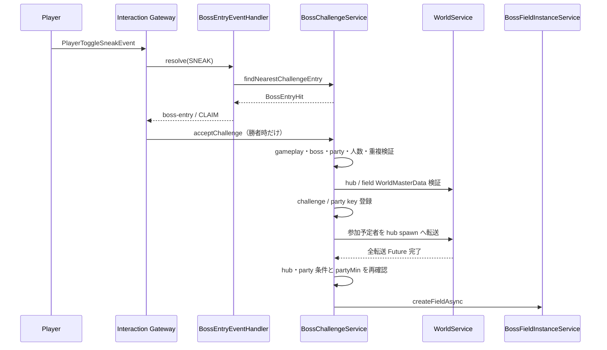
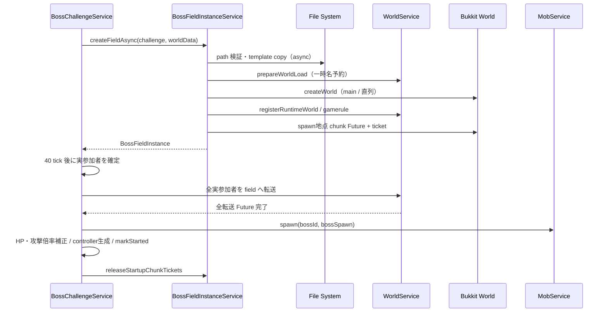
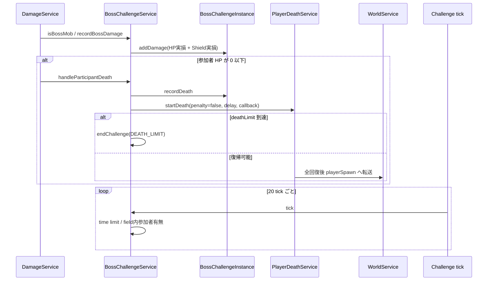
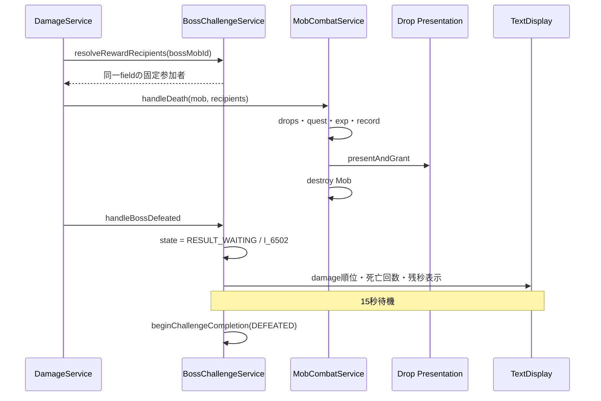
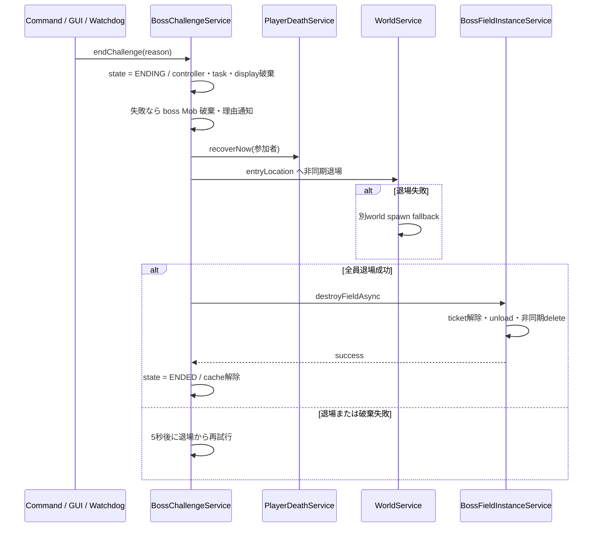
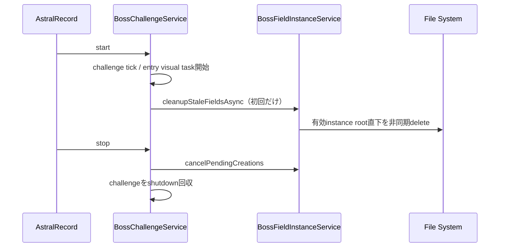

# 26_4.00-統合フロー

## 1. 入口入力からフィールド準備開始

### シーケンス

### 処理要点

- `SNEAK` 候補は入口までの実距離で他の world interaction 候補と比較し、勝者になった場合だけ受付する。
- 受付時のオンライン party member を `expectedParticipantIds` に固定する。
- 専用待機 flag は使わず、hub world、現在 party、online 状態で入場可能者を判定する。
- hub 転送の一部失敗は即 `TRANSFER_FAILED` にせず、完了時の eligible 人数が `partyMin` 未満なら `PARTICIPANT_REQUIREMENT_NOT_MET` とする。

### 例外・終了条件

- gameplay 対象外、master／入口／leader／人数／重複／world 設定不備は challenge を登録しない。

## 2. フィールド作成と戦闘開始

### シーケンス

### 処理要点

- file 操作は非同期、world load／登録／unload は world tick 外のメインスレッドで行う。
- world load は全 challenge で直列化し、各 load 間を最低1 tick空ける。
- player／boss spawn が同一 chunk の場合は1件だけ準備する。
- field 転送は確定した実参加者全員が成功した場合だけ boss を生成する。
- scaling は実参加人数を用い、最大 HP・現在 HP・`outgoingDamageMultiplier` を更新する。

### 例外・終了条件

- copy／load／chunk 準備失敗は `FIELD_PREPARE_FAILED`。
- field 転送失敗は `TRANSFER_FAILED`、boss spawn 失敗は `BOSS_SPAWN_FAILED`。
- 失敗時も chunk ticket、runtime world、copy folder を回収する。

## 3. 戦闘・ダメージ・死亡復帰

### シーケンス

### 処理要点

- damage 集計は `IN_PROGRESS` の実参加者だけを対象とする。
- 死亡は通常 death session を再利用するが、経験値 penalty を無効にし、復帰先を field に差し替える。
- 復帰時は HP / MP / EN / Shield を全回復する。
- Sidebar は準備中／戦闘中の表示参加者へ boss 名、死亡数、時間、参加者を表示する。

### 例外・終了条件

- 制限時間到達は `TIME_LIMIT`、field 内参加者0人は `NO_PARTICIPANTS`。
- 復帰転送失敗は `TRANSFER_FAILED`。

## 4. 討伐成功・報酬・結果待機

### シーケンス

### 処理要点

- reward recipient は実参加者、online、field world 同一、`AstPlayer` 解決可能を満たす対象へ固定する。
- 通常 Mob の固定受取人 overload を再利用し、現在 party／threat table では受取人を決めない。
- 討伐報酬処理が先に実行され、その後 challenge を15秒の結果待機へ移す。
- TextDisplay は damage 合計、順位、比率、個人死亡回数、退場までの残り秒数を動的表示する。

## 5. 失敗・中止・退場・フィールド破棄

### シーケンス

### 処理要点

- `/boss stop`、`/boss cancel`、中止 GUI は `ADMIN_STOP` を使う。
- 失敗終了では Mob 報酬処理を呼ばない。
- field は参加者の退場成功を確認するまで保持する。
- unload または delete 失敗でも challenge index を残し、再試行可能にする。

## 6. 起動・停止と残存フィールド

### シーケンス

### 処理要点

- startup cleanup は `BOSS_FIELD` かつ instance 有効な root だけを対象とする。
- load 済み field に player がいる、または unload に失敗した場合は削除しない。
- plugin disable 中に async delete を予約できない folder は次回起動時の cleanup に残す。
