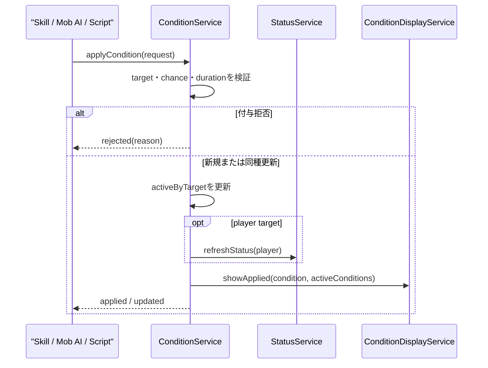
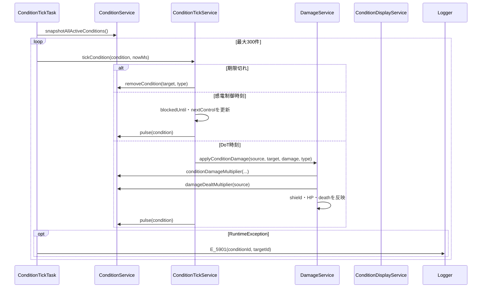
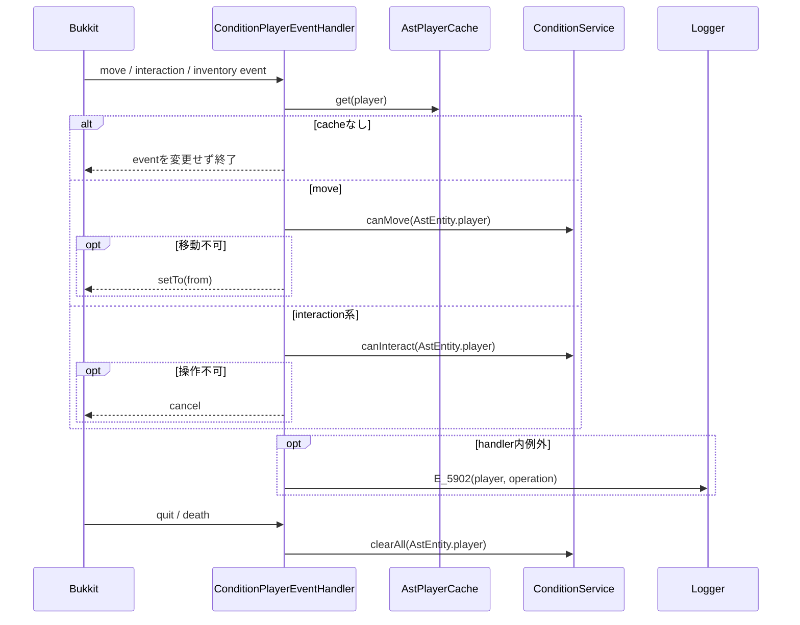
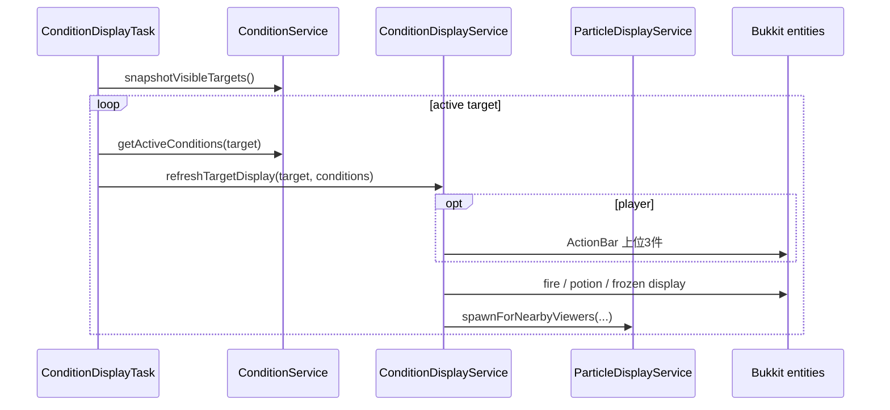
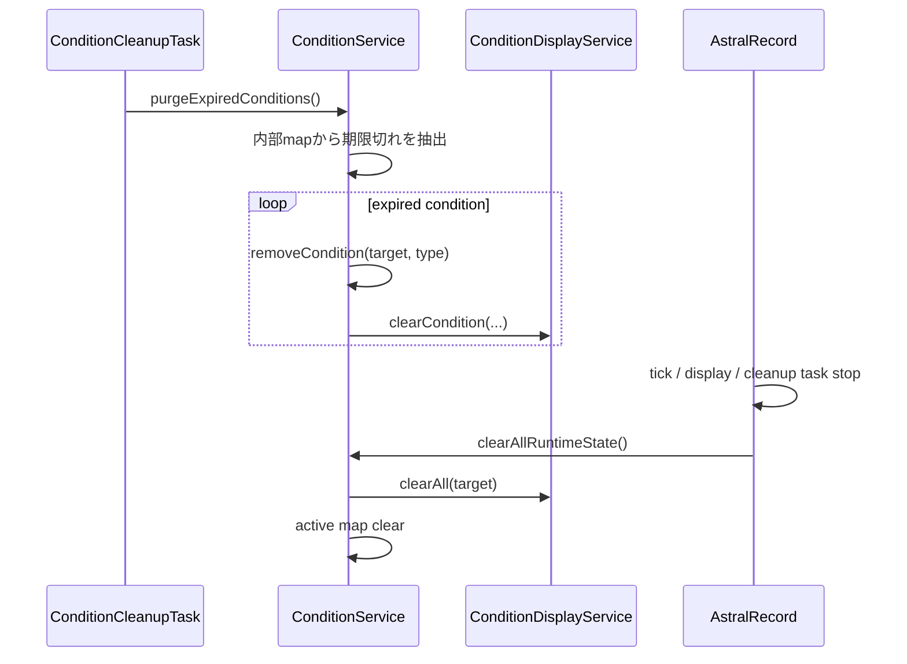

# 27_4.00-統合フロー

## 1. 状態異常の付与・同種更新

### シーケンス

### 処理要点

- `SkillCombatService` と `WeaponAttackSkillExecutor` は、ダメージ結果とは別にスキル定義の condition ごとに付与要求を作る。
- 付与確率は種別専用の付与確率増加と耐性を使い、Boss の `CONTROL` category だけ持続時間を 25% へ短縮する。
- 同種は 1 件を維持し、強い要求だけが効果値を更新する。終了時刻は弱い要求でも延長できる。
- 異なる状態異常は独立して保持する。

### 例外・終了条件

- 管理外、死亡中、NPC、確率失敗、補正後 1 tick 未満は正常な拒否結果であり、例外ログを出さない。
- 属性一致だけではこのフローを開始しない。

## 2. DoT と感電間欠制御

### シーケンス

### 処理要点

- task は 5 tick 間隔で、保持した index から最大 300 件を循環処理する。
- 燃焼・感電は最大 HP、毒は現在 HP を pulse 時点の割合基準にする。
- `DamageService` が DoT 増加・耐性・貫通、付与元の衰弱、毒の HP 1 clamp を適用する。
- condition 単位の例外は後続 condition へ波及させない。

### 例外・終了条件

- DoT interval が 0、次回時刻前、または計算結果 0 の場合はダメージを発生させない。
- snapshot が空なら task の次回 index を 0 に戻す。

## 3. プレイヤー行動制限と終了 cleanup

### シーケンス

### 処理要点

- 凍結は移動と interaction を止め、感電の間欠制御は移動だけを止める。
- 視点変更は位置移動ではないため差し戻さない。
- 通常攻撃は `ItemWeaponAttackEventHandler`、スキルは `SkillService`、Mob AI は `MobAiService` が個別に可否を照会する。
- quit / death は player の active condition と登録済み表示を全解除する。

### 例外・終了条件

- handler の 9 event は個別 operation を持つ同一ログ契約 `E_5902` を使う。
- 戦闘処理用 `E_5900` は condition player event の失敗へ使わない。

## 4. 継続表示

### シーケンス

### 処理要点

- task は 10 tick 間隔で、有効 condition を持つ対象だけを更新する。
- ActionBar は残り時間順ではなく固定優先順位で最大 3 件を表示する。
- 凍結 BlockDisplay は target UUID ごとに 1 個を追従させる。
- particle の viewer 解決は共通 service に委譲する。

### 例外・終了条件

- active list が空なら `clearAll` で fire、PotionEffect、凍結 display、ActionBar を解除する。
- 現行 display task は対象単位の例外隔離と専用ログを持たない。

## 5. 期限切れ sweep と plugin 停止

### シーケンス

### 処理要点

- cleanup は 100 tick 間隔で、通常照会されない対象も内部 map から直接 sweep する。
- `snapshotAllActiveConditions` は有効状態だけを返すため、期限切れ削除の入力には使わない。
- plugin disable は scheduler を止めてから runtime 状態を破棄する。

### 例外・終了条件

- 現行 sweep は期限切れ condition だけを対象とし、対象 entity 消失や全 world の孤立 BlockDisplay を検索しない。
- active map に存在しない表示 entity の回収は [[27_9.00-未決事項]] とする。
