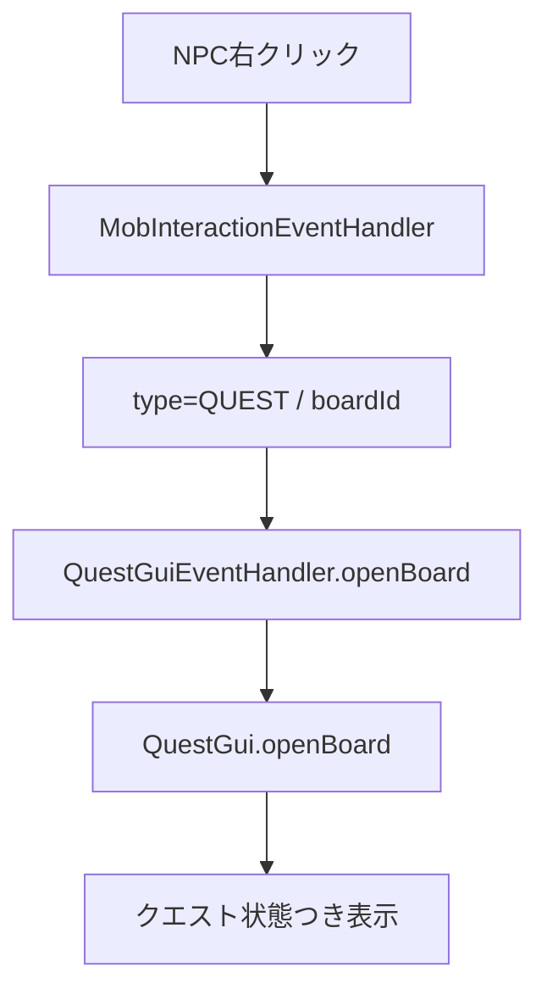
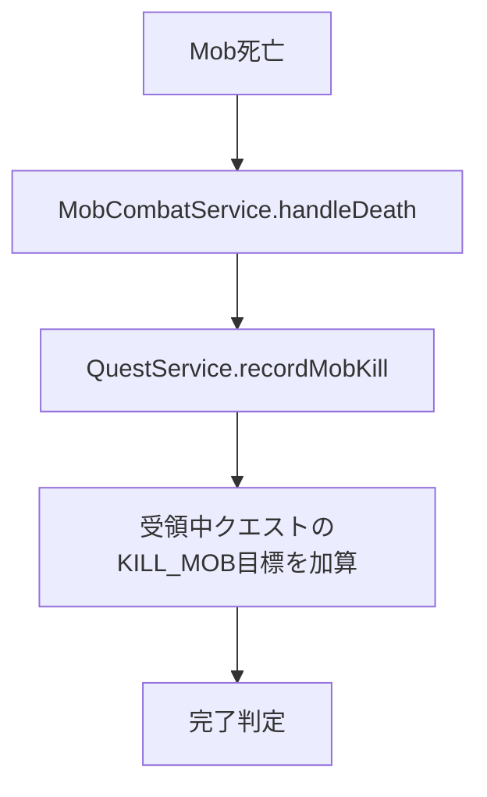
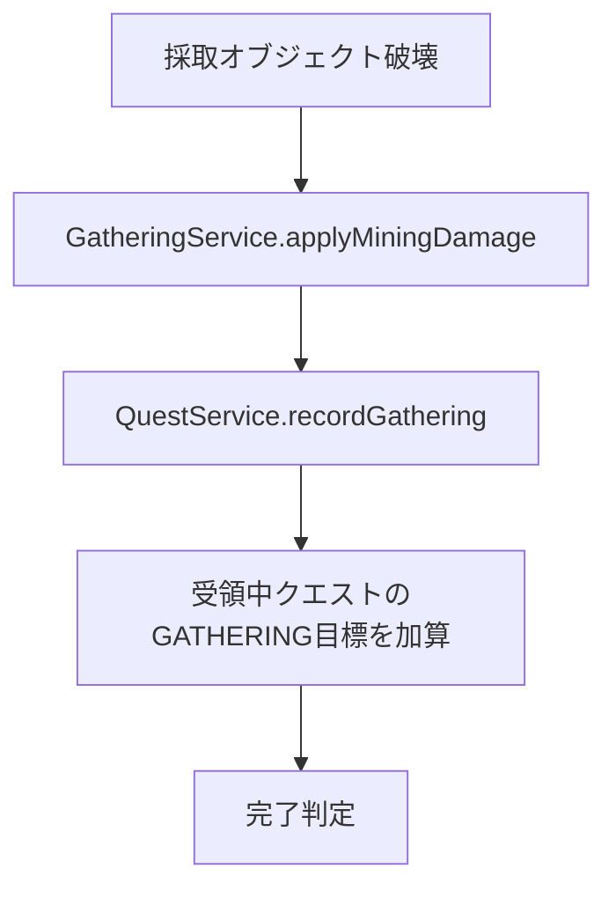

# 27_4.00-統合フロー

## 1. NPC受領フロー

## 2. 討伐進行フロー

## 3. 採取進行フロー

## 4. 完了フロー

- `AUTO`: 条件達成時に報酬付与し、受領中リストから削除する。
- `NPC`: 条件達成時に `READY_TO_TURN_IN` とし、報告先NPCでクリックした時に報酬付与し、受領中リストから削除する。
- `COOLDOWN`: 完了または報酬受取時点から `cooldownSeconds` 後まで再受領不可にする。
- EXP 報酬でプレイヤーレベルまたはクラスレベルが変化した場合は、スキルツリーのクラス別CP・PP・ノード解放条件・有効効果を即時再計算する。報酬適用をロールバックした場合も、復元後の進行度で再計算する。
