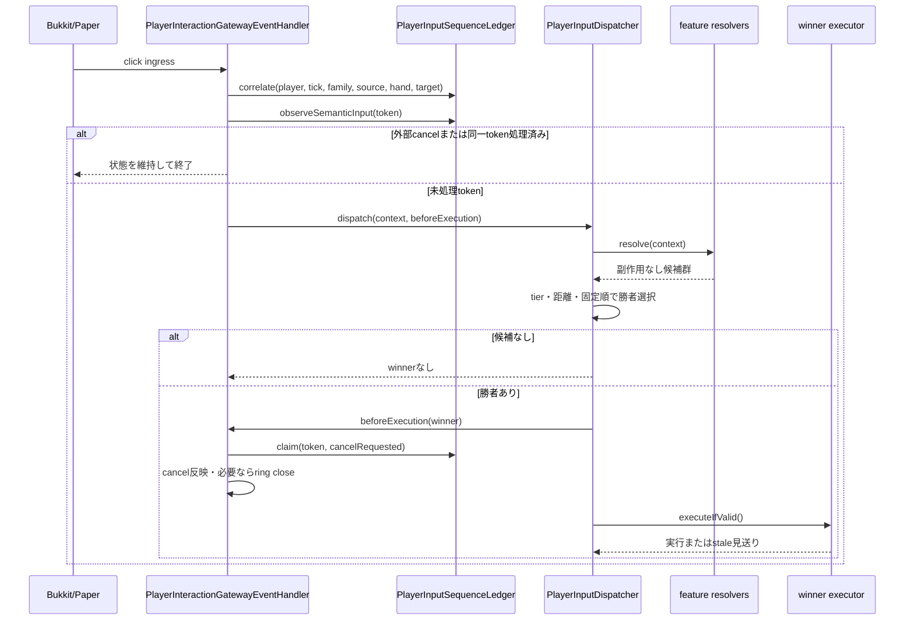
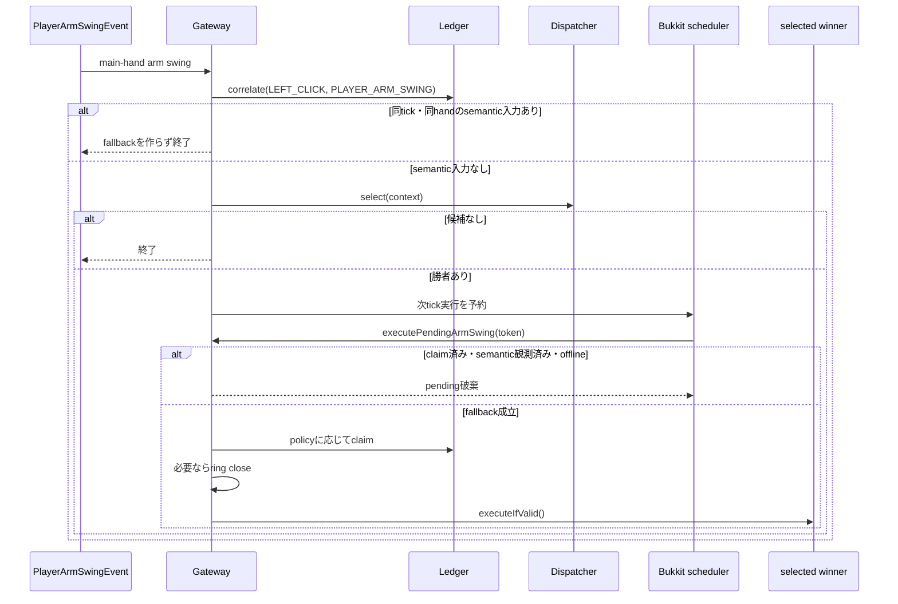
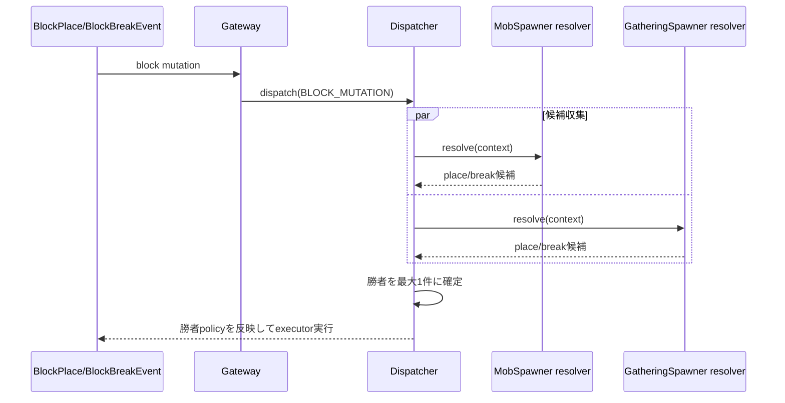
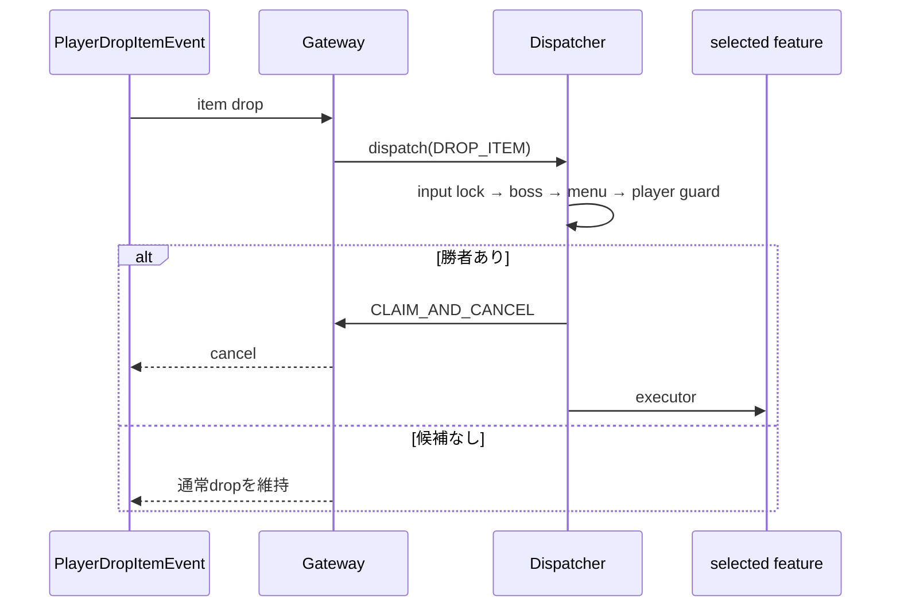
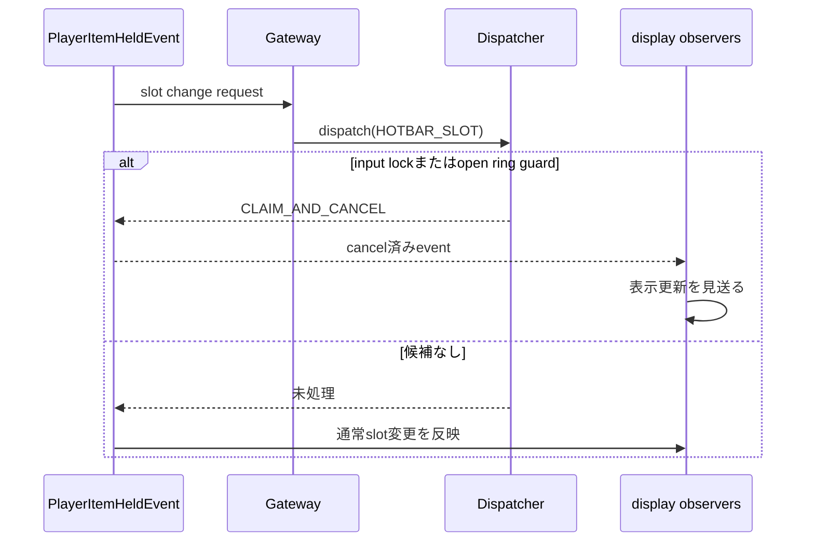
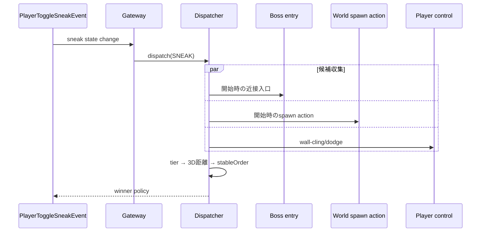
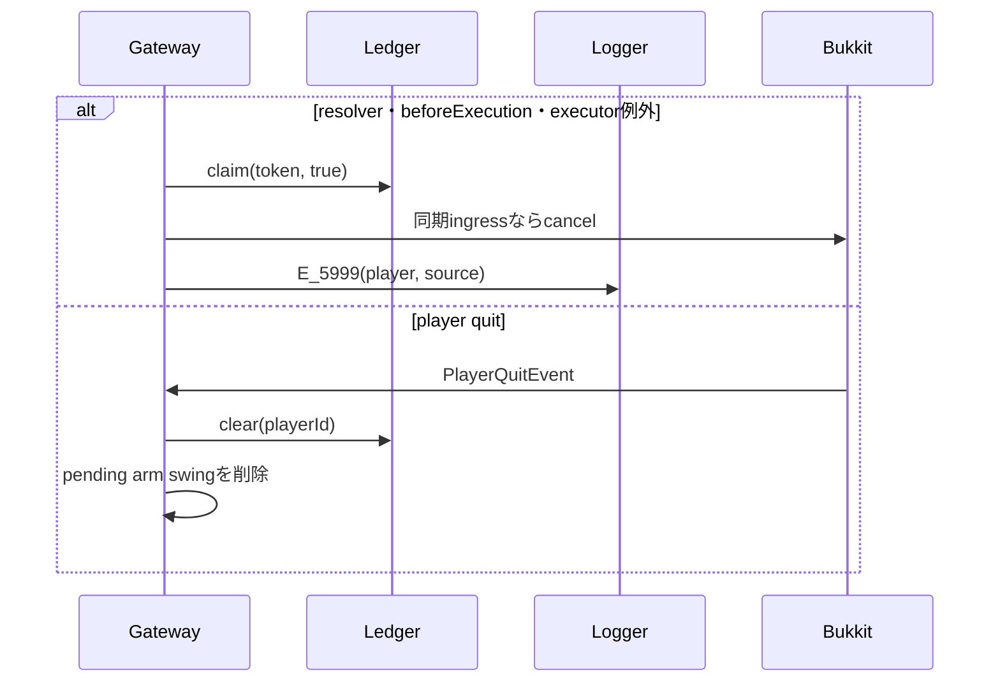

# 28_4-統合フロー

## 1. 同期クリック調停

### シーケンス

### 処理要点

- `RIGHT_CLICK` と `LEFT_CLICK` は別familyとして比較し、同じfamily内の全resolverだけを一回のdispatchへ集約する。
- `EXCLUSIVE_CONTEXT`、`WORLD_INTERACTION`、`ITEM_USE`、`FALLBACK` の順はtier priorityで決まり、同一tierは `hitDistance`、`stableOrder`、`targetKey`、候補IDで決定する。
- 明示的なvanilla block / entity操作とvanilla combatは`CLAIM`候補である。tokenは処理済みにするが元eventはcancelしない。
- 非action-ring候補が勝った場合、gatewayは候補guardより前に表示中action ringを閉じる。

### 例外・終了条件

- 候補なしはwinnerなしの未処理結果であり、元eventもledgerのclaim状態も変更しない。
- guard不成立、業務拒否、executor失敗のいずれでも敗者候補を選び直さない。
- `PlayerInteractEvent`のblock/item useがともに`DENY`、または通常のcancel済みeventは候補評価せず終了する。server-side `Interaction` entityと`willAttack=false`の攻撃事前eventは初期cancelでも評価する。

## 2. arm swing 遅延fallback

### シーケンス

### 処理要点

- 勝者選択はarm swing受信tickに行い、候補executorだけを次tickへ遅延する。
- semantic判定は同じtokenに加え、同じplayer・受信tick・handに別familyのsemantic ingressが存在するかも確認する。block設置や右クリックに伴うarm swingを独立した左クリックにしないためである。
- 遅延guardは`PlayerInteractionSnapshot.refresh()`を使い、同一target、現在の遮蔽、手持ちitem、player状態を再検証する。

### 例外・終了条件

- 受信済みarm swing eventは次tickにcancelできないため、fallback勝者が`CLAIM_AND_CANCEL`でも過去eventへcancelを再適用しない。
- guard不成立でも選択済みtokenのclaimと共通ring closeは維持し、executorと敗者fallbackだけを見送る。
- pendingは次tick処理時に削除し、ledger entryは前tick参照期間を過ぎた後続相関時またはquit時に破棄する。

## 3. block mutation 調停

### シーケンス

### 処理要点

- spawner itemの設置候補は`CLAIM_AND_CANCEL`で実block設置とvanilla item消費を抑止し、管理座標だけを登録する。
- 登録済み座標の破壊候補は`CLAIM`で勝者を固定する。管理者でなければfeature executorがeventをcancelし、管理者なら登録削除後のvanilla破壊を継続する。
- Mob/Gatheringの両候補が同一座標に成立しても、`stableOrder`と候補IDまで含む共通比較で一件だけを実行する。

### 例外・終了条件

- 対象itemまたは登録座標でなければ候補なしとしてvanilla動作を変更しない。
- 勝者の権限確認や登録・削除が失敗しても、他方のspawner候補へfallbackしない。

## 4. DROP_ITEM 調停

### シーケンス

### 処理要点

- priorityは`INPUT_LOCK`、boss中止`WORLD_INTERACTION`、menu shortcut`ITEM_USE`、player-mode guard`FALLBACK`の順である。
- menu shortcutが勝った場合だけ、生成済みitem entityをremoveして表示itemの実体化を防ぐ。
- bossまたはplayer-mode候補が勝った場合は、menu executorを実行しない。

### 例外・終了条件

- 全業務候補は`CLAIM_AND_CANCEL`であり、勝者があるdrop eventはcancelする。
- 候補なしではitem entityを変更しない。

## 5. HOTBAR_SLOT 調停

### シーケンス

### 処理要点

- input lockを最優先し、表示中action ring guardは`FALLBACK`、`stableOrder=100`でslot変更を抑止する。
- ring guardは既存sessionを維持するだけで、新しいringを表示しない。
- status、equipment、item表示更新は候補を返さないobserverである。

### 例外・終了条件

- cancel済みeventでobserverが表示状態を更新してはならない。
- 候補なしでは通常のslot変更を維持する。

## 6. SNEAK 調停

### シーケンス

### 処理要点

- input lockは`CLAIM_AND_CANCEL`、boss/world/player-controlの業務候補は`CLAIM`でvanillaのスニーク姿勢変更を維持する。
- boss入口とworld spawn actionは開始時だけ成立し、同じ`WORLD_INTERACTION`では3D実距離の短い候補を優先する。
- world spawn actionの成立判定は水平2m以内、順位比較は高低差を含む。距離も同一の場合はboss `stableOrder=10`、world `15`で決める。
- player controlは`FALLBACK`、`stableOrder=500`であり、上位候補がない場合だけ実行する。

### 例外・終了条件

- business候補がない場合は通常のスニーク変更だけを行う。
- world/boss候補が勝った場合、wall-cling/dodgeを実行しない。

## 7. 例外・ライフサイクル

### シーケンス

### 処理要点

- gatewayまで伝播した`RuntimeException`は入力をcancel要求付きで確定し、敗者候補の実行を防ぐ。
- feature executor内部で`runSafely`が処理した業務例外は、各featureのログ契約に従う。
- quit時はledgerとpending arm swingの両方をplayer単位で破棄する。

### 例外・終了条件

- 次tickarm swing処理の例外では、既に終了した元eventへcancelを反映しない。
- plugin disable時の明示的な`clearAll` APIは現行実装にない。listener・schedulerとgateway objectの破棄に追従し、将来の長寿命化は [[28_9-未決事項]] とする。
