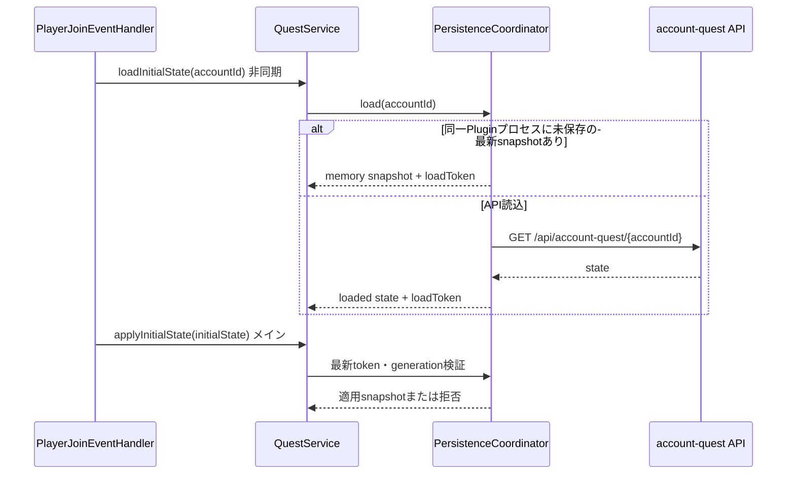
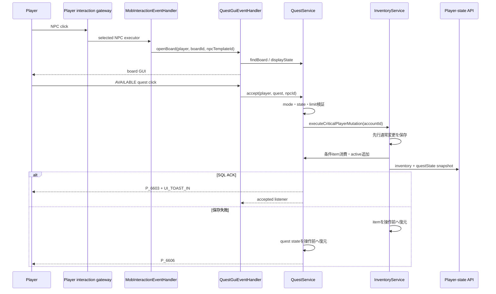
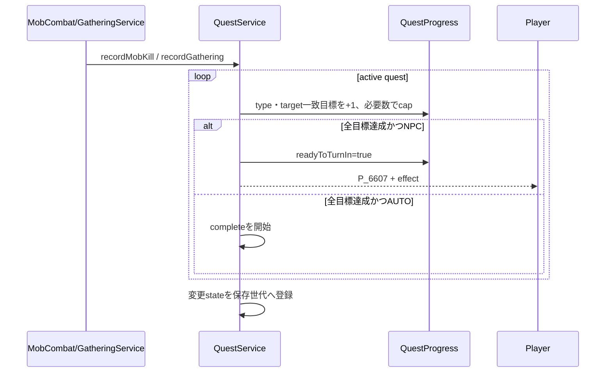
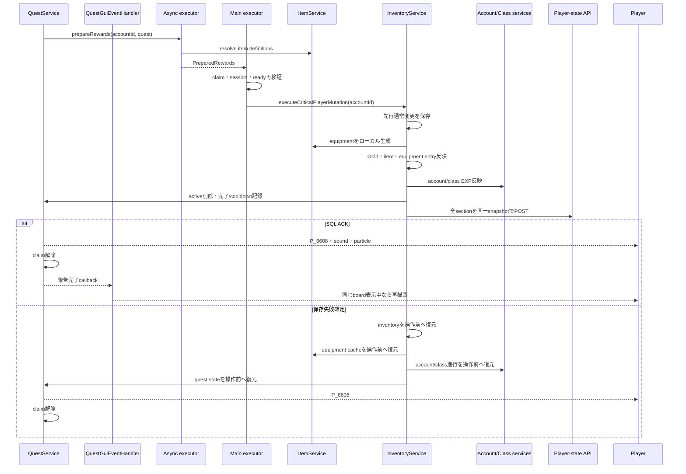
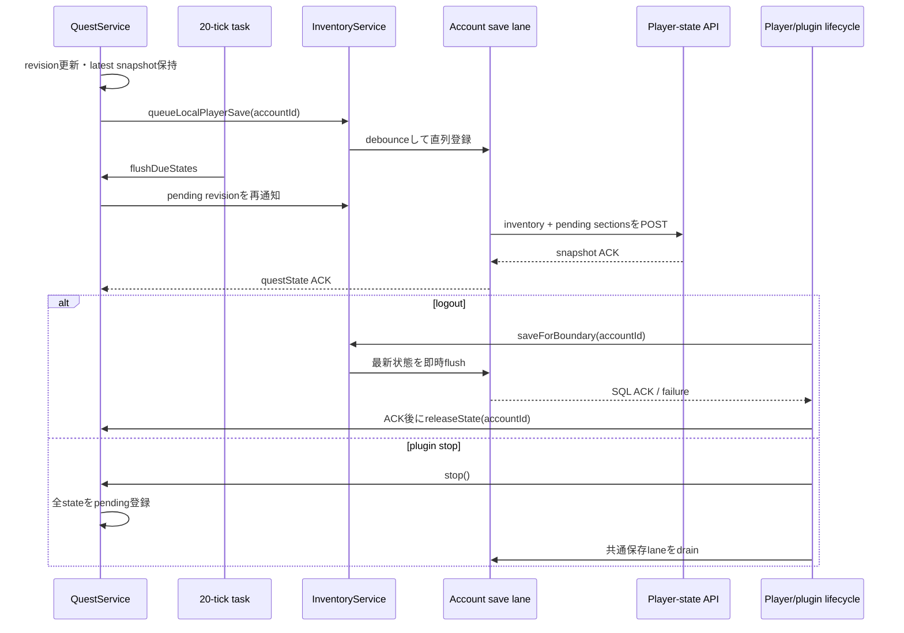

# 29_4-統合フロー

## 1. ログイン状態ロード

### シーケンス

### 処理要点

- API I/Oはjoinロードの非同期区間で行い、session mapへの公開はメインスレッドで行う。
- ロード中に保存世代が進んだ場合、API応答よりmemoryの最新snapshotを優先する。
- Plugin data folderからプレイヤー状態を復元しない。プロセス再起動後はAPIのSQL保存済み状態を読み込む。
- より新しいjoin要求が存在する場合、古い`loadToken`は適用しない。

### 例外・終了条件

- API通信またはJSON解析失敗はロード失敗としてjoin処理へ伝播する。
- joinが中断したロード結果は`discardInitialState`でtokenを破棄する。

## 2. NPCボード表示・受領

### シーケンス

### 処理要点

- boardは`type=QUEST`または`QUEST_BOARD`、`boardId`または互換`questBoardId`で開く。
- 受領上限は`max(3, floor(QUEST_LIMIT))`で、表示状態とは別にクリック時再検証する。
- 重複item条件は全必要数と消費数をそれぞれ合計し、同一itemを複数回の独立消費にしない。
- 条件item消費とquest追加は同じsnapshot ID・SQL transactionで確定する。
- 成功通知とlistenerはSQL ACK後にだけ実行する。

### 例外・終了条件

- 非gameplay account、未ロードplayer、不明board、不明questは状態を変更しない。
- 条件不足、上限到達、非`AVAILABLE`は対応するplayer messageを返す。
- 通信結果が不明な場合はsnapshot結果照会後に同じpayloadを再送し、結果が確定するまで成功扱いしない。

メインメニューのクエスト項目（slot `23`）をクリックした場合は、`QuestGuiEventHandler.openList`へ切り替えて受領中クエスト一覧を開く。一覧GUIでは共通hotbar shortcutを先に処理し、クエスト項目への通常ドロップまたはCtrl+ドロップでだけ`QuestService.abandon`を呼び出す。左クリックを含む通常クリックでは破棄せず、破棄成功後に一覧を再描画する。slot `49`の共通ナビゲーションは、メインメニューからの遷移では`戻る`としてメインメニューを再表示し、`/quest`など戻り先がない起点では`閉じる`として一覧を終了する。

## 3. 目標進行・報告可能化

### シーケンス

### 処理要点

- Mobは各報酬対象player、gatheringは各採取報酬対象playerへ一回ずつ進行を通知する。
- target IDは参照prefixを除去し、大文字小文字を区別せず比較する。
- `readyToTurnIn=true`のquestは追加進行しない。

### 例外・終了条件

- active stateに残った不明quest定義は進行対象外とする。
- AUTO報酬処理中はaccount UUIDとquest IDのprocess-local claimで重複開始を拒否する。

## 4. 報酬commit・補償

### シーケンス

### 処理要点

- NPC報告は明示`turnInNpcId`、なければ受領元`acceptedNpcId`を検証してから同じcommitへ入る。
- equipmentのUUIDと能力値は重要操作内で一度だけ生成し、同じsnapshotの再送では変えない。
- inventory、equipment、account/class進行、quest stateを単一SQL transactionで確定し、level変化後の派生状態とGUIはACK後に更新する。
- POST応答が不明な場合はsnapshot IDで結果照会し、未完了の場合だけ同じsnapshotを再送する。

### 例外・終了条件

- 報酬item解決、ローカルinstance生成、inventory空き、SQL保存のいずれかが失敗した場合はquestをactiveかつ`readyToTurnIn`のまま残す。
- version競合や結果照会後も確定できない通信失敗は操作失敗とし、全sectionを補償して成功演出を出さない。

## 5. 通常保存・ログアウト・停止

### シーケンス

### 処理要点

- accountごとの保存順は共通laneで直列化し、複数sectionのcaptureとACKを同じ世代で扱う。
- quest pending revisionは一致するACKを受けた時だけ解除し、`persistedVersion`を更新する。
- logout済みchannelはSQL ACK後かつ未参照になった後にevictするため、ACK待ちの即時再ログインへ最新snapshotを渡せる。

### 例外・終了条件

- 通常保存失敗は共通保存laneがdirtyを保持して再試行する。重要操作にはこの経路を使用せず、失敗確定時に補償する。
- ログアウト・チャンネル移動の境界保存失敗は遷移元に留め、失敗メッセージを表示する。
- Plugin data folderへプレイヤー状態や未送信payloadを退避しない。
