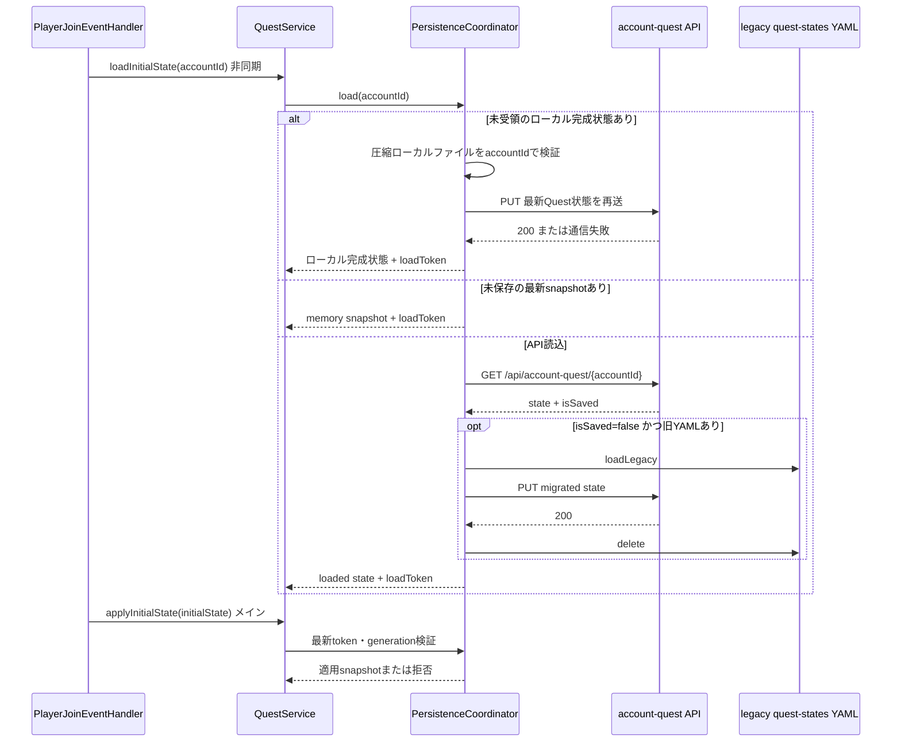
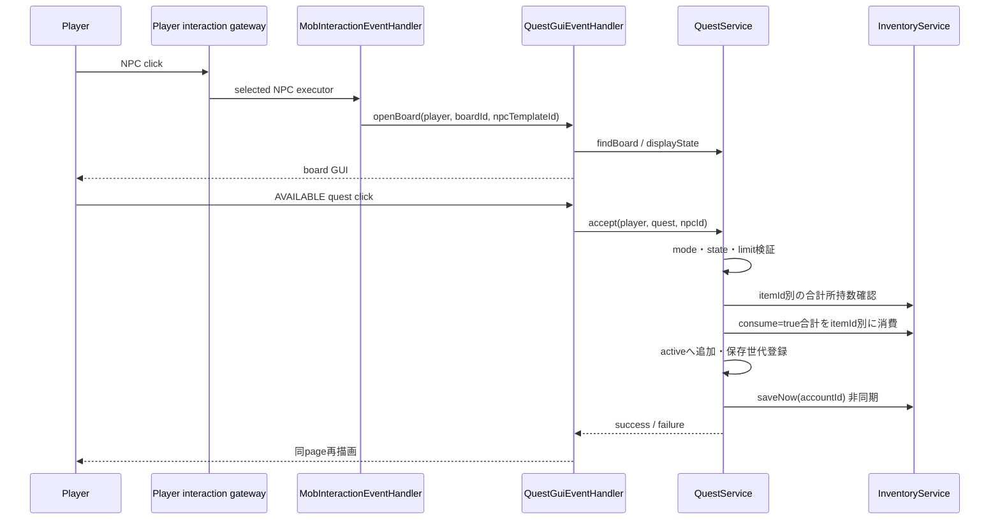
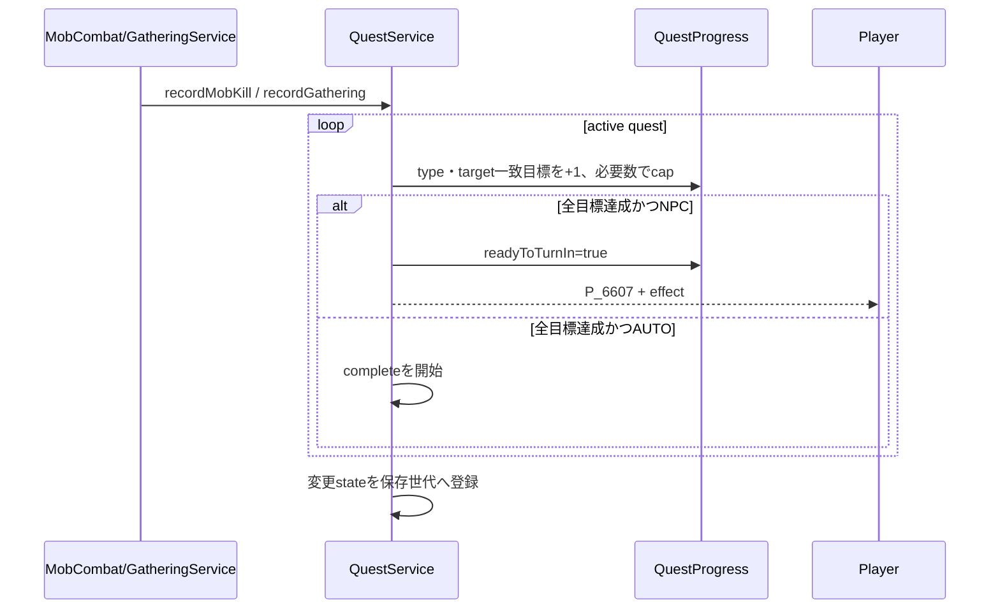
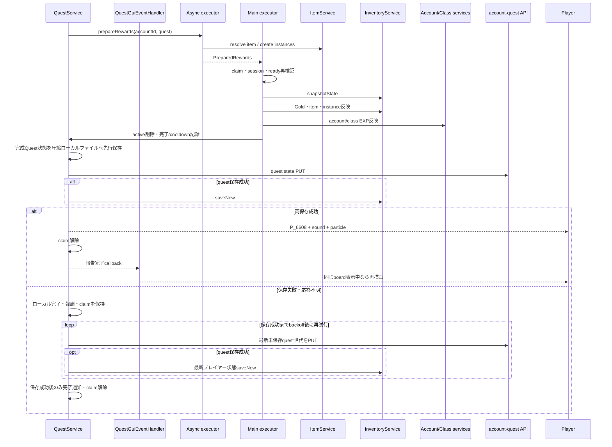
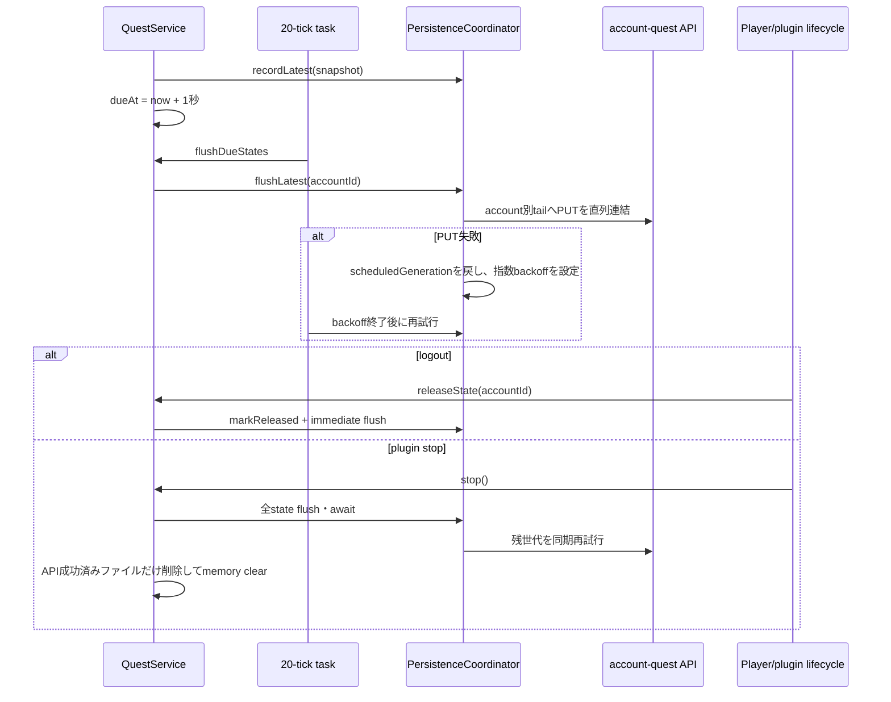

# 29_4-統合フロー

## 1. ログイン状態ロード

### シーケンス

### 処理要点

- API I/Oはjoinロードの非同期区間で行い、session mapへの公開はメインスレッドで行う。
- ロード中に保存世代が進んだ場合、API応答よりmemoryの最新snapshotを優先する。
- 未受領ローカルファイルがある場合は旧API状態を適用せず、ローカル完成状態を先に復元する。API受領後だけファイルを削除し、失敗時は次回ロードへ残す。
- より新しいjoin要求が存在する場合、古い`loadToken`は適用しない。

### 例外・終了条件

- API通信、JSON解析、旧YAML保存・削除失敗はロード失敗としてjoin処理へ伝播する。
- joinが中断したロード結果は`discardInitialState`でtokenを破棄する。

## 2. NPCボード表示・受領

### シーケンス

### 処理要点

- boardは`type=QUEST`または`QUEST_BOARD`、`boardId`または互換`questBoardId`で開く。
- 受領上限は`max(3, floor(QUEST_LIMIT))`で、表示状態とは別にクリック時再検証する。
- 重複item条件は全必要数と消費数をそれぞれ合計し、同一itemを複数回の独立消費にしない。
- quest stateは1秒debounce、受領条件itemは即時inventory保存要求となる。

### 例外・終了条件

- 非gameplay account、未ロードplayer、不明board、不明questは状態を変更しない。
- 条件不足、上限到達、非`AVAILABLE`は対応するplayer messageを返す。
- quest stateとinventoryの受領時cross-store transactionは未実装であり、[[29_9-未決事項]]とする。

メインメニューのクエスト項目（slot `23`）をクリックした場合は、`QuestGuiEventHandler.openList`へ切り替えて受領中クエスト一覧を開く。一覧GUIでは共通hotbar shortcutを先に処理し、クエスト項目への通常ドロップまたはCtrl+ドロップでだけ`QuestService.abandon`を呼び出す。左クリックを含む通常クリックでは破棄せず、破棄成功後に一覧を再描画する。slot `49`の共通ナビゲーションは、メインメニューからの遷移では`戻る`としてメインメニューを再表示し、`/quest`など戻り先がない起点では`閉じる`として一覧を終了する。

## 3. 目標進行・報告可能化

### シーケンス

### 処理要点

- Mobは各報酬対象player、gatheringは各採取報酬対象playerへ一回ずつ進行を通知する。
- target IDは参照prefixを除去し、大文字小文字を区別せず比較する。
- `readyToTurnIn=true`のquestは追加進行しない。

### 例外・終了条件

- active stateに残った不明quest定義は進行対象外とする。
- AUTO報酬処理中はaccount UUIDとquest IDのprocess-local claimで重複開始を拒否する。

## 4. 報酬commit・補償

### シーケンス

### 処理要点

- NPC報告は明示`turnInNpcId`、なければ受領元`acceptedNpcId`を検証してから同じcommitへ入る。
- inventory報酬の全件反映後にEXPを反映し、level変化時はskilltree派生状態またはstatusを再計算する。
- quest API保存が成功してからinventoryまたはEXP変更に対する共通プレイヤー状態保存を行い、両方成功するまで完了演出を出さない。
- 準備・同期反映失敗は保存開始前に限り同じmutation lock内でinventory/account/classを補償し、未確定equipmentを削除する。保存失敗後はsnapshot復元もinstance削除も行わず、報酬の消費や後続の取得・EXP・別quest進行を保持した最新状態を保存する。

### 例外・終了条件

- 報酬item解決、instance準備、inventory空き、Gold/item反映の失敗はquestをactiveかつ`readyToTurnIn`のまま残す。
- 保存失敗時は1秒から最大60秒のbackoffで保存を再試行し、成功までprocess-local claimとaccount別報酬待機列を維持する。報酬を再付与せず、繰り返しquestも再受領させない。
- API保存失敗・受領不明・正常停止ではローカルファイルを削除せず、次回ログイン時に完了状態を先に復元して再送する。報酬だけが保存されQuest状態が旧値へ戻ることを防ぐ。
- 強制停止の直前にファイル書込が完了していない場合と、複数serverをまたぐdurable排他・一括commitは保証しない。

## 5. 通常保存・ログアウト・停止

### シーケンス

### 処理要点

- accountごとの保存順は`CompletableFuture` tailで直列化し、古い世代が新しい世代を上書きしないようにする。
- dirty markerは最新世代がpersistedになった時だけ解除する。
- logout済みchannelは保存完了・未参照になった後にevictするため、即時再ログインへ最新snapshotを渡せる。

### 例外・終了条件

- 通常保存失敗は`W_6600`を記録してdirtyを維持する。
- 停止中は非同期失敗ログを重複させず、最終同期再試行が失敗した場合に`W_6600`を記録する。
- 最終同期再試行が失敗しても、先行したローカルファイルを保持して次回起動へ引き継ぐ。
