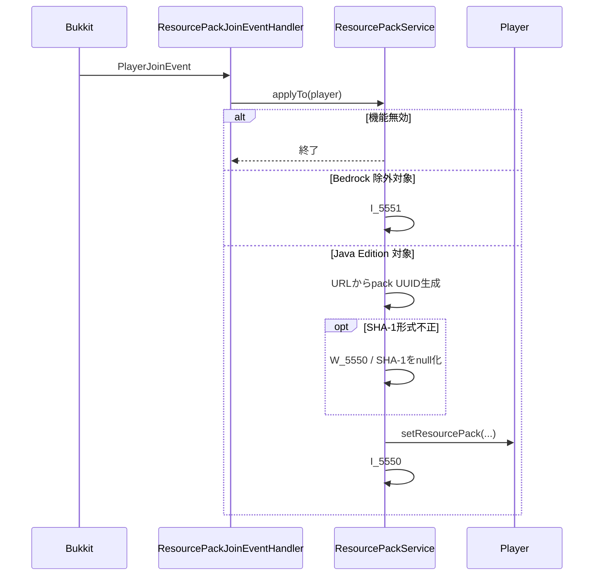
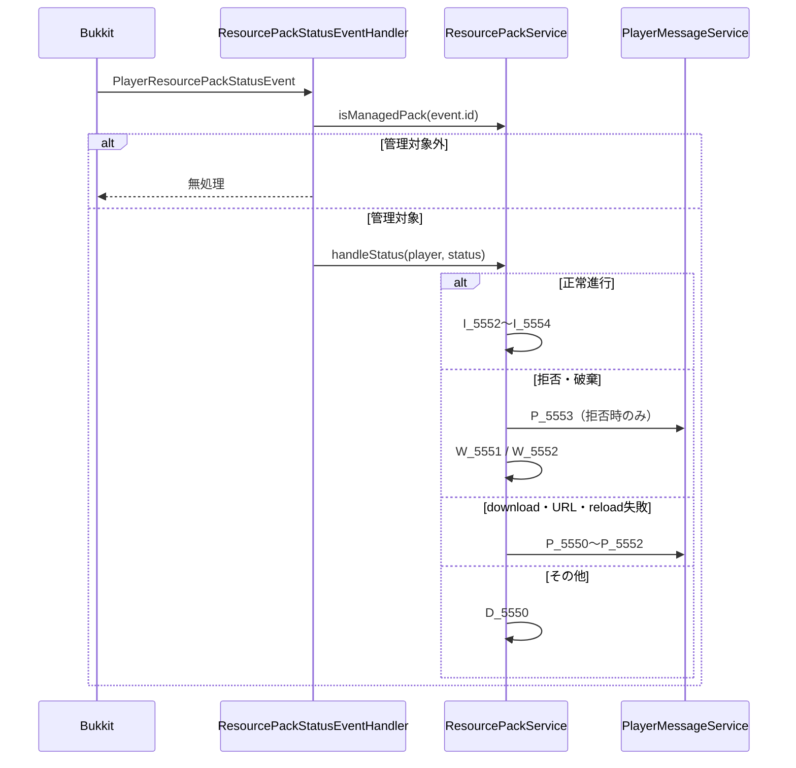

# 30_4-統合フロー

## 1. 参加時のリソースパック要求

### シーケンス

### 処理要点

1. ハンドラの登録自体が `isEnabled` により制御される。
2. `applyTo` でも有効性を再確認し、設定変更・直接呼び出しに対して安全に終了する。
3. SHA-1 不正は送信中止ではなく、SHA-1 なしの要求へ縮退する。

## 2. クライアント status の処理

### シーケンス

### 処理要点

1. URL が変わると導出 UUID も変わり、旧要求の遅延 status は管理対象外になる。
2. status は永続化せず、通知とログだけを行う。

### 例外・終了条件

ハンドラ内例外は `runSafely` が捕捉し、`E_5550` へ集約する。
